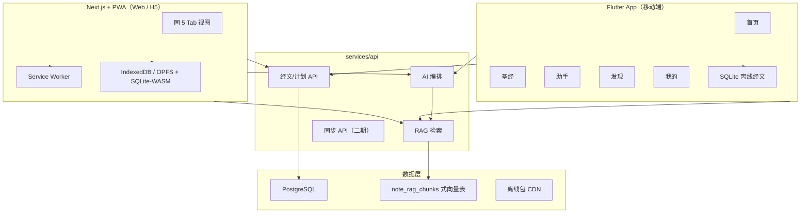
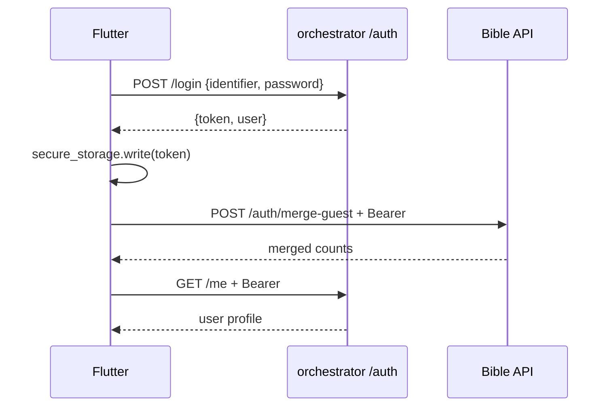
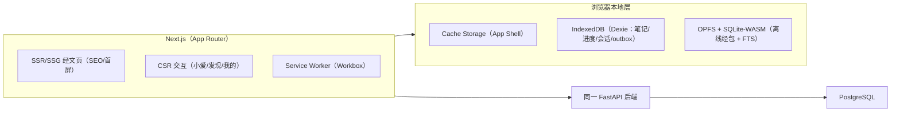

# 技术架构

> 版本：v1.3  
> 更新日期：2026-06-29

---

## 1. 总览



---

## 2. 技术选型

| 层级 | 选择 | 说明 |
|------|------|------|
| 移动端 | **Flutter** | iOS + Android 一套代码 |
| Web / H5 | **Next.js（App Router）+ React + PWA** | 独立 Web 前端（非 Flutter Web），SSR/SSG 经文页利于 SEO 与首屏；与 React canvas demo 同源（详见 §7） |
| 后端 | **Python FastAPI** | 与 minimax_aipodcast orchestrator 技术栈一致，便于复用 RAG |
| 数据库 | **PostgreSQL** | 用户数据、笔记、RAG chunks |
| 向量存储 | **PG + JSONB embedding**（首期） | 对齐 minimax `note_rag_chunks`；量大可迁 pgvector |
| LLM | **DeepSeek `deepseek-v4-flash`** | OpenAI 兼容端点；密钥见 `services/api/.env` |
| Embedding | **DashScope `text-embedding-v4`** | 阿里云百炼 OpenAI 兼容 `/compatible-mode/v1/embeddings` |
| 离线经文 | **SQLite（Flutter 本地）** | 新译本 + KJV + FTS5 |
| 登录 | **minimax_aipodcast 认证** | 复用 `fyv_shared/auth_service` + `/api/v1/auth/*`；Flutter Bearer Token |

---

## 3. 仓库目录

```
Bible/
├── apps/
│   └── mobile/                 # Flutter 应用
│       ├── lib/
│       │   ├── app/            # MaterialApp、路由、主题
│       │   ├── features/
│       │   │   ├── home/       # 首页、计划
│       │   │   ├── bible/      # 目录、阅读器、工具
│       │   │   ├── assistant/  # AI 助手
│       │   │   ├── discover/   # 发现
│       │   │   └── profile/    # 我的、报告
│       │   ├── core/
│       │   │   ├── database/   # 本地 SQLite
│       │   │   ├── network/    # API 客户端
│       │   │   ├── theme/      # 阅读主题、字体
│       │   │   └── storage/    # 设置、游客 ID
│       │   └── shared/         # 通用组件
│       ├── assets/
│       │   └── fonts/          # 思源宋体等
│       └── pubspec.yaml
│
├── services/
│   └── api/                    # FastAPI 后端
│       ├── app/
│       │   ├── main.py
│       │   ├── rag/            # 移植自 minimax rag_core + bible 适配
│       │   │   ├── core.py     # 分块、混合检索
│       │   │   ├── index.py    # 建索引
│       │   │   ├── retrieve.py # 经文章节过滤检索
│       │   │   └── profile.py  # 按资料类型切块参数
│       │   ├── ai/             # 五种模式 prompt、流式
│       │   ├── bible/          # 离线包 manifest
│       │   └── guide/          # 资源指南 API
│       ├── tests/
│       └── requirements.txt
│
├── data/                       # 静态数据（小文件入 git，大文件见 .gitignore）
│   ├── bible/
│   │   ├── cnv/                # 圣经新译本
│   │   └── kjv/                # KJV
│   ├── dictionary/             # 人名地名
│   ├── crossrefs/              # 交叉引用
│   ├── plans/                  # 读经计划 CSV
│   └── daily-verses/           # 每日经文
│
├── content/                    # RAG 源文档（通常不入 git）
│   └── commentary/             # 注释 PDF / MD
│
├── infra/
│   └── postgres/
│       └── init/
│           └── 001_bible_rag.sql
│
├── scripts/
│   ├── import_bible.py         # 经文 → SQLite/SQL
│   ├── rag_index.py            # 注释 → 向量索引
│   └── build_offline_pack.py   # 打离线包
│
└── docs/
```

---

## 4. Flutter 路由

```dart
/home
/home/plans
/bible
/bible/:book/chapters
/bible/:book/:chapter
/bible/search
/assistant
/assistant/chat/:id
/discover
/discover/topic/:id
/me
/me/report
```

---

## 5. 账号策略（v2.1）

| 阶段 | 策略 |
|------|------|
| 启动 | `GET /api/v1/auth/config` → 若 `auth_required` 则引导登录，否则游客可用 |
| 游客 | `device_id` 存 Keychain/Keystore；`X-Guest-Id` 限流与本地数据 |
| 登录 | 邮箱/用户名+密码 → Bearer Token 存 Secure Storage |
| 合并 | 登录后 `POST /auth/merge-guest` 合并本机笔记/进度 |
| 云同步 | Phase 1 末起：笔记/进度 pull-push（登录用户） |



---

## 6. 本地优先 · 数据存储与同步

> 原则：**Local-first + Offline-first**。详见 [PRODUCT.md §2.4](./PRODUCT.md)。数据默认存本地、就地计算；仅 ① AI/RAG、② 社交、③ 用户主动开启的同步/内容包需联网。

### 6.1 存储分层

| 层 | 介质 | 内容 |
|----|------|------|
| **离线只读** | SQLite（FTS5） | 经文 CNV+KJV、注释、交叉引用、人名地名（首次下载离线包，之后零联网） |
| **本地可写（真相源）** | SQLite | 笔记、高亮、收藏、书签、阅读进度、时长、成就、背经 SRS、计划/祷告进度、`user_memory` |
| **安全存储** | Keychain / Keystore（Secure Storage） | 游客 `device_id`、Bearer Token、资料（头像/签名/用户名/用户 ID）、同步开关 |
| **本地缓存** | SQLite / 文件 | AI 问答 24h 缓存（`ref+mode+hash`）、社交动态快照 |

### 6.2 写路径（本地落盘 + 机会式回传）

```
用户操作 → 本地 SQLite 立即写入（真相源）→ 端上重算统计/成就/SRS（零网络）
                                    └→ 若开启同步：写入 outbox 队列
                                          └→ 前台 + Wi-Fi 时批量 flush 到 Sync API
```

- 端上计算：连续打卡、时长、成就、SRS 排程、全文搜索 **均本机完成，不为统计联网**。
- 社交/同步写入走 **outbox 队列**，批量、去抖；**不逐次、不轮询**。

### 6.3 同步 API（二期 · 可选 · 增量）

| 项 | 设计 |
|----|------|
| 触发 | 登录后用户手动开启「云备份」；游客/未开启 = 纯本地不上传 |
| 协议 | 增量：`updated_at` 游标 + 删除墓碑（tombstone）；字段级合并 / 末次写入优先 |
| 端点 | `GET /sync/changes?since=` · `POST /sync/push`（批量） |
| 加密 | 传输 TLS；笔记可选客户端加密后上传（服务端不可读） |
| 备份 | 本地导出/导入文件，不依赖云 |

### 6.4 离线降级

| 断网可用 ✅ | 降级 ⚠️ |
|------------|---------|
| 读经、目录、搜索、计划、笔记/高亮/收藏、背经、统计、成就、资料 | AI（缓存命中仍可）、群/好友动态、分享、内容包下载 |

社交与 AI 隔离为独立模块，离网时优雅降级，不阻塞读经主线。

---

## 7. Web + PWA（H5 网页版）

> 目标：在 Flutter 移动端之外，新增一套 **H5 网页版（Web + PWA）**，复用同一后端与数据模型，做到 **可安装、可离线、首屏快、可被搜索引擎收录**。

### 7.1 方案选型：独立 Web，而非 Flutter Web

| 方案 | 优点 | 缺点 | 结论 |
|------|------|------|------|
| **Flutter Web** | 与移动端 100% 同源、零重写 | CanvasKit 包体大（首屏慢）、**经文文本不可被 SEO 收录**、文本选择/复制体验差、PWA/SW 可控性弱 | ❌ 不选 |
| **独立 Web（Next.js + React）** | 首屏/SEO 优、PWA 完全可控、与现有 **React canvas demo 同源**（组件可直接迁移）、包体小 | 需维护一套 Web UI | ✅ **采用** |
| Capacitor 包壳 | 复用 Web | 仍是 WebView，移动端体验不及 Flutter | 仅作为 Web 上架补充（可选） |

**关键依据：** 圣经经文页是天然的 **SEO / 可分享内容**（每节经文一个可索引 URL），且 PWA 离线与本项目 **本地优先（§6）** 高度契合 —— 独立 Web 才能两者兼得。canvas demo 已是 React/TSX，可作为 Web UI 的起点，降低重写成本。

### 7.2 整体架构



**原则：** Web 与 Flutter **共用 FastAPI、共用 user_id、共用同步契约（§6.3）**；服务端是两端数据的合并点。Web 端的「SQLite 离线经文 + outbox」用浏览器持久化方案落地（见 §7.5）。

### 7.3 技术栈

| 关注点 | 选择 | 说明 |
|------|------|------|
| 框架 | **Next.js（App Router）+ TS** | 经文页 SSG/ISR、其余路由 CSR |
| 数据请求/缓存 | **TanStack Query** | 请求级缓存 + 失效；与 SW 缓存分层 |
| 轻状态 | **Zustand** | 阅读设置、会话锚点等 UI 状态 |
| 离线经包 | **wa-sqlite + OPFS**（FTS5） | 复用与移动端**同一份 `.sqlite` 经包**，按书卷分包懒加载 |
| 用户数据 | **IndexedDB（Dexie）** | 笔记/高亮/进度/小爱会话/**outbox**，schema 对齐移动端 |
| PWA | **Workbox（next-pwa / 自定义 SW）** | 预缓存 + 运行时缓存策略（§7.4） |
| 加密 | **WebCrypto（AES-GCM）** | 与 §6 端上加密一致 |
| 样式 | **复用 canvas design tokens** | 与 `useHostTheme` 同源色板/间距，明暗双主题 |

### 7.4 PWA 离线策略（对齐本地优先 §6）

| 资源类别 | SW 缓存策略 | 离线表现 |
|------|------|------|
| App Shell（JS/CSS/字体/图标） | **Precache**（构建期注入 + 版本化） | 秒开 |
| 经文/计划只读 API | **Cache-First + 后台更新**（SWR） | 读经/计划离线可用 |
| 离线经包（.sqlite 分片） | **按需下载 → OPFS 持久化** | 已下载书卷离线全文检索 |
| 静态内容（专题/图片） | **Stale-While-Revalidate** | 显旧 + 后台刷新 |
| AI / RAG（动态） | **Network-Only** | 离线降级为 **本地资源指南/交叉引用/本地笔记**（同 §6.4） |
| 用户写操作 | **写 IndexedDB outbox → 在线回传** | 离线照常记笔记/进度，复网 **Background Sync** 补传 |

- **可安装：** `manifest.webmanifest`（name/icons 多尺寸/`display: standalone`/`theme_color`/`background_color`）+ iOS `apple-touch-icon` 与 `apple-mobile-web-app-*`。
- **更新：** SW `skipWaiting + clientsClaim` 配「发现新版本」轻提示，避免白屏。
- **推送（可选 · Phase 3）：** Web Push（VAPID），用于读经提醒/群打卡；iOS 16.4+ 需「加到主屏」后才可推送。

### 7.5 Web 端本地数据落地（移动端 → Web 对照）

| 数据 | 移动端（Flutter） | Web 端 |
|------|------|------|
| 离线经文 + 全文检索 | SQLite + FTS5 | **wa-sqlite（WASM）+ OPFS**，同一经包文件，按书卷分片懒加载 |
| 笔记/高亮/收藏/进度/小爱会话 | SQLite 表 | **IndexedDB（Dexie）**，表结构与字段对齐 |
| 待同步队列 | outbox 表 | **IndexedDB outbox** + Background Sync |
| 端上加密 | 平台 KeyStore + AES | **WebCrypto AES-GCM**（密钥派生自登录态） |

> 经包体积大：**按书卷/卷组分片**，首次仅下载当前阅读书卷；FTS 索引同步分片，避免一次性灌入 OPFS。

### 7.6 代码复用与单一事实源（Monorepo）

```
Bible/
├── apps/
│   ├── mobile/          # Flutter
│   └── web/             # Next.js + PWA（新增）
├── packages/
│   ├── tokens/          # design tokens（色板/间距/字号，Web+移动端共享）
│   ├── api-client/      # 由后端 OpenAPI 生成的 TS 类型 + 请求封装
│   └── shared-logic/    # 锚点路由、阅读统计聚合、RAG prompt 模板等纯逻辑
```

- **类型同源：** 后端导出 OpenAPI → 生成 TS 类型，Web 端零手写接口模型。
- **UI 起点：** canvas demo（React/TSX）→ 抽成 `apps/web` 组件；纯逻辑（如小爱**锚点路由**、阅读统计聚合）下沉 `packages/shared-logic`，移动端可经 FFI/重写对齐。
- **文案/Prompt：** 与移动端共用一份。

### 7.7 性能优化方案

| 方向 | 手段 |
|------|------|
| 首屏 / SEO | 经文阅读页 **SSG/ISR**（每节/每章可索引 URL）；其余路由 CSR |
| 包体 | 路由级 **代码分割**；避免 CanvasKit（独立 React 的红利）；Tree-shaking |
| 中文字体 | **子集化 + `unicode-range` 按需**、WOFF2、`font-display: swap` |
| 经包 | **按书卷懒加载**；OPFS 持久化避免重复下载 |
| 长章节 | **列表虚拟化**（按节窗口渲染） |
| 图片 | `next/image` 响应式 + AVIF/WebP |
| 指标 | 以 **Core Web Vitals / Lighthouse** 为门禁（LCP/INP/CLS） |

### 7.8 鉴权（Web 专属）

- 复用 minimax 认证（§5）。Web 采用 **httpOnly + Secure + SameSite Cookie**（BFF 模式，见 §8 `apps/web/lib/bff.ts`），**不**把 token 放 localStorage（防 XSS 窃取）；移动端仍用 Bearer。
- 写接口加 **CSRF Token**（double-submit）；SW 不缓存任何鉴权响应。

### 7.9 渐进式落地

| 阶段 | 范围 |
|------|------|
| **Phase 1（可安装只读）** | Next.js + 经文/计划 **只读** + App Shell 预缓存 + 可安装 PWA；共用 API |
| **Phase 2（离线 + 本地写）** | 离线经包（OPFS/FTS）+ 笔记/高亮/进度本地化（IndexedDB outbox）+ 增量同步（§6.3） |
| **Phase 3（全功能）** | 小爱 Web 全量（多会话/锚点路由）+ 发现/群 + Web Push 提醒 |

---

## 8. 与 minimax_aipodcast 的复用关系

| minimax 模块 | Bible 对应 |
|--------------|------------|
| `fyv_shared/auth_service.py` | **直接复用**（同 orchestrator 进程或 submodule） |
| `auth_bridge.py` + `routes/auth_routes.py` | Bible API 校验会话时调用 `/api/v1/auth/me` |
| `apps/web/lib/bff.ts` | **Web 专用** Cookie 模式；Flutter **不采用** |
| `rag_core.py` | `services/api/app/rag/core.py` |
| `note_rag_service.py` | `services/api/app/rag/index.py` + `retrieve.py` |
| `note_rag_profile.py` | `services/api/app/rag/profile.py`（commentary 类型） |
| `note_chapters.py` | 经卷/章元数据 → `scripture_refs` 过滤 |
| `00201_note_rag.sql` | `001_bible_rag.sql` |
| `EmbeddingProvider` | 同模式，scenario=`bible_commentary` |

详见 [RAG.md](./RAG.md)。

详见 [代码实施计划](./IMPLEMENTATION-PLAN.md) 了解分期任务与实现顺序。

---

## 9. 环境变量（API）

```bash
# LLM（DeepSeek，OpenAI 兼容）
DEEPSEEK_API_KEY=
DEEPSEEK_BASE_URL=https://api.deepseek.com/v1
DEEPSEEK_TEXT_MODEL=deepseek-v4-flash

# Embedding（阿里云 DashScope，OpenAI 兼容）
RAG_EMBEDDING_PROVIDER=api
RAG_EMBEDDING_API_KEY=
RAG_EMBEDDING_API_URL=https://dashscope.aliyuncs.com/compatible-mode/v1/embeddings
RAG_EMBEDDING_MODEL=text-embedding-v4

# 混合检索权重
RAG_HYBRID_VECTOR_WEIGHT=0.55
RAG_HYBRID_KEYWORD_WEIGHT=0.45

# 切块（注释默认）
RAG_CHUNK_CHARS=900
RAG_CHUNK_OVERLAP=70
BIBLE_RAG_INDEX_STRATEGY=per_chapter

# Auth（对齐 minimax orchestrator）
FYV_AUTH_ENABLED=1
ORCHESTRATOR_BASE_URL=http://localhost:8000
FYV_ADMIN_INVITE_CODE=

# AI 额度（游客）
AI_GUEST_DAILY_LIMIT=10

# 部署域名（已确认）
API_BASE_URL=https://www.prestoai.cn
PUBLIC_WEB_URL=https://www.prestoai.cn/2sc

DATABASE_URL=postgresql://...
```

> **部署域名（v1.3.2 已确认）：** 后端 API = `https://www.prestoai.cn`；H5/PWA 页面 = `https://www.prestoai.cn/2sc`；移动端 `API_BASE_URL` 指向同域。

> **选型（v1.3）：** LLM = **DeepSeek**（`deepseek-v4-flash`，OpenAI 兼容端点）；Embedding = **阿里云 DashScope**（`text-embedding-v4`，OpenAI 兼容 `/compatible-mode/v1/embeddings`）。真实密钥放 `services/api/.env`（已 gitignore），`.env.example` 仅留占位。

---

## 修订记录

| 版本 | 日期 | 说明 |
|------|------|------|
| v1.3.2 | 2026-06-29 | 部署域名定稿 `www.prestoai.cn`（H5 `/2sc`），写入 §9 env（`API_BASE_URL`/`PUBLIC_WEB_URL`）；DashScope Embedding Key 已配入 `services/api/.env` |
| v1.3.1 | 2026-06-29 | AI 选型定稿：LLM=DeepSeek `deepseek-v4-flash`、Embedding=DashScope `text-embedding-v4`；更新 §2 选型表与 §9 环境变量；密钥入 `services/api/.env`（gitignore） |
| v1.3 | 2026-06-29 | 新增 §7「Web + PWA（H5 网页版）」：独立 Next.js+React 选型、整体架构、技术栈、PWA 离线策略（对齐本地优先）、Web 本地数据落地（OPFS/SQLite-WASM + IndexedDB outbox）、Monorepo 代码复用、性能优化、Web 鉴权、三期落地；§2 选型表加 Web 行、§1 总览图加 Web 客户端；原 §7/§8 顺延为 §8/§9 |
| v1.2 | 2026-06-29 | 新增 §6「本地优先 · 数据存储与同步」（存储分层 / 写路径 outbox / 增量同步 / 离线降级）；原 §6/§7 顺延为 §7/§8 |
| v1.1 | 2026-06-15 | 接入 minimax 认证；Bearer 会话策略 |
| v1.0 | 2026-06-15 | Flutter + FastAPI；目录定稿 |
