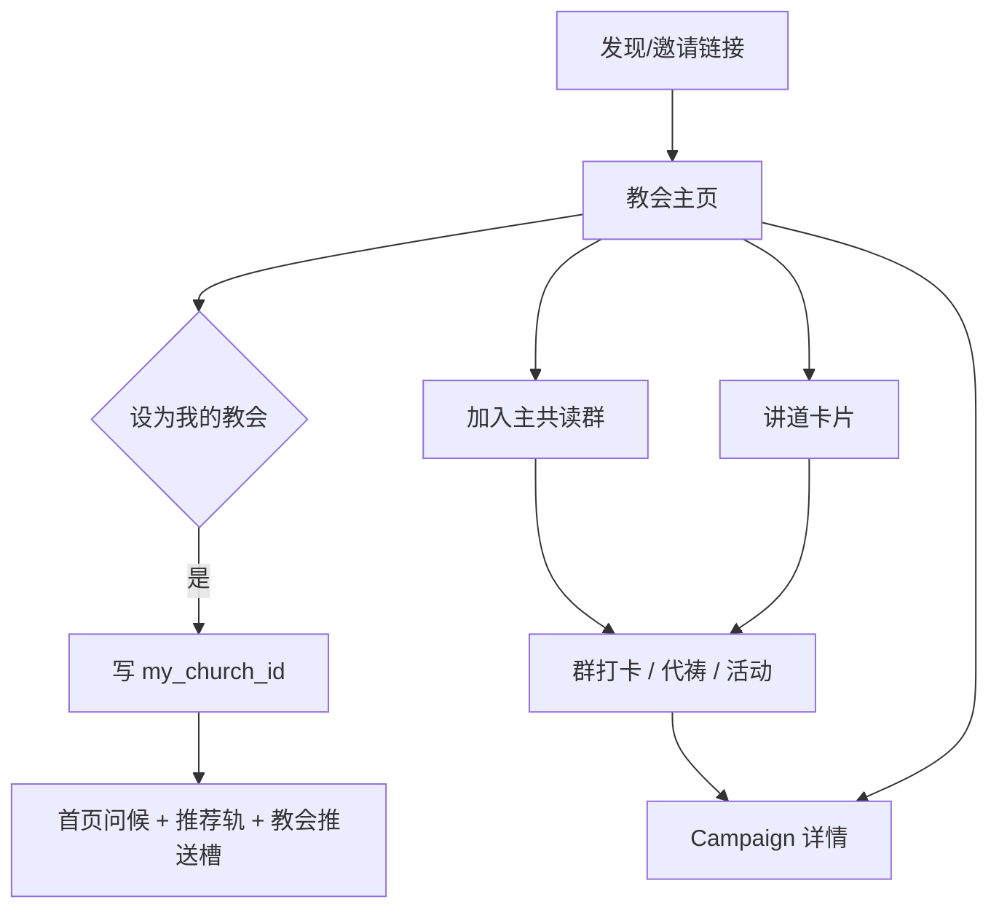

# 教会主页产品方案（阶段 A +「设为我的教会」）

> 目标：用现有 **共读群 + 活动运营（Campaign）+ 计划** 搭出「有主页的教会」，不做第二套 Connect OS。  
> 本文覆盖：**阶段 A MVP**，以及用户「设为我的教会」后的 **首页问候 / 推荐计划 / 推送策略**。

---

## 1. 产品定位（一句话）

**教会 = 品牌壳 + 一个主共读群 + 活动/计划入口。**  
主页负责发现与信任；群负责关系与习惯；Campaign 负责主日/节期运营。

与 YouVersion 的差异：他们偏「关注号 + 内容」；彼爱偏「有主页的共读教会」。

---

## 2. 阶段 A：教会主页 MVP

### 2.1 实体与字段（薄）

| 字段 | 类型 | 说明 |
|------|------|------|
| `id` | string | `church_xxx` |
| `name` | string | 教会对外名称 |
| `cover_url` | string? | 封面 |
| `logo_url` | string? | Logo |
| `intro` | string | 简介（短） |
| `city` | string? | 城市（展示用，不做全国目录） |
| `gathering` | text | 聚会时间地点（纯文案即可） |
| `contact` | text? | 联系方式（选填） |
| `primary_group_id` | UUID | **必绑** 1 个主共读群 |
| `featured_plan_ids` | string[] | 最多 3 个推荐计划 |
| `status` | draft / live | 种子教会先 live |

**不做（A）：** 多校区、权限树、公开教会广场、Insights 仪表盘、独立 Connect 后台。

### 2.2 页面结构（用户侧 `/church/[id]`）

```
教会主页
├── 顶区：封面 + 名称 +「设为我的教会」/「已设为我的教会」
├── 简介 / 聚会时间
├── 主 CTA：「加入本教会共读群」（进 primary_group，已入群则进群）
├── 本周推荐
│     ├── 推荐计划（featured_plan_ids → 计划详情/加入）
│     └── 进行中活动（该教会绑定群下的 Campaign 列表）
└── 讲道与公告（只读列表，见 2.4）
```

首屏只保留：品牌（名称/封面）+ 一句简介 + 主 CTA +「设为我的教会」。其余滚屏。

### 2.3 活动（Events）

- **不新建活动系统**：教会主页「本周活动」= 主共读群下 `status=published` 的 Campaign。
- 创建入口：群主/管理员在现有活动后台创建，选择可见范围「本群」即可；教会页只做聚合入口。
- 深链：`/campaigns/[id]`，完成后回教会主页或群。

### 2.4 讲道（Posts 精简版）

两种落地，**阶段 A 选其一**（建议 A1）：

| 方案 | 做法 | 优点 |
|------|------|------|
| **A1 主群精华帖** | 群内发「讲道」类消息或置顶任务，教会页只读拉取最近 N 条 | 零新写路径，运营成本低 |
| **A2 教会 Posts** | `church_post` 表：标题、正文、经文引用、发布时间 | 主页更干净，评论仍引导回群 |

讲道卡片字段（展示）：标题、日期、1～3 节经文引用、摘要 120 字、「在群里讨论」CTA。

### 2.5 管理员路径（A）

- **不造 Connect**：谁能管教会 = 主共读群的 `owner/admin`。
- 「编辑教会资料」入口挂在主群设置 →「教会主页」。
- 推荐计划：从已有计划库勾选最多 3 个。

### 2.6 关注 vs 入群

| 动作 | 含义 |
|------|------|
| 浏览教会主页 | 无需登录也可看公开资料（活动/讲道可要求登录） |
| **设为我的教会** | 登录；写入 `user.my_church_id`；**不强制入群** |
| 加入共读群 | 关系与打卡；可从主页 CTA 一键加入 |

「设为我的教会」与「入群」解耦：先认教会，再慢慢进群；进群后仍可保留 my_church。

---

## 3. 「设为我的教会」之后：首页 / 计划 / 推送

用户 `my_church_id` 有值时，产品侧三条规则同时生效。

### 3.1 首页问候

在现有时段问候（清晨好 / 上午好…）旁或下一行，增加教会语境：

| 状态 | 文案示例 |
|------|----------|
| 已设教会、未入主群 | `{时段问候}，来自{教会名}` + 次级 CTA「加入教会共读群」 |
| 已设教会、已入主群 | `{时段问候} · {教会名}`；无强 CTA |
| 主日（可按教会 gathering 文案或固定周日） | 可替换副文案：「主日平安 · {教会名}」 |

实现要点：
- 数据：`homeBootstrap` 增加 `myChurch: { id, name, primary_group_id, joined_primary }`。
- UI：挂在 `HomeGreetStreak` 区域，不进 Hero 经文卡，避免抢每日经文。

### 3.2 推荐计划（首页轨）

优先级（从上到下，去重）：

1. **用户进行中的个人/群计划**（现有逻辑不变）  
2. **我的教会 · featured_plan_ids**（未开始或可加入的）  
3. 全局精选计划兜底  

展示：
- 轨标题可用「{教会名}推荐」或「本教会共读」。
- 卡片点进计划详情；若计划与主群绑定，CTA 可为「和教会一起读」。

### 3.3 推送策略跟教会走

原则：**教会相关推送 ≤ 每日 Digest 配额内的「教会槽」**，避免噪音。

| 类型 | 触发 | 受众 | 频次上限 |
|------|------|------|----------|
| 教会活动开始提醒 | Campaign 开场前 2h / 当天早 | `my_church_id` 且未关「教会通知」 | 每活动 1 次 |
| 教会推荐计划催读 | 用户未开始 featured 计划，且近 3 日无读经 | 同上 | 每周 ≤ 1 |
| 主群未读/打卡（已有） | 现有群推送 | **仅已入群** | 沿用群 mute |
| 讲道更新 | 新讲道/精华帖 | `my_church`；默认关，可在设置开 | 每周 ≤ 2 |

设置项（「我的 → 通知」）：
- 教会活动提醒（默认开）
- 教会计划提醒（默认开）
- 讲道更新（默认关）

与群 mute 关系：入群后群消息仍受群免打扰控制；教会推送是独立开关，不绕过系统推送总开关。

Digest 合并示例（早间一条）：
> 清晨好 · {教会名}｜今日经文…｜本周活动《…》今晚 7 点｜教会推荐计划还可加入

---

## 4. 关键路径与权限



权限简表：

| 角色 | 编辑教会资料 | 发讲道 | 建活动 | 设为我的教会 |
|------|--------------|--------|--------|--------------|
| 游客 | 否 | 否 | 否 | 否（先登录） |
| 普通用户 | 否 | 否 | 否 | 是（仅 1 个） |
| 主群 admin/owner | 是 | 是 | 是 | 是 |

「我的教会」全局唯一：再设另一间教会时确认覆盖，并提示原教会推送将停止。

---

## 5. 数据与 API 草图（实现时对照）

```
GET  /content/churches/{id}          # 公开主页
POST /content/churches/{id}/follow   # 设为我的教会（body 可空）
DELETE /content/churches/me          # 取消
GET  /content/home-bootstrap         # + myChurch
PATCH /content/churches/{id}         # 主群 admin
```

表：
- `church`（上表字段）
- `user_profile.my_church_id`（或独立 `user_church`）
- 可选 `church_post`（若走 A2）

---

## 6. 验收标准（阶段 A 可上线）

1. 种子教会能打开主页，看到简介、入群 CTA、≥1 个活动或计划入口。  
2. 用户可「设为我的教会」，首页问候出现教会名。  
3. 教会推荐计划出现在首页推荐轨（在无个人进行中计划时可见）。  
4. 教会活动开始前，已设教会用户能收到一条提醒（可在测试环境验证）。  
5. 非主群管理员无法编辑教会资料。

---

## 7. 明确不做（防范围膨胀）

- 全国教会目录 / 地图发现  
- 多校区、讲台排期、奉献收款  
- 匿名 Insights 大盘  
- 独立「教会工作台」门户（等 ≥10 家付费/签约再开阶段 C）

---

## 8. 建议排期

| 周 | 交付 |
|----|------|
| W1 | `church` 表 + 主页只读 + 绑主群 + 设为我的教会 |
| W2 | homeBootstrap.myChurch + 问候文案 + 推荐轨 |
| W3 | 教会推送槽（活动提醒）+ 通知设置 |
| W4 | 讲道列表（A1 或 A2）+ 1～2 家种子教会运营验收 |

阶段 B（本文不展开）：一教会多群、Insights、简易教会工作台。
