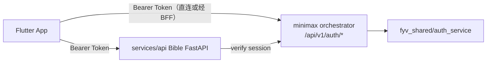

# 圣经 App 产品文档

> 版本：**v1.0 正式版 + v1.2 社交/内容安全增量定稿**  
> 更新日期：2026-07-15  
> 平台：iOS + Android + Web

> **关于版本号：** 本文档此前的 `v1.1 ~ v3.1.1` 为 **设计迭代轮次**（评审打磨的内部编号），功能基线以 v1.0 为准。**社交与内容安全以 §23（v1.2）为准**，废止「无聊天原则 / 好友动态 / 公开广场」。下方各 `vN.N 变更摘要` 保留为演进史；若与 §23 冲突，**以 §23 为准**。

## v1.2 变更摘要（2026-07-15）· 社交 IM 与内容安全

| 模块 | 变更 |
|------|------|
| **发现** | 改为双 Tab：**消息 / 好友**；**删除好友动态**；底栏「发现」**永不显示**未读角标 |
| **消息** | 群会话 + 好友单聊 + 申请/群通知；成熟 IM（撤回/引用/@/搜索/置顶/免打扰/媒体进度等） |
| **群** | 闲聊**默认开**；打卡/任务/群计划/图/PDF·Office 一等公民；**管理员**角色；成员**不可**分享个人计划入群 |
| **好友** | **申请制**加好友；单聊文字+图+经文卡；无通话/红包/朋友圈 |
| **生命周期** | 群/单聊消息与附件仅 **30 天**，服务端物理删除不归档 |
| **勿扰** | **圣经 Tab** 无消息红点/横幅；未读仅在进入发现→消息后可见 |
| **安全** | 信仰准则 + 分层处置异端/违法；审核·举报·主/管治理·处置档案；详见 §23.8 |

完整规格见 **[§23](#23-发现--消息与好友--内容安全v12-定稿)**。  
数据设计见 [`SOCIAL-V12-DATA.md`](./SOCIAL-V12-DATA.md)；实施计划与进度见 [`SOCIAL-V12-PLAN.md`](./SOCIAL-V12-PLAN.md)。

## v1.0 正式版 · 范围与待优化清单（2026-06-29，社交条目已被 v1.2 更新）

**核心范围（含 v1.2）：** 5 Tab 闭环（首页 / 圣经 / 小爱 / 发现 / 我的）；CNV+KJV 经包与沉浸阅读；读经计划 + 祷告计划；半屏接力释经 + 小爱自由对话（RAG + 脚标引用 + 额度合规）；阅读报告与成就；**发现 = 消息（群+单聊）+ 好友通讯录**（受邀/申请制，成熟 IM + 共读特色，**无好友动态、无公开群广场**）。内容安全与异端分层治理见 §23.8。

**待优化清单（Phase 2+ 候选，按主题归并）：**

| 类别 | 待优化项 | 状态/说明 | 优先级 |
|------|----------|-----------|--------|
| **上线前阻断项** | 新译本文本入库（EPUB→DB）、首批 3–5 本注释入库 | 内容就位才能跑通 RAG（§14）；**AI 选型 ✅**；**域名 ✅** `prestoai.cn` | **P0** |
| **上线前阻断项** | 品牌名与中文字标定稿 | §19.11 待定 | **P0** |
| **社交交付（v1.2）** | §23 全量：双 Tab、申请制、群闲聊+管理员、成熟 IM、30 天清理、审核台与异端工单 | **规格已定稿**；工程按 §23.10 分批达标上线 | **P0** |
| **阅读体验补齐** | KJV 对照、交叉引用、资源指南、原文 Sheet（Strong's） | Phase 2（§5.2） | P1 |
| **小爱补齐** | 对话历史长期化、查经/讲道结构化、预填模板统一、异端诱导拒答话术配置 | Phase 2（§5.3、§23.8） | P1 |
| **数据与同步** | 笔记/进度/AI 历史云同步稳态、阅读报告 Dashboard | Phase 2（§8、§9） | P1 |
| **推送与召回** | 每日提醒、断签召回、群/私信聚合推送（尊免除打扰与圣经勿扰） | §10、§23.7 | P1 |
| **祷告计划深化** | 首页读经/祷告动态切换；祷告打卡并入报告 | 内容已有，体验待接 | P1 |
| **群 · 共读深化** | 补卡/时区/请假态（原 H）、轮值领读（原 J）、打卡接龙与罐头鼓励 | 在 IM 之上增强共读，不替代 §23 | P1 |
| **主机与运维安全** | SSH 密钥-only、密钥轮换、Web 劫持监测、异地备份 | 生产运维（非本功能规格） | P0 |
| **可访问性/国际化** | 大字号、多译本与多语言 | 未系统规划 | P2 |
| **视觉精美化** | 完成卷微动画等 | 插画已有；微动画待做 | P2 |

---

## 目录

1. [产品概述](#1-产品概述)
2. [产品原则](#2-产品原则)
3. [目标用户](#3-目标用户)
4. [信息架构与导航](#4-信息架构与导航)
5. [各 Tab 功能规格](#5-各-tab-功能规格)
6. [AI 体系设计](#6-ai-体系设计)
7. [功能清单与归属](#7-功能清单与归属)
8. [账号与数据](#8-账号与数据)
9. [阅读报告](#9-阅读报告)
10. [推送与深链](#10-推送与深链)
11. [用户体验与留存策略](#11-用户体验与留存策略)
12. [技术架构概要](#12-技术架构概要)
13. [版本规划](#13-版本规划)
14. [待确认事项](#14-待确认事项)
15. [附录：路由结构](#15-附录路由结构)
16. [产品优化定稿（v1.1）](#16-产品优化定稿v11)
17. [产品优化建议（v1.2）](#17-产品优化建议v12-评审)
18. [产品优化路线图（v2.0 评审采纳）](#18-产品优化路线图v20-评审采纳)
19. [视觉与 UI 设计语言（v2.2）](#19-视觉与-ui-设计语言v22)
20. [产品优化补充（v2.3 评审采纳）](#20-产品优化补充v23-评审采纳)
21. [产品优化定稿（v2.8）](#21-产品优化定稿v28)
22. [新功能规划（v1.1）](#22-新功能规划v11)
23. [发现 · 消息与好友 · 内容安全（v1.2 定稿）](#23-发现--消息与好友--内容安全v12-定稿)

## v3.1.1 变更摘要（2026-06-29）

> 主题：**共读群改为「结构化打卡/任务流」**（聊天式界面，但只发打卡/任务、可 emoji 回应，仍不支持自由聊天）。

| 模块 | 变更 |
|------|------|
| **群 · 界面** | 点击群进 **类微信聊天的消息流**；消息=成员 **打卡** / 群主 **任务**；左右气泡 + 时间 |
| **群 · 输入框** | 仅承载 **打卡 / 任务** 内容（选类型→填内容→发送）；**无自由聊天 / @ / 回复** |
| **群 · 打卡约束** | **打卡必须关联经文或任务**，未关联发送置灰（防闲聊、可回跳经文、可聚合统计） |
| **群 · 任务闭环** | 未完成任务可 **去完成 → 一键分享到群**；群主发任务可 **自定义内容** |
| **群 · 互动** | 每条消息可 **点赞 + emoji 表情**（👍❤️🙏🔥🙌）替代文字评论；可看成员、不可私聊 |
| **建议** | §5.4.4 群功能产品建议：10 条 + **A–F 扩展** + **G/H/J 选采**（公开群广场/拼群冷启动 P0/P1、群节奏与补卡、轮值领读与反羞辱）；A/B/D/G 标 P0/P1 |

## v3.1 变更摘要（2026-06-29）

> 主题：**祷告计划上线、共读群权限定稿、社交「无聊天」边界明确**。

| 模块 | 变更 |
|------|------|
| **计划库** | 新增 **祷告** 类型；上线通用 **祷告计划方案**（7 天入门 / 30 天操练 / 焦虑·感恩主题），采用 **ACTS** 与 **主祷文 / 诗篇祷告** 框架，每日提供经文 + 祷词引导 + 打卡 |
| **发现 · 共读群** | 群进入 **群详情**；**群主** 拥有 **发布计划、发起打卡、群公告、成员管理、群设置** 权限；成员仅 **打卡 + 点赞**；**全程禁群内聊天** |
| **社交边界** | 明确 **好友之间不支持聊天**（无私信、无 IM）；关系仅承载 **共读、打卡、分享、点赞** |

## v3.0 变更摘要（2026-06-15）

> 主题：**提升「问小爱」的提问效率**，从三层降低成本。

| 层 | 模块 | 变更 |
|----|------|------|
| **减少进入步数** | 小爱 / 半屏 | 选中即问、半屏 **零输入默认答**、空状态 **「本章重点一起问」** 批量入口 |
| **降低组织成本** | 小爱输入 | 输入框 **经节占位**（关于 约3:16…）；输入时 **联想补全** 候选问法，点选即发 |
| **降低等待成本** | 小爱 / 半屏 | 从经节进入 **预读首答**；高频/缓存问法标 **「缓存 · 秒回」**「已预读这节 · 秒回」 |

## v2.9 变更摘要（2026-06-15）

| 模块 | 变更 |
|------|------|
| **小爱 · Chip** | 意图 + 场景 + 追问 **合并单行**，横滑显示更多 |
| **小爱 · 输出** | **无气泡卡片**；正文阅读友好排版（大行高、无框） |
| **小爱 · 来源** | 正文 **脚标 [1][2]**；点击打开 **双语依据卡**（中文释义 + 可核对英文/原文摘录） |
| **小爱 · 输入** | 默认 **居中**；开始输入后 **沉底**；**无发送按钮**，回车发送 |
| **小爱 · 输入** | 默认 **键盘**；图标 **框内右侧** 16px；顶栏 **小爱左 / 经节右可跳转** |
| **小爱 · 历史** | 右上 **小爱** → 历史会话列表 + **新会话** |
| **小爱 · 操作** | 每条回答 **复制 / 存笔记** 图标 |

## v2.8 变更摘要（2026-06-15）

| 模块 | 变更 |
|------|------|
| **战略** | 定稿 AI 主路径：**边读 → 半屏快懂 → 去问小爱**；计划与 `reading_progress` 合一；发现=关系共读，搜索=经文+主题 |
| **首页** | S3 首屏 **严格 3 块**（每日经文、今日计划、一行摘要）；**移除** 好友分享流（迁至发现） |
| **圣经** | 半屏 **70%** + 接力契约；Chrome **状态机**；目录 **继续条**；大卷 **章分段**；章末 **轻反馈**；搜索 **三段式**；选中条 **6 项** |
| **小爱** | Onboarding **分态空状态**；Chip **L1/L2/L3 分层**；依据 **可折叠**；额度将尽/用尽提示；查经/讲道 **结构化输出** |
| **发现** | 独占分享流；分享卡 CTA：**问小爱 / 我也在读**（统一预填模板） |
| **我的** | 确认 v2.4 单页卡片；阅读数据 **可下钻**（日视图高亮今天）；书卷弹窗 **可点卷继续读** |

## v2.7 变更摘要（2026-06-15）

| 模块 | 变更 |
|------|------|
| **首页** | 问候语 + **橄榄枝** 左上，与右上搜索/加号 **同一行** |
| **设置** | 字体 **中/大/特大** 按钮本身即字号预览（去掉经文预览块） |
| **圣经 · 译本** | 取消下拉；点击 → **译本列表 Sheet**；**可多选** 逐节对照 |
| **圣经 · 浮标** | 文案 **小爱**；沉浸时 **45% 半透明**，点屏恢复不透明 |
| **圣经 · 排版** | 落实 **微读式 + YouVersion 沉浸**：分段标题、悬挂节号、对话/诗歌体、多译本对照（见 READING-EXPERIENCE.md） |

## v2.6 变更摘要（2026-06-15）

| 模块 | 变更 |
|------|------|
| **首页** | 搜索/加号 **靠右独立一行**；搜索页 **搜索历史显示全部（不折叠，v1.1）**；欢迎回来带 **用户名称** |
| **圣经** | 进入阅读 **3s 后隐藏顶栏 + 底栏 Tab**；设置字体 **联动经文字号** |
| **小爱** | 意图 Chip **单行横滑**，右滑发现更多 |
| **发现** | 「邀请一起读」标注 **4 个入口**；无好友时 **空态 + 去加好友**（分享区与好友 Tab 分治） |
| **设置** | **卡片式**排版；字体大小带 **实时预览** |

## v2.5 变更摘要（2026-06-15）

| 模块 | 变更 |
|------|------|
| **计划** | **删除** 计划日完成 Sheet（反思+行动） |
| **首页** | 右上 **全局搜索** + **加号菜单**（加好友/新建群/二维码/读经计划）；分享卡 **去掉问小爱** |
| **小爱** | 回答后展示 **继续追问** Chip |
| **发现** | **发现 / 我的好友** 子 Tab；共读群默认 **2 条** + 查看全部；好友分享 **查看全部** |
| **我的** | 加号改为 **设置**；笔记卡 **右滑下一条**；阅读时长详情增加 **阅读回顾**（最多卷/章） |
| **设置** | 名称、头像、字体、翻页方式、主题、版本、退出登录 |

## v2.4 变更摘要（2026-06-15）

| 模块 | 变更 |
|------|------|
| **搜索** | 圣经顶栏/目录 **搜索图标** 打开 **搜索页**；搜索框 **下方** 展示原发现 **人生主题宫格** 与专题 |
| **发现 Tab** | Tab 名称不变；内容改为原 **我的 · 分享**：好友分享、共读群、共享计划邀请 |
| **我的** | 顶区改为 **头像 + 名称**（可编辑）；去掉成就/分享双 Tab |
| **我的 · 卡片** | 依次：**今日时长** → **成就徽章** → **书卷进度** → **收藏经文复习**（右滑下一条）→ **最近笔记** |
| **我的 · 删除** | 移除 **「下次读什么」** |
| **首页** | 「查看全部」分享 → **发现 Tab**（不再跳转我的） |

---

> 2026-06-15 评审通过项，已回写至正文各章。

| # | 优化项 | 状态 |
|---|--------|------|
| 1 | 首页信息架构重设计 | ✅ §5.1 |
| 2 | 圣经 vs 助手双入口 + Onboarding | ✅ §5.2、§5.3、§6.2 |
| 3 | RAG 差异化用户感知 | ✅ §6.5 |
| 4 | 计划：30 天默认主推 + 完成日庆祝 | ✅ §5.1 |
| 5 | 打卡：本月已读 X 天 + 欢迎回来 | ✅ §5.1、§9 |
| 6 | 发现 Tab 重设计 | ✅ §5.4 |
| 7 | 阅读报告行动导向 | ✅ §9 |
| 8 | AI 额度：指南不计额、24h 缓存、用尽仍可指南/引用 | ✅ §6.7 |
| 9 | 神学敏感与合规加强 | ✅ §6.7 |
| 10 | Phase 1 阅读仅字号/主题/节号 | ✅ §5.2、READING-EXPERIENCE |
| 11 | 首页不做继续阅读；圣经 Tab 承担 | ✅ §5.1、§5.2 |
| 12 | 首启 Onboarding 四态状态机 | ✅ §5.1 |
| 13 | 离线经包默认 CNV+KJV | ✅ §5.1、§1.4 |
| 14 | 首页：每日经文 → Onboarding/计划 → 平铺今日更多 | ✅ §5.1 |
| 15 | 圣经进度独立 Onboarding；阅读工具栏 3s 隐藏 | ✅ §5.2 |
| 16 | 发现：人生主题 + 经文与资料理解 | ✅ §5.4 |
| 17 | 我的：单页下滑 + 图表 + 成就激励 | ✅ §5.5、§9 |
| 18 | 首页卡片整卡可点、无顶栏杂讯、删除今日更多 | ✅ §5.1 |
| 19 | 发现页精美排版（主题宫格 + 专题页） | ✅ §5.4 |
| 20 | 助手 Gemini 式对话 + 结构化输出 + 记忆 | ✅ §5.3、§6 |
| 21 | 圣经顶栏重构 + 右下 AI FAB + 3s 沉浸 | ✅ §5.2 |
| 22 | 我的：交友、打卡群、读经分享图 | ✅ §5.5、§8 |
| 23 | 今日计划「X 人在读」社交感知 | ✅ §5.1 |
| 24 | 助手自由对话输出（非固定三段） | ✅ §5.3、§6 |
| 25 | 我的：成就/分享双 Tab + 书卷弹窗 + 周月年图表 | ✅ §5.5、§9 |
| 26 | 首页：每日经文点赞 + 点赞人数 | ✅ §5.1 |
| 27 | 我的：阅读日历（日默认）+ Stat 联动 + 目录序书卷全量 | ✅ §5.5、§9 |
| 28 | 首页好友分享流；圣经 AI 不隐藏；助手改名小爱 | ✅ §5.1、§5.2、§5.3 |
| 29 | 我的：成就徽章回归；阅读卡片视图+日期切换；书卷弹窗目录跳转 | ✅ §5.5 |
| 30 | 圣经：左右滑动翻页；新旧约卡片目录（卷→章） | ✅ §5.2 |
| 31 | 阅读卡片栅格；成就排序+全部；首页分享限2条；目录上下分区 | ✅ §5.1、§5.2、§5.5 |
| 32 | 产品优化路线图 §18；我的＋读经计划弹窗 | ✅ §5.5、§18 |
| 33 | 选中经文弹出条（小爱/复制/笔记）；接入 minimax 登录 | ✅ §5.2、§8、§12 |
| 34 | 发现 8 主题各色浅底色板 + Canvas | ✅ §19.10 |
| 35 | 读懂/坚持/行动/共读/信任/漏斗/讲道预备等 §20 | ✅ §20 |
| 36 | AI 主路径与计划/阅读进度合一 | ✅ §21、§4.2、§5.1、§5.2 |
| 37 | 半屏接力契约 + Chrome 状态机 | ✅ §21、§5.2、§5.3 |
| 38 | 首页 3 块 + 断签欢迎回来；移除首页分享 | ✅ §21、§5.1、§5.4 |
| 39 | 搜索三段式；小爱 Chip 分层 + 结构化查经/讲道 | ✅ §21、§5.3、§5.4.1 |
| 40 | 发现 CTA 标准；我的阅读下钻 | ✅ §21、§5.4、§5.5 |

---

## v2.3 变更摘要（2026-06-15）

| 模块 | 变更 |
|------|------|
| **小爱** | 输入框 **意图 Chip**（弄懂/背景/怎么用）；**查经/讲道预备** Chip；依据固定展示 + 保守/多观点设置 |
| **计划** | 日完成 **反思一问** + **行动建议**；主推 **一年圣经 / 新约一季** |
| **首页** | 断签 **欢迎回来** 首屏：「从上次经章继续，约 3 分钟」；弱化连续火焰 |
| **圣经** | **对照模式** 升为阅读设置一等公民 |
| **我的** | 笔记 **书卷/主题/时间** 筛选 + 标签打通；**收藏经节复习** 卡片 |
| **社交** | **共享计划**、分享卡 **问小爱/同章跳转**、群 = 计划 + 每日讨论题 |
| **发现** | 专题底栏 **7 天微计划** 主 CTA；**带 N 节经文问小爱** |
| **信任** | 焦虑/悲伤主题 **牧养咨询免责声明** |

---

## v2.2 变更摘要（2026-06-15）

| 模块 | 变更 |
|------|------|
| **圣经 · 翻页** | **删除** 上一页/下一页按钮；**仅** 左右滑动翻页；章 **最后一页左滑** → **自动进入下一章** 首页 |
| **我的 · 账号** | 右上角 **头像**（32dp）；游客点开展 **登录/注册** 小菜单；已登录显示昵称与退出 |
| **登录 Sheet** | **紧凑弹窗**（非顶栏大卡片）；从头像菜单进入 |
| **视觉** | 新增 §19 **静穆温润** UI 设计语言（色板、字体、组件、分 Tab 规范） |

---

## v2.1 变更摘要（2026-06-15）

| 模块 | 变更 |
|------|------|
| **圣经 · 选中经文** | 用户 **选中经节/经文** 后弹出 **浮动操作条**：**小爱** · **复制** · **笔记**（取代原长按多级菜单为 **主交互**） |
| **小爱** | 从选中条进入 → 带 **经节锚点** 打开小爱（半屏或 Tab），预填选中文字 |
| **笔记** | 从选中条进入 → **锚定经节** 的笔记编辑 Sheet |
| **登录** | 接入 **`minimax_aipodcast`** 认证体系（`fyv_shared/auth_service` + `/api/v1/auth/*`）；Flutter **Bearer Token**；保留游客 + **merge-guest** |

---

## v2.0 变更摘要（2026-06-15）

| 模块 | 变更 |
|------|------|
| **我的 · ＋ 菜单** | 新增 **读经计划**；点击 → **计划选择弹窗**（与首页计划库同源） |
| **读经计划弹窗** | 按 **主题 / 书卷·章节 / 时长** 筛选；**7 天、30 天** 为主推；选中后同步 **首页今日计划卡** |
| **文档** | 新增 **§18 产品优化路线图**，收录评审采纳的 **1–7 类** 后续优化建议 |

---

## v1.9 变更摘要（2026-06-15）

| 模块 | 变更 |
|------|------|
| **首页** | 好友分享 **默认最多 2 条**最新；**「查看全部」** → **发现 Tab**；**阅读摘要**（今日时长 + 本月天）移至 **今日计划正下方** |
| **圣经 · 目录** | 点目录入口默认到 **卷列表**；**旧约上 / 新约下** 纵向连续滚动，**取消**顶栏旧约｜新约 Tab |
| **我的 · 阅读时长** | **周** 卡片 **一行 3 个**；**月** 一行 **4 个**；**年** 一行 **3 个** |
| **我的 · 成就徽章** | 支持 **横滑** + **「查看全部」**；排序：**最新完成优先**，其次 **快完成**（进度高者优先） |
| **我的 · 书卷进度** | **查看全部** 弹窗采用与圣经目录一致的 **卷卡网格**（旧约/新约上下分区 + 缩略字 + 进度） |

---

## v1.8 变更摘要（2026-06-15）

| 模块 | 变更 |
|------|------|
| **圣经 · 阅读** | 阅读页支持 **左右滑动翻页**（按章内分页/屏）；边界章自动 **上一章/下一章** |
| **圣经 · 目录** | **旧约 / 新约** 分区；**书卷卡片**（缩略字 + 卷名）；**两级导航**：点 **卷** → **章列表** → 阅读页 |

---

## v1.7 变更摘要（2026-06-15）

| 模块 | 变更 |
|------|------|
| **首页** | 今日计划下方增加 **好友分享流**（经文/打卡/笔记卡片，**仅点赞**） |
| **圣经** | 沉浸模式 **3s 隐藏顶栏** 时，**右下 AI FAB 始终可见**（不随顶栏淡出） |
| **小爱** | 原「助手」Tab 更名为 **「小爱」**；顶栏、底栏、深链文案同步 |
| **我的 · 书卷** | 成就页 **恢复上版**：主区展示 **最近在读 3–4 卷**；**查看全部** 弹窗才显示 **目录序 66 卷**（含 0%）；弹窗顶栏 **旧约/新约** 锚点 **跳转滚动** |
| **我的 · 阅读时长** | **日/周** 均为 **日历式卡片**；周卡显示 **起止日期**（如 `6/2–6/8`）；**月/年** 改为 **卡片列表**（非柱图）；增加 **日期切换**：日/周选 **月**，月选 **年** |
| **我的 · 成就徽章** | **阅读时长上方** 横滑成就徽章（连续天、卷完成、计划里程碑、笔记数等）；参考 YouVersion / 微读等主流读经成就体系 |
| **我的 · 分享** | 强化 **好友分享内容** 列表，支持 **点赞**（禁评论） |

---

## v1.6 变更摘要（2026-06-15）

| 模块 | 变更 |
|------|------|
| **首页** | 每日经文卡增加 **点赞**；展示 **X 人点赞**（同经文 ID + 当日聚合）；用户可取消点赞 |
| **我的 · 阅读时长** | 默认 **日** 视图：**日历**展示当月每日阅读时长；切换 **周 / 月 / 年** 时柱图粒度分别为 **当月各周 / 当年各月 / 自注册以来各年** |
| **我的 · 摘要 Stat** | 顶部双数字卡 **随周期联动**（如今日时长+本月天、本周天+本周时长、本月天+本月时长、今年天+今年时长） |
| **我的 · 书卷进度** | **按圣经目录顺序**展示 **66 卷**；**未读过也显示 0%**；弹窗与列表均全量目录序 |

---

## v1.5 变更摘要（2026-06-15）

| 模块 | 变更 |
|------|------|
| **首页** | 今日计划卡增加 **「今日 X 人在读」**（同计划/同经章聚合，增强陪伴感） |
| **圣经** | 搜索由文字改为 **放大镜图标** |
| **助手** | **取消**固定理解/解释/应用结构；**自由对话**输出，可含释经/应用/引用等任意相关内容 |
| **我的** | 顶栏 **成就｜分享** 双 Tab（默认成就）；右上 **＋** 菜单（加好友/新建群/二维码）；阅读图 **周/月/年** 切换；**删除**成就徽章条；书卷进度 **点按弹窗** 66 卷全览，已读完显示 **遍数**（如 `2+15%`） |

---

| 模块 | 变更 |
|------|------|
| **助手 Tab** | 底部 **输入框对话**；**无需选**理解/解释/应用，回答 **固定三段结构**；**记忆**支撑针对性应用；UI 参考 **Gemini App** |
| **圣经 Tab** | 顶栏 **左**：章节｜版本；**右**：搜索、字体；**右上/顶** 搜索入口；**右下 AI FAB**；顶/底 **3s 隐藏**，点屏恢复 |
| **我的 Tab** | **加好友**（扫码 / 搜 ID）；**读经打卡群**（分享读经+笔记，仅点赞、禁评论禁发言、群统计）；**分享图**（经文+笔记精美排版） |

---

## v1.3.1 变更摘要（2026-06-15）

| 模块 | 变更 |
|------|------|
| **首页顶栏** | **不展示**系统时间、App 名、版本号；内容区从问候/每日经文开始 |
| **每日经文** | **整卡可点**进阅读；**无「阅读」按钮**；精美背景 + 经文排版（出处 + 正文） |
| **今日计划** | **整卡可点**进计划经章；**无「开始今日」按钮** |
| **今日更多** | **删除** |
| **发现** | 主题 **宫格卡片**、专题页 **头图区 + 经文列表 + 资料卡** 精美排版 |

---

## v1.3 变更摘要（2026-06-15）

| 模块 | 变更 |
|------|------|
| **首页** | 经包含 CNV+KJV；**每日经文卡片置顶**；其下 **Onboarding/计划卡** |
| **圣经** | `reading_progress` **与 Onboarding 无关**；顶/底 **功能栏 3s 无操作自动隐藏** |
| **发现** | 人生主题（盼望、焦虑等）→ 专题页：**精选经文 + 注释/资料摘录** |
| **我的** | **单页长滚动** + **图表可视化** + **成就徽章** |

---

## 17. 产品优化建议（v1.2 评审）

> 在「首页 = 计划、圣经 = 阅读、Onboarding 状态机」定稿后的补充建议。

### 17.1 已改善的点

| 之前 | 现在 |
|------|------|
| 首页计划 + 继续阅读 双 CTA | 首页 **仅计划**；圣经 **仅阅读** |
| 新用户不知去哪 | 四态状态机 + 分状态 UI |
| Tab 职责重叠 | 首页 / 圣经边界清晰 |

### 17.2 仍需注意的风险

| 风险 | 说明 | 建议 |
|------|------|------|
| **无计划用户想随便读** | 首页只推计划，可能觉得被绑架 | 圣经 Tab 始终可目录选书；S1 文案加「也可先去圣经自由选书」 |
| **S0 过长的空首页** | 只有下载，体验冷 | 下载页展示 App 价值 3  bullet + 注释库/RAG 一句话 |
| **S2 卡在首日** | 用户选计划但不读 | 次日推送「完成第一天只需 5 分钟」；不断 guilt |
| **计划与自由阅读进度两套** | 用户混乱 | 计划「开始今日」与 `reading_progress` **写入同一经章**；完成计划日自动更新进度 |
| **默认 Tab** | 老用户每次开 App 都在首页 | S3 可选：上次结束在圣经阅读 → 冷启动直进圣经 Tab（设置可关） |

### 17.3 建议新增的优化（按优先级）

#### P0 — 建议纳入下一版 PRD

| # | 优化 | 说明 |
|---|------|------|
| 1 | **计划与进度统一** | 「开始今日」= 写 `reading_progress` + 进同一阅读页 |
| 2 | **圣经目录顶栏继续条** | 一行「继续 xxx ›」，非首页大卡片 |
| 3 | **S1 次要链「自由选书」** | 不选计划也可进圣经目录 |
| 4 | **`onboarding_state` 持久化** | 本地枚举 + 迁移日志，便于 analytics |
| 5 | **智能推荐只留「我的」** | 首页「今日更多」仅每日经文，去掉「建议继续某卷」 |

#### P1 — 体验增强

| # | 优化 | 说明 |
|---|------|------|
| 6 | S3 无计划时首页 | 只显示「选计划」单卡，不显示空计划区 |
| 7 | 计划暂停态 | 首页卡片「已暂停 · [继续计划]」 |
| 8 | 助手联动 S2 | 助手空状态主按钮 =「解释今日计划经文」 |
| 9 | 发现 Tab 在 S1+ 才露出内容 | S0/S1 可简化发现为「下载完成后再探索」 |
| 10 | 完成首日动画 | S2→S3 过渡时轻庆祝，强化习惯 |

#### P2 — 后期

| # | 优化 | 说明 |
|---|------|------|
| 11 | 冷启动默认 Tab 记忆 | 设置项「打开 App 时：首页 / 上次 Tab」 |
| 12 | 计划完成 → 自动推下一 30 天计划 | 与 S3→S1 迁移联动 |
| 13 | 小组计划 | 与 Onboarding 独立 |

### 17.4 Tab 职责矩阵（v1.2 定稿）

| 能力 | 首页 | 圣经 | 助手 | 发现 | 我的 |
|------|:----:|:----:|:----:|:----:|:----:|
| 每日经文 | ✅ 置顶 | | | | |
| 计划 / 开始今日 | ✅ | | | | |
| 继续阅读 | | ✅ | | | |
| 目录选书 | | ✅ | | | |
| Onboarding 下载/选计划 | ✅ | | | | |
| AI 对话 | | 半屏 | ✅ | 链入 | |
| 资源 / 专题 | | 指南 | | ✅ | |
| 阅读报告 | 一行摘要 | | | | ✅ |
| 智能推荐「下次读什么」 | | | | | ✅ |

### 17.5 建议追踪指标（按 Onboarding 漏斗）

```
S0 下载完成率 → S1 选计划率 → S2 首日完成率 → S3 七日留存
```

| 漏斗步骤 | 指标 |
|----------|------|
| S0→S1 | 下载完成率、下载耗时 |
| S1→S2 | 选计划率、从「自由选书」绕过比例 |
| S2→S3 | 首日完成率、首日阅读时长 |
| S3 | 周有效阅读天、计划日打卡率 |

---

## 18. 产品优化路线图（v2.0 评审采纳）

> 2026-06-15 产品评审结论：以下 **7 类** 优化建议纳入路线图，按模块归档；**不等同于全部排期 P0**，实施时结合 §7 功能清单与 Phase 划分。

### 18.1 P0 — 建议下一版 PRD 必做

| # | 优化 | 说明 |
|---|------|------|
| 1 | **计划与进度统一** | 「开始今日」= 写 `reading_progress` + 进同一阅读页；完成计划日自动更新进度 |
| 2 | **首页摘要深链** | 「今日 X 分钟 · 本月 Y 天」点击 → **我的 · 成就**，并定位对应 **日/月** 视图 |
| 3 | **圣经目录继续条** | 有进度时目录顶栏一行「继续 约翰福音 3 ›」，一键回上次经章 |
| 4 | **社交数据模型** | 点赞、在读人数、分享流需 **登录/设备去重** 规则；游客可看、可选不计入统计 |
| 5 | **有效阅读口径** | 默认 ≥5 分钟/天；设置可配置；明确 **翻页停留** 是否计入 |

### 18.2 首页

| 优化 | 说明 |
|------|------|
| 好友分享 **空态** | 无好友：引导加好友，避免空白 |
| 分享 **排序** | 与我的 · 分享同源，**时间倒序**；首页固定最新 **2 条** |
| 摘要 **去重** | 计划卡已有「在读人数」时，摘要可只保留时长或本月天 |
| **S1 自由选书** | 选计划卡下次要链：「也可先去圣经自由选书」 |
| 每日经文 **点赞规则** | S0/S1 明确：预览 vs 下载/登录后可参与 |

### 18.3 圣经

| 优化 | 说明 |
|------|------|
| **章边界翻页** | 章末左滑 **自动下一章**；**无** 翻页按钮；极简页码 |
| **目录性能** | 66 卷虚拟列表；卷卡进度 **懒加载** |
| **大卷章列表** | 诗篇 150 章等：**章号跳转** 或分段 |
| **顶栏快捷** | 点卷章 → 卷目录（已定）；可选 **长按** → 章列表 |
| **沉浸页码** | 顶栏隐藏时保留 **极简页码** `3/12` |

### 18.4 小爱

| 优化 | 说明 |
|------|------|
| **半屏 → 小爱接力** | 半屏 1–2 轮后 **一键展开**，保留 `conversation_id` |
| **S2 联动** | 首日未完成：空状态 CTA =「解释今日计划经文」 |
| **记忆可编辑** | 用户可查看/删除「小爱记得的处境」 |
| **依据折叠** | 回答下 **可展开注释出处** |
| **额度用尽** | 仍可指南/复制；小爱友好提示 **明日恢复** |

### 18.5 我的

| 优化 | 说明 |
|------|------|
| 成就 **分组** | 「全部」页按连续/卷/计划/笔记/习惯分组 |
| **快完成 tie-break** | 同进度：计划里程碑 > 卷完成 > 笔记 |
| 阅读卡片 **下钻** | 点周/月/年卡 → 下钻 **日视图** 并定位区间 |
| 书卷弹窗 **可点卷** | 目录式卷卡点击 → 章列表或继续读 |
| **`2+15%` 说明** | 帮助文案解释遍数格式 |
| **读经计划入口** | ✅ v2.0 已纳入：＋ 菜单 → 计划弹窗 |

### 18.6 发现

| 优化 | 说明 |
|------|------|
| 专题 → **微计划** | 人生主题读完可推 **7 天相关计划**；**底栏主 CTA**（§20.6） |
| **S0/S1 弱化** | Onboarding 未完成时发现可简化 |
| **问小爱预填** | 专题页 **「带 N 节经文问小爱」** + 默认经节 |

### 18.7 留存与推送

| 优化 | 说明 |
|------|------|
| **S2→S3 庆祝** | 完成首日轻动画 + 「第一日」徽章 |
| **断签推送** | 禁止 guilt；推今日经文或「5 分钟就好」 |
| **冷启动 Tab** | 可选：上次在圣经 → 直进圣经 Tab |
| **计划暂停/完成** | 暂停卡片、完成庆祝、推荐下一 30 天计划 |

### 18.8 v2.0 / v2.3 已排期项

| 项 | 状态 |
|----|------|
| 我的 · ＋ **读经计划** 弹窗 | ✅ §5.5 |
| §18 优化路线图归档 | ✅ 本章 |
| §20 读懂/坚持/行动/共读等 | ✅ §20 |

---

## 1. 产品概述

### 1.1 一句话定位

带 AI 释经助手的双端圣经阅读 App，帮助用户**读懂、坚持读、用得上**经文。

### 1.2 核心差异化

| 维度 | 说明 |
|------|------|
| 普通读经 | 新译本离线阅读、目录、搜索、计划、统计 |
| **AI 助手** | 理解 / 解释 / 应用 / 对照 / 原文 五种模式 |
| **RAG 资料库** | 基于上传注释与教材，回答可溯源 |
| **资源指南** | 非 AI 生成的注释摘录，一键跳转 AI 解读 |

### 1.3 产品故事

> **首页定今日计划，圣经专心读，助手帮你懂，发现拓视野，我的见成长。**

### 1.4 已确认决策

| 决策项 | 选择 |
|--------|------|
| 底部导航 | 5 Tab：首页、圣经、助手、发现、我的 |
| 读经计划 | 放在**首页**，不单独占 Tab |
| 首发译本 | **圣经新译本**（CNV） |
| 对照译本 | **KJV**（英对照） |
| **离线经包** | **默认打包 CNV + KJV**（一次下载，双语离线可读） |
| 客户端 | **Flutter**（iOS + Android） |
| 后端 | **Python FastAPI**（RAG 参考 minimax_aipodcast） |
| 账号体系 | **游客默认可用**；**登录** 接入 minimax 认证（邮箱/用户名+密码）；云同步与社交能力 **登录后完整** |
| 默认启动 Tab | **首页**（Onboarding 状态机驱动 UI） |
| Tab 重置 | 再次点击当前 Tab → 回到该 Tab 根页面 |
| **继续阅读** | **不在首页**；**圣经 Tab**：有进度 → 阅读页，无进度 → 目录 |
| **首启 Onboarding** | 四态状态机，见 §5.1 |

---

## 2. 产品原则

### 2.1 设计原则

1. **读经第一**：AI 是辅助，不抢阅读主屏
2. **可溯源**：AI 回答尽量引用资料库片段，减少凭空解释
3. **成就感可见**：读经时长、连续天、书卷进度，鼓舞而非审判
4. **云优先 / 离线可用**：用户数据以**服务端为真相源**、多端一致；本地做**缓存 + 离线写队列**，断网照常读写、复网回放（详见 §2.4）
5. **少打断**：工具藏在需要时出现，阅读页保持沉浸

### 2.2 情感目标

用户应感受到三种感觉：

| 感觉 | 设计体现 |
|------|----------|
| **被接纳** | 读 5 分钟算有效一天；计划可暂停；断签不惩罚 |
| **被理解** | 应用模式贴近真实处境；AI 用平实中文 |
| **在进步** | 周报、卷书进度、笔记沉淀、智能推荐下一步 |

### 2.3 核心等式

- **喜欢 App** = 好用、有回报、不打扰
- **喜欢读经** = 经文与自己有关、读得下去、做得出一步

### 2.4 数据与网络（云优先原则 · v1.1 定稿）

> **一句话：** Cloud-first + Offline-capable。**用户数据以服务端为真相源**、登录即多端一致；本地承担**缓存 + 离线写队列（outbox）**。在线读写都经服务端（本地即时回显），离线读缓存、写入队列、复网回放。**经文/译本/注释等静态内容仍本地离线**（按需下载一次）。

#### 2.4.1 数据分级（真相源 · 同步）

| 数据 | 真相源 | 本地角色 | 同步 |
|------|--------|----------|------|
| 经文 / 译本 / 注释 / 交叉引用 | 内容包（CDN） | **本地 SQLite 离线** | 仅首次下载 |
| 笔记 / 高亮 / 收藏 / 书签（我的经文） | **服务端** | 缓存 + outbox | ✅ 增量 |
| 阅读进度 / 时长 / 统计 / 成就 | **服务端** | 缓存 + 端上即时计算 | ✅ 增量 |
| 背经 SRS（卡片/排程） | **服务端** | 缓存 | ✅ 增量 |
| 读经 / 祷告计划 **进度** | **服务端**（计划定义可内置） | 缓存 | ✅ 增量 |
| 资料（头像/签名/用户名/用户 ID）/ 设置 | **服务端**（账号级） | 缓存 | ✅ 增量 |
| AI 对话历史（小爱多会话/锚点） | **服务端** | 缓存 | ✅ 增量 |
| 群打卡 / 任务 / 好友动态 / 分享 | **服务端** | 缓存 | ✅ 需联网 |
| AI 问答 / RAG 检索 | 服务端实时 | 24h 缓存 | 缓存命中则零 |
| 搜索（经文 + 关键词） | 本地 FTS5 | 本地 | 零 |

#### 2.4.2 三项关键决策（已定稿）

| 决策 | 结论 |
|------|------|
| **游客** | 仍允许**纯本地**使用（不登录可读经/记笔记，标「未同步」）；**登录时一次性 merge-guest 上云**，不丢游客期数据 |
| **同步时机** | **准实时**：前台变更**即推**（push）+ 拉增量（pull `since=cursor`）；其它设备变更经 **WebSocket/轻推送** 通知拉取，无则下拉刷新兜底；写操作前台合并**批量 flush** |
| **私密笔记 E2EE** | 提供**可选**「私密笔记」：客户端加密后上云，服务端不可读；**代价**——该笔记不参与 RAG / 全文检索 / 小爱引用。默认关闭 |

#### 2.4.3 同步机制

| 项 | 设计 |
|----|------|
| **读** | 先回显本地缓存 → 并发 `GET /sync/pull?since={cursor}` 增量更新 |
| **写** | 本地乐观更新 + `POST /sync/push` 上行；失败进 **outbox** 重试 |
| **游标** | 服务端单调 `server_seq`（或 `updated_at`+id）；客户端存 `lastCursor` |
| **冲突** | 字段级 **Last-Write-Win + version**；列表型用 **id + tombstone（删除墓碑）** 不丢条目 |
| **多端** | WebSocket/推送通知 → 拉增量；批量写降请求数 |
| **加密** | 传输 TLS；服务端静态加密；笔记正文列级加密；私密笔记 E2EE 可选 |
| **权属** | 一键**导出 / 删除**账号全部数据（合规） |

#### 2.4.4 离线降级矩阵

| 断网仍可用 ✅ | 降级 ⚠️ |
|--------------|---------|
| 读经、目录、搜索、计划；**读已缓存的**笔记/高亮/进度/会话；**新写入入 outbox** | AI 问答（缓存命中仍可）、群/好友动态、分享、跨端实时、内容包下载 |

> 断网时小爱仍可给：**资源指南、交叉引用、本地阅读与笔记**；写操作不丢，复网回放（状态：已同步 ✓ / 同步中 ⟳ / 待同步 ●）。

#### 2.4.5 必须诚实的边界

- **云优先 = 常态联网**；离线为降级，靠本地缓存 + outbox 保证读经主线与记录不中断。
- **静态内容（经文/注释）仍本地**，与用户数据上云互不影响。
- **AI** 需联网，但靠 24h 缓存 + 预读把实际请求次数压到很低。

---

## 3. 目标用户

| 用户类型 | 需求 | 主要使用路径 |
|----------|------|--------------|
| 日常读经者 | 坚持读、有进度 | 首页计划 → 圣经阅读 |
| 查经学习者 | 读懂、有依据 | 圣经阅读 → 资源指南 / 助手 |
| 牧者 / 同工 | 资料库维护、带查经 | 发现资源 + 助手深研 |
| 新信徒 | 低门槛、少术语 | 首页短计划 + AI 理解模式 |

---

## 4. 信息架构与导航

### 4.1 底部导航

```
┌─────────────────────────────────────┐
│              主内容区                │
├─────────────────────────────────────┤
│  首页  │  圣经  │  助手  │  发现  │  我的  │
└─────────────────────────────────────┘
```

| 顺序 | Tab | 图标建议 | 一句话定位 |
|------|-----|----------|------------|
| 1 | **首页** | 房子 / 日历 | 今天读什么、计划进行到哪 |
| 2 | **圣经** | 书本 | 目录与阅读，沉浸读经 |
| 3 | **助手** | 星火 / 对话+书 | AI 释经主战场 |
| 4 | **发现** | 指南针 / 人形+气泡 | **好友分享、共读群、一起读** |
| 5 | **我的** | 人像 | 成长数据与个人资产 |

### 4.2 Tab 职责边界

| Tab | 负责 | 明确不做 |
|-----|------|----------|
| **首页** | **计划任务**、打卡摘要、Onboarding 引导 | **继续阅读**、完整阅读器、**好友分享流**（v2.8 迁至发现） |
| **圣经** | 目录、阅读、**继续阅读入口**、**搜索（经文+主题）**、工具条 | 计划市场、文章列表 |
| **助手** | 对话输入 + 结构化输出 + 记忆 | 计划管理 |
| **发现** | **好友分享**、共读群、共享计划动态 | 人生主题宫格（已迁入搜索） |
| **我的** | 阅读报告、笔记/高亮/收藏、提醒、账号 | 经文正文、社交分享流 |

### 4.3 核心用户路径

```
打开 App → 首页（计划 / Onboarding）→ 开始今日 → 圣经阅读
                ↘ 圣经 Tab（有进度继续读 / 无进度选书）
不懂 → 助手 → 存笔记 → 我的看成长
```

### 4.4 Tab 间跳转关系

```
首页 ──开始今日/选计划──→ 圣经阅读页（写入同一 reading_progress）
圣经 ──有进度：根页=继续阅读；无进度：根页=目录──→ 阅读页
圣经 ──半屏小爱──→ 小爱 Tab（去问小爱 · 带 thread 接力）
助手 ──去阅读──→ 圣经阅读页
发现 ──问小爱/我也在读──→ 小爱 Tab / 圣经阅读页
圣经 ──搜索图标──→ 搜索页（经文结果 + 人生主题宫格）
首页 ──一行摘要 [›]──→ 我的 · 阅读时长（日视图 · 高亮今天）
```

---

## 5. 各 Tab 功能规格

### 5.1 首页 — 任务中心（v1.3.1 定稿）

**定位：** **每日经文** + **Onboarding/计划** + 轻量摘要；不承担继续阅读。

#### v1.3.1 首页信息层级

```
优先级 1  每日经文卡片（置顶 · 整卡可点 · 精美排版）
优先级 2  Onboarding 卡 / 今日计划卡（整卡可点）
优先级 3  一行状态摘要（S3 起）
```

> **已删除**「今日更多」模块。首页 **不展示** 顶栏时间、App 名称、版本信息。

#### 顶栏规范（v1.3.1）

| 展示 | 规则 |
|------|------|
| 系统时间 / 状态栏仿制 | **不要** |
| 「圣经 App」标题 | **不要** |
| CNV / KJV 版本角标 | **不要**（译本在阅读页切换） |
| 问候语（早安等） | 可选，作为内容区第一行文案，**非**固定顶栏 |

#### 每日经文卡片（v1.3.1）

| 项 | 规格 |
|----|------|
| 交互 | **整张卡片可点** → 深链圣经阅读页定位该节 |
| 按钮 | **禁止**单独「阅读」按钮 |
| 视觉 | 独立背景层（主题色浅底 / 插图纹理 Phase 2）；**大字号经文正文** + 小号出处 |
| 排版 | 出处左上或居中（如「约翰福音 3:16」）；正文 2–4 行，行距舒适；S0 可灰态预览全文 |
| S0 | 展示今日经文样式；点击提示「下载经包后阅读」 |

#### 每日经文点赞（v1.6）

| 项 | 规格 |
|----|------|
| 交互 | 卡片底部 **心形点赞**；**不与整卡阅读冲突**（点赞区域独立点击，不触发深链） |
| 展示 | 已赞高亮 + 「**3,842 人点赞**」或「**你和 3,841 人**」 |
| 数据 | 同 **每日经文 ID + 自然日** 聚合；需登录或设备 ID 去重 |
| 原则 | **陪伴感**，非竞赛；不展示点赞排行 |
| 隐私 | 设置可关闭「计入点赞人数」 |
| S0 | 点赞可预览样式；点击提示登录/下载后生效（产品二选一，默认下载后可赞） |

#### 线框 — 每日经文（含点赞）

```
┌─ 每日经文（整卡可点阅读）──────────┐
│  约翰福音 3:16                     │
│  「神爱世人……」                    │
│  ♥  3,842 人点赞                   │  ← v1.6
└────────────────────────────────────┘
```

#### 今日计划 / Onboarding 卡片（v1.5）

| 状态 | 交互 |
|------|------|
| **S3 有计划** | **整卡可点** → 计划今日经章；展示 **「今日 X 人在读」** |
| **S3 已完成** | 整卡可点 → 复习今日经章 |
| S0–S2 | Onboarding 卡可保留必要主按钮；S2 首日 **整卡可点** |

**「今日 X 人在读」（v1.5）：**

| 项 | 规格 |
|----|------|
| 位置 | 今日计划卡内，经章信息下方（小字） |
| 文案 | 如「**1,284 人今日在读**」或「**今日 326 人读过这段**」 |
| 数据 | 同计划 ID + 当日经章聚合（服务端统计；离线显示缓存/区间文案） |
| 原则 | **陪伴感**，非竞赛；不展示排名、不 guilt |
| 隐私 | 用户可在设置关闭「计入在读人数」 |

#### 线框 — 今日计划（含在读人数）

```
┌─ 今日计划（可点）──────────────────┐
│  新约 30 天 · 第 8/30 天            │
│  马可福音 2:1–12 · 约 6 分钟        │
│  今日 1,284 人在读                  │  ← v1.5
└─────────────────────────────────────┘
```

#### 好友分享流（v1.7 · v2.8 删除）

> **v2.8：** 好友分享流 **仅从首页移除**，全部在 **发现 Tab** 展示（§5.4）。首页 S3 首屏 **严格 3 块**，不再承载分享预览。

| 项 | 规格（历史 v1.7–v2.7） |
|----|----------------------|
| 位置 | ~~今日计划卡片下方~~ → **发现 Tab** |
| 内容 | 好友 **读经打卡**、**经文分享**、**笔记分享** 卡片流 |
| 交互 | **仅点赞**；卡片下 **问小爱 / 我也在读**（§5.4） |
| 与「发现」 | 与 **发现 Tab** 动态 **同源** |

#### 阅读摘要位置（v1.9 · v2.8 更新）

| 项 | 规格 |
|----|------|
| 位置 | **今日计划卡片正下方**（S3 首屏第 3 块） |
| 文案 | 如「今日 12 分钟 · 本月已读 9 天」 |
| 交互 | 可点 **[›]** → **我的 · 阅读时长详情** · **日视图**，**高亮今天** |

#### S3 首屏信息层级（v1.1 重构 · 焦点收回）

> **演进（方案 B）：** 解决"卡轨 / 经文 / 计划三处抢主操作 + 多个 tap-to-read"的问题——**每日经文升为唯一 hero**；**今日计划并入个性化卡轨作"固定首卡"**（不随滑动消失），回到 **三区**：

**首屏三区（自上而下）：**

1. **每日经文（hero · 唯一视觉主角）**：金句最大字号 + 充足留白，是"欣赏"非任务；右上「盼望系列 · 3/7」轻系列感；底部 ❤️ + 分享/壁纸；点整卡 → 阅读该章。
2. **今日个性化卡轨**（行动层 · 横滑 · 无标题）：**第 1 张固定 = 今日计划/状态卡**（plan/done/return/no_plan 自适应），其后为 继续阅读 / 待复习背经 / 小爱一问 / 群待打卡（详见下「今日个性化卡轨」）。
3. **一行摘要**：今日 X 分钟 · 本月已读 Y 天 **[›]** → 我的 · 阅读时长。

> **不加日期/节期 chip**（问候行保持极简）。**唯一 accent**：同屏只让 **每日经文 或 计划首卡** 之一为高亮，避免满屏强调。

> **问候两行防换行（v1.1）：** 用户名可能较长（如「温柔的葡萄树」），与右上搜索/加号占位叠加易折行。**改为两行**——第 1 行 **前缀**（`早安` / `欢迎回来`，12px 次要色）、第 2 行 **橄榄枝 + 用户名**（20px 加粗，`nowrap + ellipsis` 兜底超长名）。S0「欢迎使用」仍单行。

**计划与阅读进度合一（v2.8）：**

| 动作 | 写入 | 跳转 |
|------|------|------|
| 首页点「今日计划」整卡 | 更新 `active_plan` 当日进度 + **同一** `reading_progress` | 圣经阅读页，定位 **计划今日经章** |
| 圣经 Tab 有 `reading_progress` | 根页 = 继续该经章 | 与计划卡展示 **同一 ref**（若今日计划未完成） |
| 目录自由选书阅读 | 仅写 `reading_progress` | **不** 自动改计划日进度 |
| 完成今日计划日 | 计划 `day+1` + 阅读时长计入有效日 | 首页计划卡打勾 |

若用户在读别处，计划卡副文案示例：**「今日计划：可 2:1–12 · 你上次读到 约 3 ›」**（可点后者继续上次）。

#### 线框 — S3 常规（v1.1 · 方案 B）

```
┌─────────────────────────────────────┐
│  早安                    🔍  ＋      │  ← 前缀(无日期) + 搜索/加号右上
│  🌿 温柔的葡萄树                     │  ← 用户名单独一行(防换行)
├─────────────────────────────────────┤
│  ╔ 每日经文（hero · 大字 + 留白）═══╗ │  ← ① 唯一主角
│  ║ 每日经文           盼望系列·3/7 ║ │  ← 系列感
│  ║ 约3:16「神爱世人……」          ║ │
│  ║ ❤️3842            [分享/壁纸]   ║ │  ← 分享图/壁纸
│  ╚═════════════════════════════════╝  │
├─────────────────────────────────────┤
│  ┌[计划·固定首卡]┐ ┌[背经]┐ ┌[小爱]┐ │  ← ② 卡轨(含计划)，横滑无标题
│  │新约30天 第8天 │ │待复习│ │想问你│→│
│  │可2:1-12 去读 ›│ │ 3张 │ │聊聊 ›│ │
│  └──────────────┘ └─────┘ └──────┘ │
│  ●○○○                                │
├─────────────────────────────────────┤
│  今日 12 分钟 · 本月已读 9 天    [›]  │  ← ③ 一行摘要
├─────────────────────────────────────┤  ← 折叠线以下（渐进内容）
│  [小组] 新约共读群·今日6人打卡 去发现›│
│  成长与回忆                          │
│  [就快读完] 马可还剩2章 …    读完它 ›│
│  [去年今日] 诗篇23·划了线      看看 ›│
│  [回顾] 6月·9天·14处       生成回顾 ›│
└─────────────────────────────────────┘
```

#### 今日个性化卡轨（v1.1 · 替代「继续/欢迎回来」单卡）

> **演进：** 把原先单张「继续阅读 / 欢迎回来」升级为 **横滑卡轨**——一条由 **小爱按用户特征 + 当下情境排序** 的可执行卡片。**不设标题**（无「今日为你」字样），直接置于问候语下方、每日经文之上；每日经文与一行摘要仍保留，S3 三块为演进而非推翻。

**布局规范：**

| 项 | 规格 |
|----|------|
| 标题 | **无**（删除「今日为你 · 小爱」标题，保持静穆） |
| 卡片宽 | 每张约 **80% 宽**，露出下一张边缘提示可滑；底部 **页点** 指示数量 |
| 露出 | 默认露 **1 主卡 + 半张**，**非**无限流；可见 **≤5 张**，超出折叠 |
| 卡片解剖 | 左上 **类型标签**（继续/计划/背经/灵修/共读/小爱）+ 轻 **理由**（如「你上次读到这里」）→ 标题（动作）→ 副标题（情境 + 时长）→ 右下隐式 CTA「读 ›」 |

```
┌─────────────────────────────────────┐
│ 早安，Mark                    🔍  ＋ │
├─────────────────────────────────────┤
│ ┌──────────────┐ ┌──────────────┐   │
│ │[继续] 约翰3   │ │[背经] 待复习3 │ → │  横滑 · 无标题
│ │ 从上次·3min 读›│ │ 约3:16… 复习›│   │
│ └──────────────┘ └──────────────┘   │
│ ●○○○  (页点)                         │
├─────────────────────────────────────┤
│ 每日经文（hero · 保留）              │
│ 今日计划（保留）/ 一行摘要（保留）    │
└─────────────────────────────────────┘
```

**卡池（能放什么）：** **今日计划（固定首卡）**、继续阅读、今日待复习背经（§22.1）、小爱主动默想一问（§22.5）、群待打卡/群任务（§5.4）、断签召回、缺卡补读、处境化推荐（§22.4：焦虑→平安经文/微计划）、节期专题。（**今日灵修已并入每日经文 hero，不进卡轨**，见 §22.2）

> **计划作固定首卡（方案 B）：** 「今日计划/状态」是卡轨 **第 1 张且 pinned**（不随滑动消失，按 plan/done/return/no_plan 自适应），不再单列独立块——既消除"计划块 vs 卡轨"重复，又保证核心承诺始终可见。断签态首卡即「欢迎回来 · 从上次继续」。

**个性化排序（v1 规则，后续上模型）：**

| 信号 | 影响 |
|------|------|
| 时间段 | 晨→晨读/计划前置；夜→听经/睡前灵修前置 |
| 进度/历史 | 有未读→继续阅读；**断签 ≥3 天→温和召回置顶** |
| 计划状态 | 今日未完成→相关卡前置 |
| 情绪/主题打卡 | 标记焦虑→处境化经文/计划 |
| 背经到期 | 有待复习→背经卡 |
| 群 | 有群任务/未打卡→共读卡 |
| 偏好 | 常用功能加权；常忽略降权/隐藏 |

> 规则示例：断签召回 ＞ 继续阅读 ＞ 群待打卡 ＞ 背经到期 ＞ 今日灵修 ＞ 小爱一问 ＞ 处境推荐 ＞ 节期；取 **Top 3–5**，超出折叠「更多」。

**小爱的三个角色：** ① **生成**（默想问、个性化计划、灵修兜底）；② **排序**（给谁、排第几）；③ **解释**（卡上一行「为你 · 因为…」，支持「不感兴趣/少给这类」校准）。

**护栏（守静穆温润）：** 限量 ≤5；**无 guilt / 无红点轰炸**（召回用「从上次继续就好」）；设置可关个性化、切「极简首页」（仅每日经文+计划）；AI 内容标注 + 过合规额度（§6.7）。

**定制化推送一致性：** 每日推送复用同一排序，推 **排第一的卡** 深链进 App，首页与推送口径统一（§10）。

> **与「首页不做继续阅读」(§4.2) 的关系：** 卡轨中的「继续」卡是 **入口/快捷方式**，点击 **深链到圣经阅读页**；阅读器与继续阅读 **根页仍在圣经 Tab**。首页不内嵌阅读器、不与计划做双大按钮，原则不变。

**埋点：** 卡片曝光/点击/划走、各类型 CTR、「不感兴趣」率、个性化 vs 默认的留存/时长对比 → 反哺权重。

#### 首页内容丰富（v1.1 · 一 / 二 / 五，不含听经/音频）

> **取舍：** 本轮仅落地三组（① 深化每日经文 hero、② 折叠线以下渐进内容、⑤ 成长与回忆）；**不做「听经/音频朗读」**。「快捷 chips、时段问候/今日一句祷告」等暂缓。整体仍守「静穆温润 / 一屏一事 / 唯一 accent」。

**① 深化「每日经文 hero」（不含听经）**

> **定稿（v1.1）：** hero 回到 **纯每日经文**——金句"欣赏"+ 系列感 + 分享/壁纸；**不在 hero 内嵌灵修正文/默想 CTA**（避免 hero 过重）。今日灵修的首页入口另行安排（§22.2）。

| 元素 | 说明 |
|------|------|
| **系列感** | hero 右上轻标「盼望系列 · 3/7」——经文非孤立，属一条主题脉络，给"明天还想来"的钩子 |
| **分享 / 壁纸** | 底部 `分享 / 壁纸` pill → 生成 **经文图**（可存壁纸/发朋友圈）；生成后态「已生成图 ✓」 |
| 保留 | ❤️ 点赞、整卡 tap 进阅读、紧凑尺寸、无顶部色条（v1.1 既定） |

**② 折叠线以下「渐进内容」（首屏下方，滚动渐出）**

> 首屏三区（经文 hero / 卡轨 / 一行摘要）不变；摘要 **以下** 追加可滚动的低密度内容块，按需浏览、不抢首屏。

| 块 | 内容 | 跳转 |
|----|------|------|
| **小组今日动态（一行）** | 「新约共读群 · 今日 6 人已打卡」摘要一行 | 去发现 →（§5.4，仅摘要不在首页展开） |

> 今日灵修**不在**折叠线以下——已上提至每日经文 hero（封面金句即灵修入口，§22.2）。

**⑤ 成长与回忆**（首页下方独立分组，弱提醒、重温暖）

| 块 | 内容 | 跳转 |
|----|------|------|
| **就快读完**（accent） | 「马可福音还剩 2 章就读完啦」——临门一脚的正向推力（非 guilt） | 读完它 → 定位续读 |
| **去年今日** | 「去年今日你读了诗篇 23，还划了线」——回忆唤起 | 看看 → 历史标记/原章节 |
| **回顾入口** | 「6 月回顾 · 已读 9 天 · 标记 14 处」月末/年末生成回顾 | 生成回顾 →（我的 · 阅读时长 / §22.4 回顾） |

> **护栏：** 「成长与回忆」全部 **非红点、非催促**；「就快读完」是唯一可带 accent 的提醒卡，但同屏 accent 仍互斥（hero / 计划首卡 / 就快读完 三者取一高亮）。所有 AI 生成内容（灵修导语、为什么是这节、回顾）标注且过合规额度（§6.7）。

#### 今日计划 / Onboarding（v1.3.1 交互基线）

#### v1.3 边界（与圣经 Tab 分工）

| 能力 | 首页 | 圣经 Tab |
|------|:----:|:--------:|
| 每日经文 | ✅ 置顶卡片 | 深链阅读 |
| 计划 / 开始今日 | ✅（S3 计划卡） | |
| Onboarding | ✅（每日经文下方） | |
| 继续阅读 | ❌ | ✅（仅看 `reading_progress`） |
| 书卷目录 | ❌ | ✅（无进度时） |
| 一行阅读摘要 | ✅（S3） | |

#### 离线经包（v1.3）

| 项 | 规格 |
|----|------|
| **默认内容** | **CNV（主）+ KJV（对照）** 打包为单一离线包 |
| 下载文案 | 「下载经包（新译本 + KJV）」 |
| S0 完成条件 | 经包下载并校验成功（含双译本 SQLite/JSON） |
| 体积提示 | 约 15–20 MB（双译本，以实际打包为准） |

#### 设计原则

| 原则 | 说明 |
|------|------|
| **每日经文优先** | 首屏第一眼是「今天一句」；**整卡可点** |
| **卡片即入口** | 计划区 **无独立 CTA 按钮**；点卡片即读 |
| **顶栏极简** | 无时间、无 App 名、无版本条 |
| **零 guilt** | 不展示「你落后了」「X 天没读」 |

#### 首启 Onboarding 状态机（v1.2+）

本地持久化：`onboarding_state`（**与 `reading_progress` 独立**，见 §5.2）。

```
App 首启 → S0（下载 CNV+KJV 经包）→ S1（选计划）→ S2（完成首日）→ S3（常规）
```

| 状态 | Onboarding 卡片（在每日经文下方） | 主 CTA |
|------|-----------------------------------|--------|
| **S0** | 下载进度 + 价值说明 | **下载经包** |
| **S1** | 推荐「新约 30 天」+ 计划库 | **选这个计划** |
| **S2** | 计划第 1 日任务 | **开始第一天** |
| **S3** | 今日计划 / 选计划 / 完成态 | **点卡片阅读** |

**每日经文卡片（全状态）：**

| 状态 | 展示 |
|------|------|
| S0 | 精美经文卡预览；点击 → 提示下载经包 |
| S1+ | 完整经文排版；**整卡点击** → 圣经阅读页 |

#### 线框 — S3 常规（v1.3.1）

```
┌─────────────────────────────────────┐
│  早安                                 │  ← 无顶栏时间/App/版本
├─────────────────────────────────────┤
│  ╔═════════════════════════════════╗  │
│  ║  约翰福音 3:16                   ║  │  ← 精美背景 · 整卡可点
│  ║                                 ║  │
│  ║  「神爱世人，甚至将他的独生子     ║  │
│  ║    赐给他们，叫一切信他的，       ║  │
│  ║    不致灭亡，反得永生。」         ║  │
│  ╚═════════════════════════════════╝  │
├─────────────────────────────────────┤
│  ┌─ 今日计划（可点）───────────────┐  │
│  │  新约 30 天 · 第 8/30 天         │  │
│  │  马可福音 2:1–12 · 约 6 分钟     │  │  ← 无「开始今日」按钮
│  └─────────────────────────────────┘  │
├─────────────────────────────────────┤
│  今日 12 分钟 · 本月已读 9 天    [›]  │
└─────────────────────────────────────┘
```

#### 模块清单（v1.3.1）

| 模块 | 优先级 | 说明 |
|------|--------|------|
| **每日经文卡片** | P0 | 置顶 · 精美排版 · **整卡可点** |
| Onboarding / 计划卡 | P0 | 每日经文下方 · S3 **整卡可点** |
| 一行状态摘要 | P0 | S3 起 |
| ~~今日更多~~ | — | **v1.3.1 删除** |
| ~~顶栏时间/App/版本~~ | — | **禁止** |
| ~~继续阅读~~ | — | 仅在圣经 Tab |

#### 更多产品建议（首页）

1. **问候语随时间变**：早/午/晚不同文案  
2. **计划卡片显示「预计分钟」**：降低启动心理成本  
3. **S2→S3 过渡**：首日完成轻庆祝动画  
4. **完成今日后轻反馈**：勾选动画 + 可选反思（≤140 字，可跳过）  
5. **不把「问助手」做成与「开始今日」同级大按钮**  
6. **下拉刷新**：仅刷新计划状态与摘要  

#### 读经计划（v1.1+）

**计划库排序（默认）：**

| 排序 | 计划 | 天数 | 标签 |
|------|------|------|------|
| 1 | 新约 30 天 | 30 | 🔥 推荐 |
| 2 | **新约一季（90 天）** | 90 | 🔥 推荐（v2.3 主推档位） |
| 3 | **一年读完圣经** | 365 | 🔥 推荐（v2.3 主推档位） |
| 4 | 诗篇 30 天 | 30 | 推荐 |
| 5 | 四福音 21 天 | 21 | 推荐 |
| 6 | 盼望主题 7 天 | 7 | 主题 |

**主推档位（v2.3）：** 计划库首屏与弹窗 **并列展示** **7 天主题**（如盼望）、**30 天**（新约 30 天）、**新约一季（90 天）**、**一年圣经（365 天）**；短计划拉新，长计划服务系统通读。

#### 祷告计划（v3.1 · 通用方案）

**定位：** 在「读经计划」之外新增 **祷告** 类型，作为计划库的第四类（与 主题 / 书卷 / 章节 并列）。读经解决「读懂」，祷告解决「带着读到的话回应神」，与单日任务 §18 S2「带走一句话」「简短祷告」天然衔接。

**计划库 · 祷告类型条目：**

| 计划 | 天数 | 每天 | 框架 | 标签 |
|------|------|------|------|------|
| **7 天祷告入门** | 7 | ~5 min | **ACTS 祷告法** | 🔥 推荐 |
| **30 天祷告操练** | 30 | ~6 min | **主祷文 · 诗篇祷告** 轮换 | 🔥 推荐 |
| 焦虑中的祷告 7 天 | 7 | ~5 min | 交托（腓 4:6-7 等） | 主题 |
| 感恩祷告 7 天 | 7 | ~5 min | 感恩（诗 100 等） | 主题 |

**单日结构（通用模板）：** 每天一页，固定四段，时长可控（约 5 分钟）：

| 段 | 内容 | 说明 |
|----|------|------|
| 1. 今日经文 | 1–3 节短经文 | 点击可跳圣经 / 问小爱（复用 §6.2） |
| 2. 默想一问 | 一句引导问题 | 可跳过，非考试 |
| 3. 祷词引导 | 按当日框架给 **可照着祷告的句子** + 留白让用户自己说 | 文本，非 AI 必需 |
| 4. 今日打卡 | 勾选完成 + 可选「写一句祷告/感恩」（≤140 字，可跳过） | 进度 +1，与读经打卡同源（`reading_progress` / `checkins`） |

**ACTS 祷告法（7 天入门的每日骨架）：**

| 字母 | 含义 | 引导 |
|------|------|------|
| **A**doration 敬拜 | 称颂神是谁 | 「主啊，你是……」 |
| **C**onfession 认罪 | 承认与悔改 | 「求你赦免我……」 |
| **T**hanksgiving 感恩 | 数算恩典 | 「谢谢你赐下……」 |
| **S**upplication 祈求 | 为己/为人代求 | 「求你帮助……」 |

**30 天祷告操练（轮换框架）：** 主祷文七大主题（尊名为圣 / 国度降临 / 旨意成就 / 日用饮食 / 赦免 / 不遇试探 / 脱离凶恶）与 **诗篇祷告**（照诗篇句子祷告）交替，配合每周一个生活主题（家庭、工作、教会、仇敌、软弱…）。

**与小爱的边界：** 祷词引导为 **预置文本**，默认 **不调用 AI**；用户可主动「让小爱按这段经文帮我写一段祷告」，走小爱额度，遵守 §6.7 信任与额度规则。

**与共读群结合：** 群主可发布祷告计划作为群计划，成员各自完成 **祷告打卡**（仍不支持群内聊天，见 §5.4）。

**计划完成日：**

- 全计划完成 → 轻庆祝页（徽章 +「你完成了新约 30 天」）
- 推荐下一计划（默认再推一个 30 天短计划）
- 可选：生成「计划完成摘要」（读过的书卷、总时长、笔记数）

**计划日完成（v2.3 · 单日任务完成后）：**

| 步骤 | 规格 |
|------|------|
| 1. 反思一问 | 可选、可跳过：「**今天哪一句最触动你？**」（非考试） |
| 2. 带走一句话 | 用户输入或点选摘录 → **一键记笔记** 或 **发给小爱续聊**；与 §18 S2「解释经文」互补 |
| 3. 行动建议 | 一页内 **一个具体建议**（三选一轮换）：**简短祷告** · **找人谈谈** · **写一句感恩**；可关 |

**断签欢迎回来（v2.3 · v2.8 强化）：**

| 条件 | 首屏文案与 CTA |
|------|----------------|
| 距上次有效阅读 **≥3 天** | 优先于计划 guilt 文案；问候 **「欢迎回来，{名称}」** |
| 主 CTA | **「从上次经章继续，约 3 分钟」** → 圣经 `reading_progress` |
| 副文案 | 「欢迎回来，从上次继续就好」；**禁止**「你已 X 天没读」「落后」「断签」 |
| 与计划卡关系 | 计划卡仍可展示，但 **不置顶责备**；摘要强化 **「本月已读 X 天」** |
| 埋点 | `welcome_back_shown` · `welcome_back_tap` · `resume_reading_completed` |
| 推送 | 断签召回推送使用 **同一套** CTA 文案与深链 |

**计划交互：**

| 操作 | 行为 |
|------|------|
| 开始今日 | 深链到圣经阅读页，定位计划章节 |
| 完成今日 | 阅读达标或手动标记 → 进度 +1 → 首页卡片打勾 |
| 添加计划 | 计划库默认 Tab =「推荐（30 天）」 |
| 暂停计划 | 保留进度；首页卡片显示「已暂停 · 继续」 |
| 游客 | 计划存本地；登录后合并同步 |

**打卡与文案（v1.1）：**

| 展示 | 规则 |
|------|------|
| **本月已读 X 天** | 首页摘要 + 报告顶部并列展示 |
| 连续天 | 报告内次要展示；**首页不突出 🔥** |
| 有效日 | 当日阅读 ≥ 5 分钟 |
| 断签 | 文案：**「欢迎回来，从今日继续就好」**；禁止「你已 X 天没读」 |
| 推送 | 禁止 guilt tripping 类文案 |

---

### 5.2 圣经 — 阅读主战场（v1.4）

**定位：** 读经主入口；沉浸阅读 + **右下 AI 浮动入口**。

#### 阅读页顶栏（v1.4 定稿）

```
┌─────────────────────────────────────┐
│ 约翰福音 3 │ 新译本▼      🔍  Aa   │  ← 3s 后可隐藏
└─────────────────────────────────────┘
  ↑ 左区              ↑ 右区（功能）
```

| 区域 | 元素 | 交互 |
|------|------|------|
| **左侧** | **章节**（如「约翰福音 3」） | 点击 → **书卷目录 / 章节列表** |
| **左侧** | **版本**（如「CNV+KJV」） | 点击 → **译本列表 Sheet**（v2.7）；**非下拉**；可多选 |
| **右侧** | **搜索图标** 🔍 | 点击 → 经内搜索 |
| **右侧** | **字体 Aa** | 点击 → 阅读设置（快捷入口译本选择） |

#### 译本选择（v2.7）

| 项 | 规格 |
|----|------|
| **形态** | 全屏/半屏 **Sheet 列表**；每行：译本全名、缩写、语言、离线状态 |
| **多选** | 支持 **勾选多个译本**；至少保留 1 个 |
| **阅读页** | **逐节对照**：第一选中译本为主正文；其余译本 **弱化行**（小一号、tertiary 色）跟在每节下方 |
| **顶栏摘要** | 1–2 个显示缩写（如 `CNV+KJV`）；3 个以上显示「N 个译本」 |
| **Aa 设置** | 提供「选择译本」快捷入口；字号/主题/翻页在 **我的 · 设置** |

#### 正文排版原则（v2.7 · 对齐 READING-EXPERIENCE.md）

> **微读式排版 + YouVersion 式沉浸**；不追求 Logos 式全功能研究台。

| 元素 | 规格 |
|------|------|
| **分段标题** | 章内小节标题（如「耶稣与尼哥底母」） |
| **节号** | 悬挂式、弱化、tabular |
| **正文** | 宋体类衬线；行高 1.75 |
| **对话** | 引号 + 可选首行缩进 |
| **诗歌** | 左缩进、行距略紧 |
| **对照** | 多译本逐节附属行，非第二套 UI |
| **沉浸** | 3s 隐藏顶栏 + 底栏 Tab；**小爱浮标** 45% 半透明；半屏/选中/overlay 时见 **Chrome 状态机（v2.8）** |

目录页顶栏可保留 **搜索图标**（全经搜索入口），与阅读页一致。

#### 阅读翻页（v2.2）

| 项 | 规格 |
|----|------|
| **手势（唯一翻页方式）** | **左滑** → 下一页；**右滑** → 上一页（与常见电子书一致） |
| **无按钮** | **不提供** 上一页/下一页图标或文字按钮；避免打断沉浸 |
| 分页单位 | 以 **章** 为界；章内按 **屏高自动分页**（字号/行距变化后重算） |
| **章末自动衔接** | 章 **最后一页左滑** → **下一章第 1 页**（无确认弹窗）；章 **第 1 页右滑** → **上一章末页** |
| 全书边界 | 圣经末章末页 / 首章首页：轻 **弹性回弹** + 可选 Toast「已到尽头」 |
| 反馈 | **极简页码**（如 `3/12`）；顶栏隐藏时 **页码仍可见**（底部居中或顶栏幽灵态） |
| 冲突 | 与系统返回手势共存：屏幕 **左缘 16dp** 保留系统返回；章内中部滑动翻页 |
| 首次引导 | 首次进入阅读页 **一次性** 轻提示「左右滑动翻页」（3s 消失，不再打扰） |

#### 阅读翻页（v1.8 历史）

~~章边界需点按钮~~ → v2.2 改为 **纯手势 + 章末自动下一章**。

#### 书卷目录（v1.8）

**结构：** **旧约** / **新约** 两大区 → **书卷卡片网格** → **章列表** → 阅读页。

| 元素 | 规格 |
|------|------|
| 分区 | **旧约在上、新约在下** 同一滚动流；**无**顶栏 Tab 切换（v1.9） |
| 默认层级 | 点 **目录** 入口 → **卷列表**（非直接进章） |
| 书卷卡 | **卡片**布局；主视觉 **缩略字**（如「创」「约」）；副标题 **全卷名**；可选角标 **章数** |
| 缩略字 | 与教会常用简称一致（创、出、太、可、约…）；撒母耳记上→**撒上** 等 |
| 交互 | 点 **卷卡** → **章列表页**（数字格 1…N）；点 **章** → 阅读页定位该章首页 |
| 返回 | 章列表 `‹` → 目录；阅读页顶栏点卷章 → 章列表或目录 |

**线框 — 目录（卷 · 上下分区）**

```
┌─ 圣经 目录 ─────────────── 🔍 ─┐
│  旧约                           │
│  ┌────┐ ┌────┐ ┌────┐          │
│  │ 创 │ │ 出 │ │ 利 │  …       │
│  └────┘ └────┘ └────┘          │
│  ─ ─ ─ ─ ─ ─ ─ ─ ─ ─ ─ ─      │
│  新约                           │  ← 下滑可见
│  ┌────┐ ┌────┐ ┌────┐          │
│  │ 太 │ │ 可 │ │ 路 │  …       │
│  └────┘ └────┘ └────┘          │
└─────────────────────────────────┘
```

**线框 — 章列表**

```
┌─ ‹ 创世记 ─────────────────────┐
│  ┌──┐ ┌──┐ ┌──┐ ┌──┐ ┌──┐     │
│  │1 │ │2 │ │3 │ │4 │ │5 │ …   │
│  └──┘ └──┘ └──┘ └──┘ └──┘     │
└─────────────────────────────────┘
```

#### 沉浸模式 + AI 入口（v1.4 · v2.8 状态机）

| 元素 | 行为 |
|------|------|
| **顶栏** | 章节｜版本 + 搜索 + 字体 |
| **底栏 Tab** | 进入阅读 **3s 无操作** → 与顶栏一并隐藏 |
| **AI FAB** | **右下角「小爱」浮标**；沉浸时 **45% 半透明**；点屏恢复不透明 |
| **触发** | 进入阅读页 **3s 无操作** → 顶栏 + 底栏 Tab 淡出 |
| **恢复** | **点击屏幕** → 顶栏立即显示；**半屏/overlay 打开时** 点内容区 **不** 误触恢复顶栏 |

**Chrome 状态机（v2.8）：**

状态变量：`chromeHidden` · `verseSelected` · `halfSheetOpen` · `catalogOverlayOpen` · `noteSheetOpen` · `compareSheetOpen` · `originalSheetOpen`

| 状态 | 顶栏 | 底栏 Tab | 小爱 FAB | 页码 |
|------|:----:|:--------:|:--------:|:----:|
| 默认阅读 | 显示 | 显示 | 显示 | 显示 |
| 沉浸（3s 无操作） | 隐藏 | 隐藏 | **45% 半透明** | 显示 |
| **半屏小爱打开** | **保持隐藏** | 隐藏 | **隐藏** | 显示 |
| **经节选中** | 沉浸规则照旧 | — | **隐藏** | 显示 |
| **目录 overlay** | 隐藏 | 隐藏 | 隐藏 | — |

**优先级（互斥）：** `halfSheetOpen` > `verseSelected` > `catalogOverlayOpen` > 沉浸 FAB

**目录 overlay：** 与半屏一致 — **点遮罩空白收起**；顶栏 **‹ 返回**（章列表回书卷，书卷列表关闭）。

#### 半屏小爱 ↔ 小爱 Tab 接力契约（v2.8）

| 字段 | 规格 |
|------|------|
| **半屏高度** | 自下而上 **70%**，面板不透明 |
| **内容** | 经文摘要 + 主回答 + L1 意图 Chip + L3 追问 Chip + 追问气泡流；**无** 输入框/语音 |
| **关闭** | 顶部下滑 / 点遮罩空白 |
| **底部固定** | **「去问小爱」** 全宽主按钮 |
| **半屏不提供** | L2 **预备查经 / 预备讲道**（牧者场景 **仅** 小爱 Tab） |

**接力写入（跳转小爱 Tab 时）：**

```
conversation_id（新建或续用）
anchor_ref（如 约3:16）
thread[]：半屏内已有 {q,a} 对
assistant_draft = ""（不自动再发一条）
auto_send = false
```

**验收：** 半屏内点过追问后跳小爱，Tab 内可见完整历史，输入框为空；关闭半屏 **不丢** 当次半屏会话（同经节再次打开可恢复，或保留至离开该章）。

#### 目录继续条与大卷体验（v2.8）

**继续条：** 有 `reading_progress` 时，目录页顶栏下第一行固定 **「继续 约3 ›」**（或全卷名）；点击 → 阅读页定位上次经章；与首页计划卡 **同一 ref**。

**大卷章列表分段：**

| 卷 | 规则 |
|----|------|
| 章数 ≤ 50 | 数字格一次展示（可滚动） |
| 章数 > 50（如诗篇 150） | 顶部分段 Pill：**1–50 · 51–100 · 101–150**；或顶栏 **跳转输入**「第 __ 章」 |

**章末左滑进下一章：** 章最后一页左滑进入下一章时 — **轻反馈**（页码闪动 + 顶栏卷章缩写变化）；可选 Toast「已进入约翰福音 4」（**1.5s 消失，每章最多 1 次**）；**无** 确认弹窗。

#### ~~沉浸模式 + AI 入口（v1.4）~~

#### 阅读页线框（v1.4）

```
┌─────────────────────────────────────┐
│ 马可福音 2 │ 新译本▼           🔍 Aa│  ← 搜索为图标
├─────────────────────────────────────┤
│                                     │
│           经文区（沉浸）              │
│                                     │
│                              ┌───┐  │
│                              │ AI│  │  ← 右下 FAB
│                              └───┘  │
└─────────────────────────────────────┘
```

#### Tab 根页逻辑（v1.3+）

```
点击「圣经」Tab
        ↓
   有 reading_progress？     ← 仅看本地阅读记录，不看 onboarding_state
    ┌────┴────┐
   是         否
    ↓          ↓
上次阅读页   书卷目录（66 卷）
（经章定位）   ↓ 选卷 → 章节 → 阅读页
```

| 条件 | 圣经 Tab 根页 | 说明 |
|------|---------------|------|
| `reading_progress` 存在 | **继续上次进度**（直达经章） | 与是否 S0/S1/S2/S3 **无关** |
| 无进度 | **书卷目录** | 新用户未读过任何章时即目录 |

> 用户在 S1 从圣经 Tab 自由选书并阅读 → 写入 `reading_progress` → 下次进圣经 Tab 直接回到该章，**不触发 Onboarding 变化**。

#### 沉浸模式：功能栏 3 秒自动隐藏（v1.4）

见上表「沉浸模式 + AI 入口」。

#### 页面层级

```
圣经 Tab 根页
├─ 有进度 → 阅读页（可左右翻页）
└─ 无进度 → 目录（旧约/新约 · 卷卡）
         ↓ 点卷
      章列表
         ↓ 点章
      阅读页
```

顶栏点「约翰福音 3」→ **章列表**（当前卷）；长按或二级入口可回 **卷目录**。

#### ~~阅读页结构（旧）~~

已废弃固定底栏 AI，见 v1.4 顶栏 + 右下 FAB。

#### 阅读页能力

| 能力 | Phase | 说明 |
|------|-------|------|
| 书卷目录、笔记、复制、书签 | 1 | — |
| **阅读设置** | **1** | 字号、行距、主题、节号；**对照模式一等公民**（§20.1.3） |
| KJV 对照、交叉引用、资源指南 | 2 | 对照模式见 §5.2 **对照阅读** |
| **专名点击、对话排版、诗歌体** | **3** | Phase 1 **不做** |

#### 圣经 vs 助手 Onboarding（首次点 AI，全 App 一次）

1. 「读着不懂？点 **小爱** 快速理解这一节」  
2. 「想深入？点 **去问小爱** 继续追问」  
3. 「小爱 Tab 适合跨经节、看历史」  

半屏底部固定：**「去问小爱」**（v2.8；接力带 `thread` + `anchor_ref`）

#### 对照阅读（v2.3）

| 项 | 规格 |
|----|------|
| **入口** | 阅读页 **Aa / 阅读设置** 内 **一等公民** 开关，与字号、主题并列 |
| **模式** | **逐节对照**（默认）· **段落对照** · **仅显示 KJV 行**（可选） |
| **布局** | 上行 CNV、下行 KJV（或左右分栏，宽屏/iPad 优先） |
| **记忆** | 用户上次选择持久化；切换译本不关闭对照 |
| **与沉浸** | 对照开启时顶栏可隐藏；**页码仍可见** |

#### 选中经文操作条（v2.1 · v2.8 扩展）

| 项 | 规格 |
|----|------|
| **触发** | 用户在阅读页 **选中** 经节或一段经文 |
| **形态** | 选区上方 **浮动工具条** |
| **主条（6 项）** | **小爱** · **复制** · **笔记** · **收藏** · **对照** · **原文** |
| **小爱** | 带经节锚点 → **半屏小爱**（主路径）；深问通过半屏 **「去问小爱」** 接力 Tab |
| **复制** | 复制 **含出处** |
| **笔记** | 打开 **笔记 Sheet**，锚定选中经节 |
| **收藏** | 写入收藏列表；我的页 **收藏经文复习** 卡片消费 |
| **对照** | 打开 **对照 Sheet**（多译本逐节，与 §5.2 对照阅读一致） |
| **原文** | 打开 **原文 Sheet**（Strong's / 词根摘要，Phase 2+） |
| **消失** | 取消选区 / 点击空白 / 切换章页 → 工具条收起 |
| **与沉浸** | 选中时 **隐藏 FAB**；顶栏可保持隐藏 |

**线框**

```
        ┌─────────────────────────┐
        │  小爱  │  复制  │  笔记  │
        └─────────────────────────┘
              ▲ 选区高亮
    16 「神爱世人，甚至将他的独生子……」
```

#### ~~长按经文菜单（v1.x）~~

v2.1 起 **选中弹出条** 为主交互；长按仍可作为 **扩大选区** 的系统手势。扩展能力（高亮、分享）可收入 **笔记 Sheet** 或 **更多 ›**（Phase 2），**不在主条展示**。

~~原菜单：复制经文 / 高亮 / 问 AI~~

#### 返回逻辑

- 阅读页 `‹` → 章节列表 → 书卷目录（或 Tab 根页）
- 再次点击底部「圣经」→ Tab 根页（**有进度 = 继续阅读；无进度 = 目录**）

---

### 5.3 小爱 — 自由对话释经（v1.7）

**Tab 名称：** **「小爱」**（原「助手」Tab；底栏、顶栏、深链统一）

**定位：** **Gemini 式对话** + **灵活释经回答**；带记忆；**不强制固定段落结构**。

**品牌话术：** 「**带出处的释经助手 · 小爱**」

#### UI 规格（v2.9 定稿）

| 元素 | 规格 |
|------|------|
| **顶栏** | 左：可点 **「小爱」** → **历史对话**；右：可点 **经节锚点** → 圣经阅读页定位 |
| **输入默认** | **键盘模式**（非语音） |
| **切换图标** | **16px**，位于输入框 **内部右侧**（非框外大按钮） |
| **Chip** | **单行横滑**（意图 + 预备查经/讲道 + 追问）；右滑显示更多；点击 **即发送** |
| **回答排版** | **不用** 助手气泡卡片；左对齐正文；`line-height ≥ 1.7`；段落间距舒适 |
| **输出区滚动（v1.1）** | **与 DeepSeek 输出区一致**：对话从上往下排列（**旧在上、最新在最下**），输出区 **独立纵向滚动**；**新内容追加到底部并自动滚到最新**；输入框固定在底部，不被对话推走 |
| **来源脚标** | 句末或段末 **上标 [n]**；点击 → **双语依据卡**（半屏/抽屉，见 §6.7.1）；主阅读区 **不** 常驻铺开多条注释 |
| **依据状态条** | 回答上方一行：有引用时「已参考 N 条释经资料」；走过 RAG 无命中时「本次以圣经与通识作答 · 资料库暂无直接对应注释」；未走 RAG（如章/卷导读）不展示 |
| **回答主读** | **小爱综述为主阅读**；依据按需点开（**否决** 左注释/右综述常驻双栏，避免手机信息过载） |
| **回答操作** | 每条回答下方：**复制** · **存笔记**（图标按钮） |
| **输入区位置** | 冷启动 / 无对话：**居中**；用户聚焦输入或已有对话 → **固定底部** |
| **文字输入** | 多行输入框；**无发送按钮**；**回车发送**（Shift+回车换行） |
| **语音输入** | 点输入框内 **麦克风** → **「按住说话」**；松手发送；按住上划 **取消**；框内 **键盘** 图标切回文字 |
| **键盘模式** | **默认**；底部/居中输入框 + 框内右侧 **麦克风** 切换语音 |
| **半屏内** | 仍仅 L1 + L3；无完整输入区（v2.8 接力不变） |

#### 多会话 · 锚点驱动（v1.0 执行）

> 解决「新会话怎么开、是否全部一个会话」的问题：**不是单一长会话，也不要求用户手动管理**，而是以 **经节锚点（anchorRef）自动路由**，叠加 **手动新会话** 兜底。

**会话模型**

| 概念 | 说明 |
|------|------|
| **会话（session）** | `{ id, title, anchorRef, preview, updated, thread[] }`；`thread` 为问答轮次数组 |
| **锚点 anchorRef** | 该会话绑定的经节（如「约翰福音 3:16」）；顶栏右侧可点跳转圣经 |
| **活动会话** | 当前展示的会话；输入即追加到它的 `thread` |

**新会话的开法（路由规则）**

| 触发场景 | 规则 |
|------|------|
| **同锚点 · 当天** | 从同一经节再次进入（或活动会话已是该锚点）→ **续用** 该会话，不新建 |
| **不同锚点** | 从新经节进入（半屏接力 / 选中条「小爱」/ 发现·分享卡问小爱）→ **自动新建** 一个绑定该锚点的会话 |
| **半屏接力** | 半屏 1–2 轮对话作为 **种子线程** 带入对应锚点会话（已存在则并入，否则新建） |
| **带首问进入** | 选中条/分享卡问小爱 → 进入锚点会话并 **自动发出首问**（标「缓存·秒回」） |
| **手动新会话** | 历史面板顶部 **＋ 新会话**：以当前锚点开一个空会话（兜底，用户主动开新话题） |

**历史会话面板**

| 元素 | 规格 |
|------|------|
| **入口** | 顶栏左「小爱」→ 历史对话列表 |
| **列表项** | 标题（取首问前 20 字，缺省用锚点）· 更新时间 · 预览（末条回答前 48 字）· 锚点经节 |
| **当前会话** | 高亮描边 |
| **新会话** | 列表顶部主按钮 ＋ 新会话 |
| **删除（v1.0）** | 每项右上 **✕** 删除；删除活动会话后自动切到最近一条，无剩余则新建空会话 |

**默认行为说明**

- **不做「全部一个会话」**：长期单线程会让不同经文的上下文互相污染、检索召回不准。
- **不强迫用户命名/手动开**：锚点路由覆盖 90% 场景，手动新会话仅作兜底。
- **续用窗口** = 当天同锚点；跨天再进入同经节按新会话起算（保留历史可追溯）。

#### UI 参考（v2.8 及以前）

| 元素 | 规格 |
|------|------|
| **布局** | 上：对话流；下：输入区 |
| **意图 Chip（L1）** | 经文背景 · 解释经文 · 应用 |
| **场景 Chip（L2）** | 预备查经 · 预备讲道 |
| **追问 Chip（L3）** | 最新回答下方 2–3 条 |

#### 输出原则（v1.5 — 取代固定三段）

| 原则 | 说明 |
|------|------|
| **问题驱动** | 用户问什么答什么；可短可长 |
| **不强制模板** | **禁止**每次必出「理解 / 解释 / 应用」标题块 |
| **可含任意块** | 需要时可出现：摘要、背景、应用、祷告、相关经文、对照、原文等 |
| **结构化可选** | 长回答可用小标题 / 列表，由模型 **按内容决定**，非固定 schema |
| **半屏圣经 AI** | 简短回答 + **「去问小爱」** 接力 Tab |

#### 提问效率优化（v3.0）

> 目标：把「问小爱」拆成 **进入提问 → 组织问题 → 等待追问** 三段，逐段减成本。

**① 减少进入步数**

| 方案 | 规格 |
|------|------|
| 选中即问 | 圣经选中条「小爱」→ 半屏 **1 步出答案** |
| 零输入默认答 | 半屏打开后 **默认按「解释经文」预答**，无需打字 |
| 批量问 | 小爱空状态 / 选多节 → **「本章重点一起问」**，一次问多节 |

**② 降低组织问题成本**

| 方案 | 规格 |
|------|------|
| 经节占位 | 输入框 placeholder 带真实经节：「关于 约3:16，输入问题…」 |
| 联想补全 | 输入时下方浮现 **候选问法**（背景 / 原文 / 应用 / 对比…）；**点选即发**，无需补全句子 |
| 意图 Chip 即发 | 单行横滑 Chip，点击直接发送（v2.8） |
| 追问 Chip | 回答后给 2–3 条动态追问，连续深问不打字（v2.8） |

**③ 降低等待与追问成本**

| 方案 | 规格 |
|------|------|
| 预读首答 | 从经节进入小爱 / 半屏时 **后台预生成「解释这节」**，切到即见；标 **「已预读这节 · 秒回」** |
| 缓存秒回 | 同 `ref + 问法` 命中 24h 缓存 → **不计额度**、即时返回；回答标 **「缓存 · 秒回」** |
| 流式输出 | 先出结论再出依据，可中途打断追问 |

#### 记忆功能

| 项 | 规格 |
|----|------|
| **目的** | 个性化应用与跟进建议 |
| **存储** | `user_memory` 本地；登录后云同步（二期） |
| **隐私** | 设置中查看 / 删除 / 清空 |

#### 页面线框（v2.9）

```
┌─────────────────────────────────────┐
│  小爱 ›                    约翰福音 3:16 ›  │  ← 左：历史；右：跳圣经
├─────────────────────────────────────┤
│  这节里的「永生」是什么意思？         │  ← 用户：右对齐纯文本
│                                     │
│  已参考 2 条释经资料 ›               │  ← 依据状态条（可打开列表）
│  「永生」在这里指与神联合、不灭亡     │  ← 助手：无卡片 · 主阅读
│  的生命……[1][2]                      │  ← 脚标可点 → 双语依据卡
│  ⎘  📑  释经资料                    │  ← 复制 · 笔记 · 依据入口
├─────────────────────────────────────┤
│  经文背景·解释经文·应用·预备查经… ›   │  ← 单行横滑 Chip
│  ┌ 继续追问…（回车发送）          🎤 ┐   │  ← 图标在框内右侧
└─────────────────────────────────────┘

点脚标 [1] 或「释经资料」→ 底部抽屉 · 双语依据卡：
┌ 依据 [1] 约翰福音 · 背景注释 ────────┐
│ 中文释义（便于阅读）                 │
│ ……白话概括本条注释在说什么……         │
│ 原文摘录（出处，可折叠）             │
│ ……English / 原文 snippet……           │
│ 声明：中文为辅助释义，非官方译本     │
└────────────────────────────────────┘
```

#### ~~输出结构（v1.4 固定三段）~~

v1.5 起 **废弃** 强制理解/解释/应用三段结构。

#### 空状态分 Onboarding（v2.8）

| 状态 | 首屏 |
|------|------|
| **从半屏接力** | 无空状态，直接展示 `thread` + 顶栏 `anchor_ref` |
| **S2 首日未完成** | 主 CTA Chip：「解释今日计划经文」 |
| **S3 有计划** | 主 CTA Chip：「问今天这段经文的背景」 |
| **S3 无计划** | 主 CTA：「选个计划开始」→ 计划弹窗 |
| **冷启动（无上下文）** | 2–3 个示例追问 Chip（**无** 说明段落文案） |

#### 与圣经 Tab 分工（v2.8 定稿）

| 维度 | 圣经半屏 | 小爱 Tab |
|------|----------|----------|
| 场景 | **边读边懂**（主路径） | **深问/跨节/查经·讲道预备** |
| 界面 | 半屏 **70%**；**无** 输入框 | 全屏 + 完整输入 |
| 输出 | 主回答 + L1/L3 Chip | L1/L2/L3 + 结构化查经/讲道 |
| 接力 | 底部 **「去问小爱」** → Tab 带 `thread` | 承接续聊，**不** 重复发同一问 |
| 历史 | 当次半屏会话（同章可恢复） | 全部可续聊 |

#### ~~与圣经 Tab 分工（v1.x）~~ · ~~空状态（v1.1）~~ · ~~模式 Tab~~

v2.8 起见 **与圣经 Tab 分工（v2.8 定稿）**；v1.4 起取消顶部模式 Tab。

#### ~~与圣经 Tab AI 的分工（v1.1 · 历史）~~

#### 经文选择器

| 类型 | 示例 | 输出策略 |
|------|------|----------|
| 单节 | 约 3:16 | 该节完整分析 |
| 经节范围 | 约 3:16–21 | 分段 + 段间关系 |
| 整章概览 | 约 3 章 | 结构提纲 + 核心经节 |
| 整章逐段 | 用户明确要求 | 按段落分块，非逐节 36 条 |
| 无经文 | 「什么是因信称义」 | 主题问答 + 推荐相关经节 |

**首次使用 AI（全 App 仅一次）：** 3 屏引导，见 §5.2。

---

### 5.4 发现 — 社交分享与共读（v2.4）

> **⚠️ v1.2 废止说明（2026-07-15）：** 本节（含 §5.4.3「无聊天原则」、好友动态流、仅打卡不可闲聊等）为历史规格。**现行发现/群/好友/IM/内容安全一律以 [§23](#23-发现--消息与好友--内容安全v12-定稿) 为准。** 下文仅作演进追溯，新开发不得再实现「好友动态」或「禁止闲聊」。

**定位（历史）：** 好友与小组的分享流、共读群、一起读计划……

#### （历史正文保留至文件内原结构，开发请跳转 §23）

> 为控制文档体积与冲突，v1.2 起本 §5.4 的操作规格不再维护；原 §5.4.3～5.4.4、好友分享流、「无聊天原则」等均由 §23 整体替代。检索「无聊天原则」时视为 **已废除**。

<!-- 注：下方直至 §5.4.1 仍为旧稿原文归档；冲突时以 §23 为准 -->

**定位：** 好友与小组的 **分享流、共读群、一起读计划**；Tab 名称仍为「发现」，但 **不再** 承载人生主题策展（已迁入 **圣经搜索页**，见 §5.2）。

#### 发现首页排版（v1.0 重排 · 行动优先）

> **改版要点（删除标题块 + 行动优先）：** ① **去掉**大号「发现」标题与副标题（Tab 栏已表明位置，省一屏）；② 顺序按「**能行动 → 能欣赏**」重排：今日摘要 → 我的共读 → 好友动态；③ **状态自适应**（有群 / 冷启动两态）；④ 概念收敛：**共享计划邀请并入「群」**（邀请别人=邀请加入群计划），不再单列。

> **v1.1 移除「找更多共读群」：** **删除公开群广场 / 拼群 / 找群入口与冷启动 hero**。共读群改为 **受邀 / 创建制**——经好友或群主邀请加入，或自己创建。发现页不再提供公开找群通道（§5.4.4 G1/G2 同步作废）。

| 区块 | 排版 | 备注 |
|------|------|------|
| **今日摘要**（新增） | accent 卡，一行可操作：`N 个群待打卡 · M 个群任务待完成 · 今天 K 位好友打卡` | 点击直达；与首页 S3 一行摘要呼应 |
| **我的共读**（置顶） | **横滑卡**（每张约 76% 宽，露出下一张提示可滑）：群名 +（群主）+ **集体进度条** + 今日 X/Y + **我的状态/任务徽章**（去打卡 / 已打卡 ✓ / 任务 N）；点进群详情（§5.4.3）；「查看全部」进竖向全列表 | 留存发动机，放第一屏 |
| **好友动态** | 经文/打卡/笔记卡片流（只读，仅点赞/emoji）；底部 **问小爱 / 我也在读**（§5.4.2） | 由「好友分享」更名，下移为欣赏区 |

**有群态：**

```
┌─────────────────────────────────────┐
│ ╔ 今日 ═══════════════════════════╗ │
│ ║ 1 群待打卡·1 群任务·3 好友打卡  ║ │
│ ╚═════════════════════════════════╝ │
│ 我的共读                  查看全部 › │
│ ┌─────────────────────────────────┐ │
│ │ 小组弟兄姊妹            [群主]    │ │
│ │ 新约30天 · 12 人                 │ │
│ │ ▓▓▓▓▒▒▒▒▒▒ 今日5/12  [任务1]去打卡›│ │
│ └─────────────────────────────────┘ │
│ 好友动态                  查看全部 › │
│ · 马可·马可福音2  🙏2 ❤️1            │
└─────────────────────────────────────┘
```

**冷启动态（无群/无好友 · v1.1）：**

```
┌─────────────────────────────────────┐
│ ╔ 今日 ═══════════════════════════╗ │
│ ║ 还没有共读群·受邀或创建一个开始  ║ │
│ ╚═════════════════════════════════╝ │
│ ╔ 共读群 · 一起读 ═════════════════╗ │
│ ║ 受好友邀请，或自己创建一个群     ║ │
│ ║                      [创建共读群] ║ │
│ ╚═════════════════════════════════╝ │
│ 好友动态                             │
│ [加好友]                            │
└─────────────────────────────────────┘
```

**状态自适应：**

| 状态 | 第一屏主角 |
|------|-----------|
| 无群 + 无好友 | **创建共读群 hero**（受邀/创建）+ 好友区引导加好友 |
| 有群 + 无好友 | **我的共读**（进度/待办）；好友区引导加好友 |
| 有群 + 有好友 | 今日摘要 → 我的共读 → 好友动态（完整态） |

| Tab | 回答的问题 |
|-----|------------|
| 首页 | 今天读什么？ |
| 圣经 | 怎么读？ |
| **发现** | **朋友们在读什么、我们一起在读什么？** |
| 助手 | 帮我弄懂（深问、追问） |
| 我的 | 我留下了什么、成长如何 |

> **人生主题**（盼望、焦虑等）专题内容见 **§5.4.1 搜索页**；原专题页结构、色板（§19.10）、微计划 CTA、敏感主题免责 **保持不变**，仅 **入口迁移**。

#### 分享卡 CTA 标准化（v2.8）

每条好友分享卡底部 **固定两项**（图标+文字扁平）：

| CTA | 行为 |
|-----|------|
| **问小爱** | 跳小爱 Tab，`anchor_ref` + `auto_send`：「请解释：{经节摘录前 24 字}…」 |
| **我也在读** | 跳圣经 Tab，`reading_progress` 定位 **同卷同章** |

与半屏接力、搜索专题「带 N 节问小爱」共用 **同一预填模板表**（产品配置）。

#### 5.4.3 共读群 — 结构化打卡/任务流（v3.1.1 改版）

**模型：** 点击群进入 **类微信聊天的消息流界面**，但 **消息不是自由文字**，而是 **打卡 / 任务** 等结构化内容。把「群」从只读墙升级为 **可发可应、但不可闲聊** 的共读现场。

> **与 v3.1 的差异：** v3.1 群详情为「只读打卡墙」；v3.1.1 改为 **聊天式消息流**，成员可发结构化消息、可表情回应，**仍禁自由文字聊天**。

**群聊式页面结构：**

```
┌─────────────────────────────────────┐
│ ‹  小组弟兄姊妹  [群主]      成员 12 › │
├─────────────────────────────────────┤
│ ╔ 新约 30 天 · 今日 5/12 打卡 ═══════╗│
│ ┌──────────────────────────────────┐ │
│ │[任务] 组长 08:00                  │ │  ← 群主发的任务（左）
│ │ 读《新约30天》今日进度，写一句默想 │ │
│ │ [去完成]            👍3 🙏 ❤️      │ │  ← 未完成可点；可表情回应
│ └──────────────────────────────────┘ │
│ ┌──────────────────────────────────┐ │
│ │ 马可 08:21                        │ │  ← 他人打卡（左）
│ │ 已打卡·马可福音2·看到耶稣赦罪权柄  │ │
│ │ 🙏2 ❤️1 [+表情]                    │ │
│ └──────────────────────────────────┘ │
│            ┌─────────────────────────┐│
│            │ 你 刚刚                  ││  ← 自己消息（右）
│            │ 已完成任务·写一句默想     ││
│            └─────────────────────────┘│
├─────────────────────────────────────┤
│ [打卡][任务完成][发布任务*]            │  ← *仅群主
│ [ 写下今天的打卡 / 默想…      ] [发送] │
│ 群内仅支持发送「打卡 / 任务」，不支持聊天│
└─────────────────────────────────────┘
```

**消息类型（唯二）：**

| 类型 | 谁可发 | 内容 |
|------|--------|------|
| **打卡** | 全员 | 今日读经/祷告打卡 + 一句默想；**必须关联经文或任务**（结构化，非闲聊） |
| **任务** | **仅群主** | 群主 **自定义任务内容** 发给全群；成员收到后可 **去完成 → 一键分享** |

**打卡必须挂经文或任务（v3.1.1 硬约束）：** 发「打卡」前 **必选** 一个关联对象——**经文锚点**（今日计划经文 / 自选经节）或 **一条群任务**；未关联则 **发送置灰**。这条规则把打卡从「可写任意文字」收敛为「一定指向经文/任务」，从机制上杜绝群滑向闲聊，也让每条打卡可点回经文、可聚合统计。

**底部输入框约束：** 输入框 **只承载打卡/任务内容**，先选类型（打卡 / 任务完成 / 发布任务*）→（打卡需 **选经文/任务**）→ 填内容发送；**没有** 自由聊天通道、@、回复输入。

**打卡与「我的足迹」绑定（v1.1 · 降低发送成本）：**

> **问题：** 旧版打卡需手动从静态列表选关联 + 打字，绑定与"我真实做过的事"脱节。
> **方案：** 打卡候选 = **我的真实足迹**（端上行为），**一键带入** + **正文选填**，发送降到「点一下足迹 →（选填一句感想）→ 发送」。

| 机制 | 说明 |
|------|------|
| **足迹候选** | 「关联」不再是静态项，而是端上真实足迹，每条带 **来源标签**：①`刚读完 / 今天读过`的章（阅读日志）②`已完成任务`（我完成的群任务）③`今日计划`经章 ④`我收藏`的经节（我的经文库） |
| **一键绑定** | 点某条足迹即选中关联 ref，**无需打字** |
| **正文选填** | 打卡 = 关联(必) + 一句感想(选填)；仅选足迹即可发送（默认正文「完成今日打卡 ✓」） |
| **快捷感想** | 提供感想 chips（`很受触动🙏` / `为家人祷告` / `想问小爱` / `愿与弟兄共勉`）一键填入正文，可叠加 |
| **来源** | 足迹由 **本地行为日志** 聚合（reading_progress / 任务状态 / 我的经文库），呼应 §2.4 本地优先 |

> 任务侧延续「去完成 → 一键分享到群」闭环；读经页读完章亦可直达「打卡到群」（带 ref + 选填感想）。

**任务闭环（成员侧）：**

```
收到任务 →【去完成】→ 跳读经/祷告完成 →【一键分享到群】→ 群内生成「已完成」打卡
```

| 状态 | 按钮 | 行为 |
|------|------|------|
| 未完成 | **去完成** | 深链到对应读经/祷告页 |
| 已完成 | **一键分享到群** | 群内追加一条「已完成任务·…」打卡消息 |
| 已分享 | 「已完成并分享 ✓」 | 终态 |

**互动：表情反应（v3.1.1）：** 每条消息下方提供 **点赞 + emoji 表情**（👍 ❤️ 🙏 🔥 🙌），可叠加计数、可取消；**替代** 文字评论，满足「回应彼此」又不滑向闲聊。

**权限矩阵：**

| 功能 | 群主 | 成员 |
|------|:----:|:----:|
| 发布 / 更换群计划（读经或祷告） | ✅ | — |
| 发起 / 设置打卡（频率、范围、提醒） | ✅ | — |
| **发布任务（自定义内容）** | ✅ | — |
| 群公告（只读广播）/ 成员管理 / 群设置 | ✅ | — |
| **发送打卡消息** | ✅ | ✅ |
| 收到任务 → 去完成 → 一键分享 | ✅ | ✅ |
| 查看成员与群进度 | ✅ | ✅ |
| 对消息 **点赞 / emoji 表情** | ✅ | ✅ |
| **自由文字聊天 / 私聊** | ❌ | ❌ |

**关键约束：**

- **聊天式、但非聊天：** 界面像群聊，**消息仅限打卡/任务**；无自由文字、@、回复、私聊。
- **打卡必挂经文/任务：** 打卡消息 **强制关联** 经文或任务，未关联不可发送（见上）。
- **群主即管理员：** 群主额外拥有 **发布任务（自定义内容）**、计划、打卡、管理权限；可 **转让** 群主。
- **进度透明、数据不攀比：** 展示「今日 X/Y 完成」与成员状态；**不做** 时长/连续天排行榜或个人数据公开对比。

#### 社交互动边界（v2.8 · v3.1.1 强化）

| 允许 | 禁止 |
|------|------|
| 群内 **打卡 / 任务** 消息 | 群内 **自由文字聊天**、@、回复 |
| 点赞 + **emoji 表情回应** | 文字评论流 |
| 任务「去完成 → 一键分享」 | 阅读时长/连续天 **排行榜** |
| 同章跳转（我也在读）、问小爱 | 个人阅读数据公开对比 |
| 好友：共读、打卡、分享、点赞 | **好友之间聊天 / 私信 / IM** |

> **无聊天原则（v3.1.1 定稿）：** 全 App **不提供自由即时通讯**——**好友之间不能聊天**；**群内是结构化打卡/任务流**（可发打卡、群主发任务、可 emoji 回应），但 **不能自由聊天**。需要深入交流引导至线下小组或第三方 IM。

**无好友空态：** 「加好友后，可以看到朋友的读经与分享」+ CTA「加好友」。

#### 5.4.4 群功能产品建议（v3.1.1）

| # | 建议 | 说明 |
|---|------|------|
| 1 | **任务模板库** | 群主发任务时除自定义外，提供模板（读 X 章 / 背一节 / 为某事祷告 / 默想一问），降低运营成本 |
| 2 | **任务到期与提醒** | 任务可设截止与推送；逾期未完成 **温和提醒**（不羞辱、不排行） |
| 3 | **群进度看板** | 顶部计划卡可下钻：今日/本周完成率、连续达标人数（**聚合**展示，不点名攀比） |
| 4 | **表情语义化** | 固定一组属灵语义表情（🙏 代祷、🙌 感恩、❤️ 共鸣），比通用 emoji 更贴场景 |
| 5 | **打卡即分享卡** | 群内打卡可一键沉淀为「经文+默想」分享图，反哺发现流与拉新 |
| 6 | **代祷专用任务** | 任务类型扩展「代祷事项」：成员提交 → 群以 🙏 计数回应（仍不开聊天） |
| 7 | **群主轻运营工具** | 一键「催打卡」、置顶今日任务、周报自动汇总（完成人次/金句） |
| 8 | **防打扰** | 群消息聚合推送（每日 1–2 次摘要），避免逐条打扰；可按群静音 |
| 9 | **新人引导** | 入群首屏说明「这是共读打卡群，不聊天」，设定预期，减少误发 |
| 10 | **内容安全** | 打卡/任务文本仍过 **审核与敏感词**；提供举报；群主可删消息 |

##### 群功能建议扩展（v3.1.1 · A–F）

> 核心命题：在「**不开自由聊天**」的约束下，仍补足 **群体目标感** 与 **彼此关怀**。优先级：A/B/D → **P1**，C/E/F → **P2**。

**A. 群体目标感（P1）**

| # | 建议 | 说明 | 守边界 |
|---|------|------|--------|
| A1 | **群集体进度条** | 「今日 X/Y」升级为 **共同目标**（如「本周全组累计读 86/120 章」），制造「一起完成」牵引，非个人 PK | 聚合，不点名 |
| A2 | **里程碑共同庆祝** | 全组读完一卷 / 一周全勤 → 群内 **系统消息**「🎉 我们一起读完了马可福音」，全员可 🙌 | 系统消息，非聊天 |
| A3 | **打卡接龙视图** | 今日打卡按时间形成「接龙」，营造一个接一个的节奏感 | 仍是结构化卡 |

**B. 问责但不羞辱（P1）**

| # | 建议 | 说明 | 守边界 |
|---|------|------|--------|
| B1 | **罐头鼓励回应** | 除 emoji 外提供 **预设短语**（为你加油 / 一起坚持 / 记得你）作为结构化回应 | **关键**：有温度但不开自由文字 |
| B2 | **搭子配对（2×2）** | 群主把成员两两配对互相看见进度，小单元更易坚持；落后方仅收 **系统温和提醒** | 不点名、无私聊 |
| B3 | **请假/暂离态** | 成员可标记「本周休息」，期间不计入催促与掉队预警，回来无 guilt | 反羞辱 |

**C. 群主运营与角色（P2）**

| # | 建议 | 说明 |
|---|------|------|
| C1 | **多管理员/副群主** | 大群允许 2–3 名管理员协作发任务、审核打卡，降低单点负担 |
| C2 | **群主交接与解散保护** | 退群须先转让；解散二次确认 + 数据导出（成员打卡归个人留存） |
| C3 | **任务排期/连载** | 一次排好一周/一卷每日任务，到点自动发布（配合「任务到期」） |

**D. 与小爱 / 经文联动（P1 · 差异化）**

| # | 建议 | 说明 | 守边界 |
|---|------|------|--------|
| D1 | **任务内嵌问小爱** | 任务卡上「就这段问小爱」，群任务与释经打通 | 走个人额度（§6.7） |
| D2 | **小爱辅助写默想** | 打卡时「让小爱按这段经文给个默想提示」，降门槛 | 用户确认后才发 |
| D3 | **今日群默想集** | 当天全组打卡金句/默想 **聚合成一页**（去重精选），沉淀群「集体笔记」，可生成分享图 | 聚合、可拉新 |

**E. 增长与生命周期（P2）**

| # | 建议 | 说明 |
|---|------|------|
| E1 | **邀请链接/二维码 + 入群审核** | 群主可开关审核、设人数上限 |
| E2 | **计划毕业 → 续期** | 计划读完引导「开下一季」并保留原班人马，降流失 |
| E3 | **群模板** | 教会/团契常见群一键套用（计划 + 任务节奏 + 群规预设） |

**F. 通知与防打扰（P2 · 扩展 §8）**

| # | 建议 | 说明 | 守边界 |
|---|------|------|--------|
| F1 | **个性化摘要推送** | 按成员习惯时间推「今日任务 + 几人已打卡」，非逐条；群主广播 **限频**（≤2 条/日） | 防打扰 |
| F2 | **「轻推一下」替代 @** | 群主对掉队成员发一次 **系统化提醒**（非文字、有冷却、不可滥用），替代被禁用的 @ | 替代 @，不开聊天 |

##### 群功能建议扩展（v3.1.1 · G/H/J 选采）

> 第二批采纳：聚焦 **冷启动找群（G）**、**节奏与补救（H）**、**角色与降压（J）**。优先级：**G1/G2 → P0/P1**（解决「没群可进」的增长瓶颈），其余 P1/P2。

**G. 冷启动与找群（P0/P1）**

> **v1.1 调整：** **G1 公开群广场、G2 系统拼群已作废**（产品决定 **不做公开找群**，共读群为受邀/创建制）。冷启动改由 **G3 从个人计划成群** + 邀请承担。

| # | 建议 | 说明 |
|---|------|------|
| ~~G1~~ | ~~公开群广场~~ | **已删除（v1.1）**：不提供公开找群/申请加入 |
| ~~G2~~ | ~~系统拼群/匹配~~ | **已删除（v1.1）** |
| G3 | **从个人计划一键成群** | 我在读的计划 →「邀请进度相近的人组队」，把个人行为转成群（受邀/创建制下的主要冷启动） |
| G4 | **新手群/破冰首卡** | 入群第一条结构化打卡设为「贴一节最打动你的经文」，自然破冰（仍非聊天） |

**H. 节奏与补救（P1 · 防「掉队即放弃」）**

| # | 建议 | 说明 |
|---|------|------|
| H1 | **群节奏可配** | 每天 / 每周 X 次 / 工作日；**异步友好**，适配上班族 |
| H2 | **本地时区「今日」** | 跨时区成员「今日任务」按各自本地时间判定，避免误判缺卡 |
| H3 | **补卡/回填** | 错过的任务可补做、进度回填，不因一次掉队而放弃 |
| H4 | **宽容的群连续** | 群级 streak 用「尽力口径」，个别缺席不让全群断签 |
| H5 | **群计划日历** | 提前看未来任务、可预习，给规划型用户掌控感 |

**J. 角色与参与（P1 · 分散运营 + 反羞辱）**

| # | 建议 | 说明 | 守边界 |
|---|------|------|--------|
| J1 | **轮值领读** | 成员轮流当「今日领读」发默想问题，参与感强、**分摊群主负担**（比「本周之星」更健康，不引攀比） | 参与式，非排名 |
| J2 | **观察者/慕道友角色** | 允许「只看不打卡也不被催」的旁观成员，降低慕道友门槛 | 反压力 |
| J3 | **不公开「未完成名单」** | 全员只见 **已完成** 的人与聚合数字；谁没打卡 **仅群主可见**，从设计上杜绝公开羞辱 | 反羞辱 |

#### 更多产品建议（发现）

1. 分享流 **禁评论**，仅 **点赞 + emoji**  
2. 群 = **计划 + 打卡/任务结构化流**，不做通用聊天室  
3. ~~首页分享 最多 2 条~~（v2.8 首页已移除分享；发现 Tab **独占**）

| 放什么 | 不放什么 |
|--------|----------|
| 好友分享、共读群、共享计划 | 人生主题宫格、计划任务 |
| 跳转圣经 / 小爱 | 个人笔记、阅读图表 |

---

### 5.4.1 搜索页 — 经文 + 人生主题（v2.4 · v2.8 三段式）

**入口：** 圣经 Tab 顶栏/目录 **搜索图标** → 全屏搜索页（Sheet 或覆盖层）。

**结构（自上而下）：**

1. **搜索框** + ‹ 返回  
2. **搜索历史**（**显示全部 · 不折叠**，多行换行平铺；长按某条可删除。v1.1 取消「默认 6 条 + 更多」折叠）  
3. **动态区**（随输入变化）  
4. **人生主题宫格**（2 列，**常显**）

**动态区规则：**

| 输入 | 动态区 |
|------|--------|
| 空 | 不展示结果区（仅历史+主题） |
| 有输入且命中 | **经文结果置顶**（分组：经文 / 笔记 / 资源） |
| 有输入无命中 | 空结果提示一行 + **仍展示主题宫格** |

**历史记录：** 记 **用户最终到达** 的实体（经文 ref 或 `专题·盼望`），去重后插入队首。

| 区块 | 规格 |
|------|------|
| **搜索框** | 占位：「搜索经文、人生主题…」 |
| **人生主题** | 搜索框 **下方固定展示** **2 列主题宫格**（§19.10 色板）；点主题 → **专题页** |
| **返回** | ‹ 关闭搜索，回到圣经上下文 |

```
┌─ 搜索 ─────────────────────────────┐
│  ‹   [ 搜索经文、人生主题…      ]   │
├─────────────────────────────────────┤
│  人生主题                            │
│  [盼望] [焦虑] [祷告] [家庭] …      │  ← 2 列宫格
└─────────────────────────────────────┘
```

---

### 5.5 我的 — 头像与卡片式成长（v2.4）

**定位：** 顶区 **用户身份** + 下方 **纵向卡片** 呈现成长数据；社交分享已迁至 **发现 Tab**。

#### 顶栏结构（v2.4）

```
┌─────────────────────────────────────┐
│  (头像)  喜乐的旅人                  ⚙ │
│         愿日日亲近主话（≤15字）       │
└─────────────────────────────────────┘
```

| 元素 | 说明 |
|------|------|
| **头像** | 点头像 → 设置 · 个人资料；可换预设头像 |
| **名称 + 签名** | 名称下一行为 **签名**（自定义 ≤15 字；原「个人成长」改名） |
| **用户 ID** | 名称区显示「ID xxxxxxxx · 长按复制」+「ID 仅自己可见」（仅本人可见，用于加好友） |
| **右上 ⚙** | 进入设置（含个人资料、阅读、外观、账号等） |

#### 个人资料规则（v1.1）

**① 头像 — 预设、不支持上传**

| 项 | 规格 |
|----|------|
| **来源** | **全部为预设头像，不支持上传自定义图片**（规避审核/隐私/存储成本） |
| **初始** | 注册即 **随机分配** 一个预设头像 |
| **数量** | **共 50 款预设**（v1.1 由 12 扩至 50） |
| **更换** | 设置 · 个人资料 中 **网格 + 下滑滚动** 选择，随时更换；选中态高亮描边 |
| **风格（v1.1 升级）** | **真正的插画风**：不再用 emoji/符号，改为 **景致徽章式 SVG 插画**（圆形 · 天空渐变 + 山丘 + 中心母题），扁平柔和、契合"静穆温润" |
| **构成（50 款 = 10 母题 × 5 色调）** | 母题：平安鸽 / 橄榄枝 / 晨光山 / 盼望锚 / 灯台 / 话语(书) / 葡萄树 / 星夜 / 麦田 / 百合；色调：晨曦 / 晴日 / 暮色 / 星夜 / 新绿。母题×色调组合出 50 款各异插画 |

**② 用户名 — 随机生成、可改**

| 项 | 规格 |
|----|------|
| **初始** | 注册即 **随机生成**，取自 **圣经正向倾向词**，避免空白/默认名 |
| **生成规则** | `前缀 + 后缀`：前缀 = 蒙恩/喜乐/平安/盼望/良善/温柔/谦卑/慈爱/信实/忍耐/感恩/仰望/寻道/同行/馨香；后缀 = 的旅人/的牧人/的门徒/的子民/的羊群/的橄榄枝/的葡萄树/的晨星/的灯台/的活水/的麦田/的飞鸽 → 例「喜乐的旅人」「盼望的晨星」 |
| **更换** | 可手动编辑；提供 **「换一个」** 一键随机重生 |

**③ 签名 — 自定义（名称下一行，原「个人成长」改名）**

| 项 | 规格 |
|----|------|
| **命名** | 名称下一行字段名为 **「签名」**（v1.1 由「个人成长」改名） |
| **内容** | 用户自定义的一句签名 |
| **长度** | **≤15 字**（输入框 `maxLength` + 实时字数 `n/15`，超出截断） |
| **默认** | 「愿日日亲近主话」；为空时占位「添加签名」 |

**④ 用户 ID — 仅本人可见、长按复制、用于加好友**

| 项 | 规格 |
|----|------|
| **可见性** | **仅本人可见**（仅在自己「我的」页展示；**不对外/不在他人主页或动态展示**） |
| **展示（v1.1 精简）** | 「我的」头像区仅显示「ID xxxxxxxx」**纯净标签**；**去掉「· 长按复制」与「ID 仅自己可见」两处文案**（保持极简，行为不变） |
| **复制** | 仍支持 **长按 ID 复制**（复制后提示「已复制 ✓」），仅不再显示提示文案 |
| **用途** | 加好友的唯一标识：好友在 **首页 ＋ → 加好友** 中 **输入对方用户 ID** 发起申请；好友之间仍 **不支持聊天**（社交边界 §5.4） |

#### 卡片列表（自上而下 · v2.4）

| # | 卡片 | 主展示 | 点击行为 |
|---|------|--------|----------|
| 1 | **今日时长** | 今日分钟数 + 本月已读天数摘要 | → **阅读时长详情** · **日视图**，**高亮今天** |
| 2 | **成就徽章** | 横滑徽章预览（**v1.1 插画风**） | → **全部徽章** 列表 |
| 3 | **书卷进度** | 最近在读 UsageBar | → **全部 66 卷** 目录式弹窗 |
| 4 | **我的经文**（v1.1 合并） | 计数「收藏 N · 高亮 N · 笔记 N」+ 最近 1 条预览 | → **我的经文库**（统一） |

**删除（v2.4）：** ~~下次读什么~~（智能推荐改由首页计划与圣经继续阅读承担）。

> **v1.1 合并：** 原「收藏经文复习 + 最近笔记」两张单卡左滑卡 **合并为一张「我的经文」入口**（详见下「我的经文库」）。

#### 我的经文库（v1.1 · 合并「收藏 / 高亮 / 笔记」）

> **动机：** 旧两卡是被动的"单条左滑"。改为 **可检索、可整理、可操作** 的统一内容库——把"我的圣经沉淀"真正变得好查好用。

**入口卡：** 「我的经文　收藏 N · 高亮 N · 笔记 N ›」+ 最近 1 条预览。

**库内（点开后）：**

| 能力 | 规格 |
|------|------|
| **分类 Tab** | 全部 / 收藏 / 高亮 / 笔记（各带计数） |
| **搜索** | 关键词搜经文 ref 或正文/笔记内容 |
| **排序** | **按时间 ⇄ 按书卷** 切换 |
| **点击卡片** | **直接跳转经文**（无独立「跳经文」按钮） |
| **每条操作** | **编辑**（仅笔记）· **分享 图标** · **删除** |
| **分享面板** | 点分享图标 → 底部 Sheet：**共读群 / 好友** 两个 Tab（带计数）+ **真实列表**（头像首字 + 名称 + 信息：群=人数·计划，好友=动态）；点某项即分享，提示「已分享给 X ✓」 |
| **空态** | 「还没有内容 · 阅读时按经节即可收藏 / 划线 / 记笔记」 |

> **v1.1 调整：** ① 重命名 **我的标记 → 我的经文**；② 去掉「跳经文」按钮，**点击卡片整体跳经文**；③「分享」改为 **图标**，点开为 **真实的共读群 / 好友列表**（Tab 切换，逐项可选）；④ 移除「加入背经」操作（记忆/复习统一在背经 §22.1）。

#### 成就徽章 — 插画风设计（v1.1）

> 由简单单色线图标升级为 **插画风奖章（SVG）**，更好看、更有"集卡"乐趣，同时保留克制。

| 项 | 规格 |
|----|------|
| **形态** | 圆形 **奖章**：径向渐变底 + 高光 + 描边环 + **中心插画母题**（火焰/书/日历/羽毛笔/月亮/分享/小组/星/心/太阳…） |
| **状态区分** | **已得** = 全彩 + 右下角 **✓ 角标**；**未得** = 降饱和 + 半透明 + 外圈 **进度环**（按 `progressPct` 画弧） |
| **色板** | 每类徽章一套主题色（如 连续读经=暖橙火焰、读完卷=书蓝、年度=星金…） |
| **入口** | 我的 · 成就徽章卡（横滑预览）→ 全部徽章列表 |

#### 阅读数据下钻（v2.8）

| 点击 | 行为 |
|------|------|
| 「今日 X 分钟」/ 今日时长卡 | 阅读详情 · **日视图**，**高亮今天** |
| 周 / 月 / 年 Stat 卡 | **下钻日视图**，并定位该周/月/年 **区间首日** |
| 书卷弹窗 · 某卷卡 | 有进度 → **继续读**；无进度 → **章列表** |
| 首页摘要一行 **[›]** | 同上，默认日视图 + 今天高亮 |

#### ＋ 菜单 · 读经计划（v2.0）

| 菜单项 | 说明 |
|--------|------|
| 加好友 | **输入对方用户 ID** 添加（ID 在「我的」长按复制；好友不支持聊天） |
| 新建群 | 创建打卡群 |
| **读经计划** | 打开 **计划选择弹窗**（全屏 Sheet） |

> **删除「我的二维码」（v1.1）：** 加好友 **仅凭用户 ID**，移除扫码/二维码入口（简化社交、收敛识别口径）。

**读经计划弹窗：**

| 项 | 规格 |
|----|------|
| **入口** | 我的 · 右上 **＋** → **读经计划**；与首页 Onboarding **S1 计划库同源**（`plans` 表 / 本地 JSON） |
| **主推时长** | **7 天**、**30 天** 计划；其它时长（14/90/365）可收在「更多」 |
| **筛选维度** | **主题**（盼望、焦虑、家庭…）· **书卷/章节**（新约、诗篇、罗马书…）· **时长**（7 / 30 天 Tab） |
| **计划卡** | 名称 · 天数 · 每日约 X 分钟 · 标签（主题/书卷）；**进行中** 显示进度环 |
| **选择** | 点计划 → 确认「切换计划？」（若已有进行中的计划）→ 写入 `active_plan_id` → **首页今日计划卡即时更新** |
| **空态** | 无进行中计划时，首页 S3 与弹窗均主推 **新约 30 天** |

**计划库示例（MVP）：**

| 计划 | 天数 | 类型 |
|------|------|------|
| 新约 30 天 | 30 | 书卷（新约通读） |
| **新约一季** | 90 | 书卷（v2.3 主推） |
| **一年读完圣经** | 365 | 通读（v2.3 主推） |
| 福音书 7 天 | 7 | 书卷 |
| 诗篇 7 天 | 7 | 书卷 |
| 罗马书 7 天 | 7 | 章节 |
| 盼望主题 7 天 | 7 | 主题 |
| 焦虑与平安 7 天 | 7 | 主题 |

**线框 — 计划弹窗**

```
┌─ 选择读经计划 ─────────────── ✕ ─┐
│  [7天]  [30天]  [全部]            │
│  主题 ▼  书卷 ▼                   │
├───────────────────────────────────┤
│  ┌─ 新约 30 天 ─────────────────┐ │
│  │  每天约 6 分钟 · 新约通读      │ │
│  │  推荐                          │ │
│  └───────────────────────────────┘ │
│  ┌─ 诗篇 7 天 ──────────────────┐ │
│  │  每天约 8 分钟                 │ │
│  └───────────────────────────────┘ │
└───────────────────────────────────┘
```

> **首页仍是计划主战场**；「我的 · 读经计划」用于 **换计划、补选计划、浏览计划库**，不单独占 Tab。

#### Tab：我的成就（v1.7）

| 模块 | 规格 |
|------|------|
| **成就徽章** | **横滑** + 末尾 **「查看全部」**；排序：**刚完成** > **快完成**（进度%高）> 其余 |
| **阅读时长** | 日=月历；**周卡一行 3 个**；**月卡一行 4 个**；**年卡一行 3 个** |
| **书卷进度** | 主区 **最近在读**；**查看全部** → 弹窗 **目录式卷卡网格**（旧约上/新约下，含进度） |

**阅读时长 — 卡片栅格（v1.9）：**

| 周期 | 布局 | 说明 |
|------|------|------|
| **日** | 月历 7 列 | 不变 |
| **周** | **3 列/行** | 周卡显示起止日期 + 总分钟 |
| **月** | **4 列/行** | 月卡显示月份 + 时长 + 有效天 |
| **年** | **3 列/行** | 年卡显示年份 + 时长 + 有效天 |

**成就徽章排序（v1.9）：**

1. **最新完成**（`completed_at` 降序）  
2. **快完成**（未完成中 `progress` 降序，如 9/10 先于 5/7）  
3. 横滑区展示前 N 个；**查看全部** 打开完整列表页/Sheet

**书卷进度弹窗（v1.9 · 目录式）：**

```
┌─ 全部书卷进度 ─────────────────────┐
│  旧约                               │
│  [创45%] [出0%] [利0%] …  3列网格   │
│  新约                               │
│  [约78%] [可42%] [诗2+15%] …        │
└─────────────────────────────────────┘
```

**成就徽章体系（v1.7，参考 YouVersion / 微读等）：**

| 类型 | 示例徽章 | 图标语义 | 解锁条件 |
|------|----------|----------|----------|
| **连续阅读** | ~~7 日星火~~ → **本周已读 X 天**（v2.3 **弱化火焰**） | 日历 | 本周有效阅读天；**首页不展示火焰** |
| **卷书完成** | 诗篇完成 | 书卷 | 首次读完某卷 |
| **计划里程碑** | 新约 30 天 · 第 7 天 | 日历环 | 计划进度节点 |
| **阅读量** | 100 章 | 书签 | 累计读完章数 |
| **笔记** | 10 条笔记 | 笔 | 笔记条数里程碑 |
| **时段习惯** | 晨读达人 | 日出 | 连续 N 天 5–9 点阅读 |

展示：未完成显示 **进度**（如 `5/7`）；已完成 **高亮 + 日期**；横滑最多展示 8 个，其余「查看全部成就」。

**阅读时长 — 周期与视图（v1.7）：**

| 周期 | 默认 | 主视图 | 单元内容 |
|------|:----:|--------|----------|
| **日** | ✅ | **月历卡片** | 当月每天一格；格内 **分钟数**；色阶表示强度 |
| **周** | | **周历卡片** | 当月各周一张卡；标题 **起止日期**（如 `6/2 – 6/8`）；卡内总分钟 + 有效天数 |
| **月** | | **月卡片列表** | 当前年 12 个月，每月一卡：月名 + 总时长 + 已读天 |
| **年** | | **年卡片列表** | 自注册以来各年，每年一卡：年份 + 总时长 + 已读天 |

**阅读时长详情 — 数据统计（v1.1 新增）：**

> 弹窗内 **周期选择器正下方** 增加 **数据统计磁贴**，**一行 3 列**，随周期联动。
>
> **防换行优化（v1.1）：** 每格 **居中**，**数值在上**（17px 加粗）、**标签在下**（12px 次要）；数值用 **紧凑格式**（无空格，如 `1时47分`、`11时37分`）并 `nowrap`，避免窄列折行。

| 磁贴 | 内容 | 说明 |
|------|------|------|
| **总时长** | 本周/本月/今年总时长（自动 时/分 格式化） | 标签随 日/周/月/年 周期变化 |
| **阅读天数** | 该周期 **有效阅读**（≥5 分钟，§9）天数 | |
| **完成章节** | 该周期读完章数 | |

**端上真实计算（v1.1）：** 三项统计 **不写死**，由 **本地阅读记录聚合** 得出（落地为本地 SQLite，见 ARCHITECTURE §6 / PRODUCT §2.4）。

- 数据源：每日记录 `{ 日期, 分钟, 完成章节 }`（demo 中为 `JUNE_READ_LOG`，并由它派生日历视图，保证 **图表与统计同源**）。
- 聚合：`总时长=Σ分钟`、`阅读天数=Σ(分钟≥5 的天)`、`完成章节=Σ章`；周=当周子集、月=当月、年=按月聚合求和。

弹窗整体结构（v1.1）：`周期选择器 → 数据统计磁贴(一行3列) → 日期切换 → 图表(日历/卡片) → 阅读回顾(最多卷/章) → 阅读金句`。

**日期切换控件（v1.7）：**

| 周期 | 切换器 | 行为 |
|------|--------|------|
| **日** | `‹ 2026年6月 ›` | 左右切换 **月份** |
| **周** | `‹ 2026年6月 ›` | 左右切换 **月份**（周卡随月重算） |
| **月** | `‹ 2026年 ›` | 左右切换 **年份** |
| **年** | — | 展示全部注册以来年份，无需再切 |

**书卷进度（v1.7）：**

```
成就 Tab · 书卷进度（主区 · 最近在读）
├─ 约翰福音  █████░  78%
├─ 马可福音  ████░░  42%
├─ 诗篇      ██████  2+15%
└─ [查看全部 66 卷 ›]
```

**书卷进度弹窗（仅「查看全部」）：**

```
┌─ 全部书卷进度 ─────────────────────┐
│  [旧约] [新约]  ← 点击跳转列表位置   │
│  创世记    ████░░  45%              │
│  出埃及记  ░░░░░░   0%              │
│  …（66 卷目录序）                    │
└─────────────────────────────────────┘
```

| 展示 | 规则 |
|------|------|
| **主区** | 仅 **最近在读 3–4 卷**（按最近阅读时间排序） |
| **弹窗** | **目录序** 66 卷全量；**0%** 也展示 |
| **锚点跳转** | 顶栏 **旧约 / 新约** Pill → `scrollTo` 对应分区首卷 |
| **已读完** | **`{遍数}+{进度%}`**，如 `2+15%` |

#### Tab：分享（v1.7）

| 区块 | 内容 |
|------|------|
| **我的群** | 多个打卡群；群名 + 本周打卡人数 |
| **好友分享** | **好友分享内容列表**（与首页同源）；经文/打卡/笔记/分享图；**仅点赞** |
| **分享卡片 CTA（v2.3）** | 每条分享下：**「问小爱：这节什么意思」** · **「我也在读这一章」**（跳转同章） |
| **共享计划（v2.3）** | **「邀请一起读这个 30 天计划」** → 各自设备同步个人进度；首页计划卡可选 **「小组今日 5/8 人已完成」** |
| **分享图** | 从动态或阅读页生成精美图片 |

```
分享 Tab
├─ 打卡群 …
├─ 好友分享
│  · 马可 · 马可福音 2  ❤️ 8
│  · 安娜 · 诗篇 23 分享图  ❤️ 12
```

#### ~~v1.6 成就 Tab 规格~~

v1.7 起：主区书卷 **恢复最近在读**；成就徽章 **恢复**；阅读时长 **全卡片化**。

#### 交友（接 v1.4，入口改为 ＋ 菜单）

- **加好友**：**输入用户 ID**（从 ＋ 菜单进入；扫码/二维码已于 v1.1 移除）
- **新建群**：创建 **共读群**（v2.3 定义见下）

**共读群（v2.3 · v3.1 权限定稿）：**

| 项 | 规格 |
|----|------|
| **本质** | **类聊天的结构化打卡/任务流**；消息仅限 **打卡 / 任务**，**禁** 自由聊天/私聊（详见 §5.4.3） |
| **角色** | **群主（=管理员）** 与 **成员**；群主可 **转让** |
| **群主权限** | 发布/更换计划、发起设置打卡、**发布自定义任务**、群公告（只读）、成员管理、群设置/解散 |
| **成员权限** | 发送打卡消息、收任务「去完成→一键分享」、查看群进度、对消息 **点赞 + emoji**；**不可** 自由聊天 |
| **绑定** | 一群绑定 **一个 active 计划**；成员各自设备记进度 |
| **统计** | 群页展示今日 X/Y 完成、本周打卡人数、计划完成率；**不做** 排行榜/数据攀比 |
| **与共享计划** | 建群时可勾选「邀请一起读当前计划」 |

> 群详情页与完整权限矩阵见 **§5.4.3**。**好友之间同样不支持聊天**（见 §5.4 无聊天原则）。

#### ~~v1.4 页面结构（长滚动混排）~~

v1.5 起 **成就与分享分 Tab**，不再在同一长页混排社交区块。

#### 交互原则

| 原则 | 说明 |
|------|------|
| **一屏到底** | 打开「我的」= 纵向滚动浏览全部成长内容 |
| **少层级** | 报告柱图、书卷进度、成就不做「点进报告才看」 |
| **设置例外** | 提醒、账号、关于等 **仍可** 链到设置子页 |
| **鼓励导向** | 成就与可视化优先于 guilt 文案 |

#### 页面结构（自上而下，平铺）

```
┌─────────────────────────────────────┐
│  [我的成就][分享]          [头像][＋] │  ← 头像右上；游客点出登录/注册
├─────────────────────────────────────┤
│  ┌─ 成就激励 ─────────────────────┐  │  ← v1.3 新增
│  │  🏅 本月已读 9 天 · 完成 1 卷    │  │
│  │  [诗篇完成] [新约30天·8/30] …   │  │  ← 徽章横滑
│  └─────────────────────────────────┘  │
├─────────────────────────────────────┤
│  本月已读 9 天 · 本周 2h 18m         │  ← 摘要条
├─────────────────────────────────────┤
│  📊 本周阅读（柱图，直接展示）         │
├─────────────────────────────────────┤
│  📖 书卷进度（环形/条，最近 4 卷）     │
├─────────────────────────────────────┤
│  ✨ 下次读什么（最多 2 条 + 开始）     │
├─────────────────────────────────────┤
│  最近笔记（预览 3 条，可横滑）         │
│  高亮 · 书签 · 收藏（数量 + 预览）    │
│  收藏经节复习（v2.3 · 轻量卡片）       │  ← 间隔复习，非游戏化
├─────────────────────────────────────┤
│  行为摘要：笔记 12 · 指南 28 · AI 8   │
├─────────────────────────────────────┤
│  🔔 提醒  |  ⚙️ 设置                  │
└─────────────────────────────────────┘
```

#### 成就体系（v1.3）

| 类型 | 示例 | 展示 |
|------|------|------|
| **阅读天** | 本月已读 X 天 | 数字 + 轻徽章 |
| **卷书完成** | 首次读完诗篇 | 卷名徽章 + 完成日期 |
| **计划里程碑** | 新约 30 天第 7 天 | 计划进度环 |
| **行为里程碑** | 第 10 条笔记 | 小成就解锁动画（首次） |
| **连续有效日** | 连续 7 天 | **弱化**：仅成就区小字，**不**首页火焰化（v2.3） |

#### 笔记与收藏（v2.3）

| 项 | 规格 |
|----|------|
| **笔记筛选** | 我的 · 笔记列表：**按书卷** · **按主题标签** · **按时间** |
| **标签打通** | 笔记可打标签；与 **小爱记忆标签**、**发现人生主题**（盼望/焦虑等）**同源可选** |
| **收藏经节复习** | 我的页 **轻量卡片**：从 **书签/收藏** 抽取，**每日 3–5 节** 卡片复习；可关 |
| **原则** | 复习 **不** 做成 Duolingo 式打卡；以「带回一句」为主 |

成就区位于 **滚动页顶部**（Tab 切换下方），与报告图表 **同页可见**。

#### 可视化组件（P0）

| 组件 | 数据 | 说明 |
|------|------|------|
| 周阅读柱图 | 7 天分钟数 | 直接嵌入「我的」，非子页 |
| 书卷进度环/条 | 最近在读 4 卷 | 可点「查看全部 66 卷」展开 |
| 计划进度 | 进行中计划 day/total | 与首页计划同步 |
| 本月日历热力（P1） | 有效阅读日 | 浅色格，无 guilt 色 |

详细报告规则仍见 **§9**；§9 内容 **合并进「我的」单页**，不再单独 Dashboard 入口挡内容。

## 6. AI 体系设计

### 6.1 三层研经架构

```
L1 即时层（圣经 Tab，无 LLM）
    交叉引用 · KJV 对照 · 资源指南
        ↓ 不够时
L2 AI 层（圣经半屏 + 助手 Tab）
    理解 / 解释 / 应用 / 对照 / 原文
        ↓ 沉淀
L3 沉淀层（我的 Tab）
    笔记 · 阅读报告 · 计划完成记录
```

**原则：** 能不用 LLM 就不用；用了必须有引用；生成了要能存笔记。

### 6.2 圣经 Tab：点 AI 的行为

#### 经文锚点优先级

1. 用户刚点击/长按选中的经节
2. 阅读区视口中央的经节
3. 无任何选中 → 弹选择条

#### 范围选择（无选中时）

```
● 约翰福音 3:16（当前位置）      ← 默认
○ 约翰福音 3:16-21（多选时）
○ 本章概览（3 章整体）
```

| 范围 | 输出体量 |
|------|----------|
| 单节（默认） | 短，约 150–400 字 + 引用 |
| 经节范围 | 中，按节分段简述 |
| 本章概览 | 章级结构提纲，不逐节展开 |

**硬规则：** 不会自动对整章每一节各生成一段解释。

#### 半屏交互

- 默认模式：**理解**
- 顶部「展开 ›」→ 跳转助手 Tab 并带入当前会话
- 半屏内追问 **1–2 轮**，更多引导「展开到助手」
- 底部：[💾 存笔记] [📋 复制] [继续追问…]

### 6.3 助手输出（v1.5）

**自由对话**，按用户问题与经文语境生成回答；**不强制**理解/解释/应用分段。需要时可使用列表、小标题、引用卡片；**尽量附 RAG 出处**。

对照 / 原文等内容在用户追问时自然出现，**不作为固定模板字段**。

#### 可选内容块（模型按需选用，非必填）

| 块 | 何时出现 |
|----|----------|
| 经文摘要 | 解释性问题时 |
| 背景 / 注释 | 需要深度时 |
| 生活应用 | 用户问应用或记忆有相关处境时 |
| 相关经文 | 有助于理解时 |
| 依据卡片 | 有 RAG 命中时 |

#### 理解区块模板（半屏 / 短答参考）

```
📌 一句话
📖 这节在说什么（要点列表）
🔑 关键词（可点击）
📚 依据（引用卡片，至少 1 条或显式「暂无」）
❓ 你可能还想问（2 个快捷追问）
```

#### 理解模式（本章概览）

```
📌 本章主题
📐 结构提纲
⭐ 核心经节（可点击跳转）
📚 依据
```

#### 解释模式

```
📖 经文解释
🔗 相关经文
📚 注释观点（必须带引用）
⚠️ 神学术语释义（若有）
```

#### 应用模式

```
💡 核心提醒（1 句）
✅ 今日行动（圣经半屏最多 2 条；助手最多 3 条）
🙏 祷告建议
📚 依据
```

#### 对照模式

```
📊 关键词对照表（新译本 | KJV | 备注）
🔍 重点差异说明
📚 依据
```

#### 原文模式

```
🔤 关键词（英文 | 音译 | 简义）
📖 其他经文用法
💬 人话总结
📚 依据
```

### 6.5 资源指南 vs AI

| | 资源指南 | AI 助手 |
|--|----------|---------|
| 生成方式 | 检索排序，原文摘录 | LLM 综合生成 |
| 速度 | 快（<500ms） | 较慢（流式） |
| 可信度 | 最高 | 需标注「AI 生成」 |
| **是否占 AI 额度** | **否** | **是** |
| 位置 | 圣经「更多」· 指南 | 半屏 / 助手 Tab |
| 联动 | 「问 AI 解读此段」→ 强制注入 chunk | — |

#### RAG 差异化 · 用户感知（v1.1）

**品牌：** 「**带出处的释经助手**」

| 触点 | 设计 |
|------|------|
| 助手 Tab | 副标题「回答尽量附注释出处」 |
| 指南卡片 | 「注释原文」标签 + 书名页码 |
| AI 卡片 | 「AI 生成 · 仅供参考」 |
| 脚标点开 | **双语依据卡**（中文释义 + 原文摘录，§6.7.1） |
| 发现 Tab | 「注释库精选」与指南同源 |
| 我的（二期） | 「读过的注释来源」列表 |
| 设置 | 「AI 与注释库说明」 |

**视觉铁律：** 注释原文 ≠ AI 生成，样式必须区分。  
**阅读铁律：** 小爱主读综述；依据按需打开；英文资料点开须有中文释义辅助，且不得取消原文核对。

### 6.6 RAG 检索流水线

```
用户问题 + 当前经文(ref) + AI 模式
        ↓
① 经文标签过滤（book/chapter/theme）
② 向量检索 Top-20
③ 模式过滤（理解→背景类；应用→devotional 类）
④ Rerank Top-5
⑤ 强制注入：资源指南已展示的 chunk（若从「问 AI 解读」进入）
        ↓
LLM 生成（流式）+ 引用卡片
```

### 6.7 AI 信任、额度与合规（v1.1）

#### 额度规则

| 规则 | 说明 |
|------|------|
| **资源指南** | **不计入** AI 额度 |
| **交叉引用** | **不计入** AI 额度 |
| **24h 缓存** | 同一 `ref + mode + question_hash` 重复问 **不扣额** |
| 游客 / 登录 | 10 / 50 次·日（仅 LLM） |

#### 额度用尽时

仍可用：资源指南、交叉引用、本地阅读与笔记。  
文案：「**今日 AI 次数已用完，明日恢复；仍可使用注释指南与阅读。**」  
半屏/小爱 **只读** 历史，**不可新发**。  
**禁止**只弹「请登录」阻断上述能力。

#### 额度将尽（v2.8）

琥珀条：「**今日 AI 次数即将用完**」；**不** 阻断资源指南、对照、复制。

#### 引用与反馈

- **主读 + 依据按需：** 综述为唯一大段正文；脚标与「释经资料」入口打开抽屉，**不**在主栏并排铺注释
- **双语依据卡（定稿，§6.7.1）：** 点开来源须同时提供 **中文释义** 与 **可核对原文摘录**（平台库多为英文注释时尤为必要）
- **状态条：** 「已参考 N 条释经资料」或「本次以圣经与通识作答 · 资料库暂无直接对应注释」
- 无资料 → 诚实通识，禁止伪装成注释
- 每条 AI 可反馈「有帮助 / 不准确」
- 首次使用 + 设置页免责声明

#### 6.7.1 双语依据卡（定稿 · 2026-07-17）

> **背景：** 当前 RAG 入库注释以 **英文公版** 为主；小爱综述已是中文，但点开脚标若只露出英文摘录，阅读门槛高、出处链条易断。  
> **定稿：** 用户点击来源（脚标 /「释经资料」）时，展示 **双语依据卡**，而非单语英文摘录，也非用译文替换出处。

| 维度 | 规格 |
|------|------|
| **触发** | 点击正文脚标 `[n]`，或回答操作区「释经资料」/ 状态条「已参考 N 条 ›」进入列表后再点单条 |
| **容器** | 底部半屏 / 抽屉（与主阅读区分层）；**禁止** 左注释·右综述常驻双栏占满手机屏 |
| **卡片结构（上→下）** | ① 标题（中文展示名，如「约翰福音 · 背景注释」）② **中文释义**（默认展开，约 80–120 字白话概括）③ **原文摘录**（默认可折叠，英文或其他原文 snippet，供核对）④ 一行声明 |
| **中文释义性质** | **辅助阅读的 AI 释义/意译**，**不是** 注释作品的官方中文译本；须在卡上明示 |
| **声明文案（固定）** | 「以下中文为便于阅读的释义，非官方译本；请以圣经与原文摘录为准。」 |
| **原文摘录** | 来自检索 chunk；保持可核对；限高（约 3–5 行默认，可「展开更多」） |
| **中文库资料** | 若 chunk 本身已是中文：释义区可弱化或改为「要点摘要」，原文区直接展示中文摘录 |
| **生成与缓存** | **P0：** 首次点开该条时生成释义，按 `chunk_id` / snippet 哈希 **缓存**，命中不再重复生成；**P1：** 高频 chunk 可预译 |
| **额度** | 释义视为轻量辅助：优先缓存命中不扣额；未命中可计轻量额度或「每条来源每日首次免费」（实现择一，须在设置说明） |
| **失败 / 离线** | 仅展示原文摘录 +「暂无法生成中文释义」；不阻断查看出处 |
| **信任边界** | 中文释义 ≠ 注释作者原文；样式上释义与原文区分；继续遵守「注释原文 ≠ AI 综述」铁律（§6.5） |
| **与资源指南** | 双语卡解决「点开脚标读得懂」；精读更多注释仍走 **资源指南**（不经 LLM 的原文检索卡） |

**不做：**

- 用中文释义 **冒充** 或 **替换** 为唯一展示（取消原文核对）
- 将机器释义标注为「和合本注释」等既有品牌/译本名
- 在回答主栏一次性展开全部依据的双语全文

#### 6.7.2 知识库可配置（定稿 · 2026-07-17；我的库暂缓）

> **定位：** 知识库 = 用户可见、可浏览、可勾选进小爱对话的资料集合。  
> **默认：** 新会话永远回到 **平台知识库**；换库为显式动作。  
> **范围决策（2026-07-17）：「我的知识库」暂时不开。** 当前只做 **平台库 + 专题库** 的浏览与选库；用户上传/建库/分享入库等 **不排期、不露出入口**（含灰态「即将推出」也不做，避免预期）。远期规格见文末「附录：我的知识库（暂缓）」备查。

##### 库类型（当前范围）

| 类型 | 谁拥有 | 当前 | 说明 |
|------|--------|------|------|
| **平台知识库（全部）** | 产品 | ✅ 默认 · 要做 | 现有 RAG 池；状态条「释经资料」 |
| **专题知识库** | 产品 | ✅ 要做（2～3 个） | 如中文研经 / 公版英文注释 / 原文与词典；配置映射 `source_types` |
| **我的知识库** | 登录用户 | ⏸ **暂缓 · 不开** | 不进入 P0/P1；无入口、无上传、无选库项 |

##### 三个界面（当前只含平台 / 专题）

1. **知识库列表**：平台 + 专题卡片（名称、说明、资料份数、是否当前选用）；入口：**我的 → 知识库** 或小爱选库「浏览知识库」  
2. **库详情**：资料列表只读（元数据；可搜为 P1）；**用此库问小爱**  
3. **小爱输入框选库**：`[📚 平台知识库 ▾]`，**单选**平台或某一专题；绑定当前会话，新会话恢复平台库  

**当前不做：** 「管理我的库」、新建库、添加资料、分享入库、对话挂文件进库。

##### 选用与信任（当前）

| 规则 | 说明 |
|------|------|
| 默认库 | 平台知识库 |
| 会话 | 选库绑定当前会话；新会话恢复默认 |
| 回答状态 | 「已参考 N 条释经资料」（可带专题库名） |
| 无命中 | 诚实说明；可「换回平台库」 |
| 游客 | 可用平台 / 专题库（只读选库） |

##### 分期（当前）

| 期 | 范围 |
|----|------|
| **P0** | 平台 + 专题配置映射；列表/详情只读；小爱单选库；双语依据卡（§6.7.1） |
| **P1** | 库内搜索；状态条带库名；无命中换库；指南可选跟随当前（平台/专题）库 |
| **暂缓** | **我的知识库**整包（上传、OCR、容量、审核、个人选库）——另议重启，不占当前排期 |

#### 6.7.3 当前执行范围与暂缓项（定稿 · 2026-07-17）

> **主航道：** 「带出处的释经助手」——小爱 × RAG（双语依据卡 + 平台/专题选库）。  
> **同日决策：** 下列能力 **暂时不做 / 不扩展**，不占本主航道排期。

| 项 | 口径 |
|----|------|
| **每日经文** | **既有首页经文卡维持现状**（展示/点赞/壁纸等已上线能力不回退）；**不做** 与 RAG/选库/双语卡的新联动，**不做** 以每日经文为中心的新增长玩法 |
| **每日灵修** | **整包暂缓**（含真人正文库、独立灵修页、灵修推送、与计划打通）；§22.2 规格保留备查，不排期 |
| **今日陪伴** | **整包暂缓**（陪伴条、「我在」、陪伴向推送等） |
| **我的知识库** | **暂缓**（见 §6.7.2） |

**本阶段只执行：** §6.7.1 双语依据卡 + §6.7.2 平台/专题知识库（浏览 + 小爱单选）+ 输出线诚实状态与脚标控量；半屏与 Tab 依据体验对齐（P1）。

##### 与双语依据卡 / 资源指南（当前范围）

- 平台/专题英文资料：点开走 **双语依据卡**（§6.7.1）  
- **资源指南** 默认跟平台注释池；P1 可跟随当前选中的平台/专题库  

##### 附录：我的知识库（暂缓 · 仅备查）

> **不作为当前交付范围。** 曾对齐 IMA/Notebook/对话挂文件；重启时再评审。解除暂缓前，产品与 UI **不出现** 我的库入口或文案。

#### 回答风格设置（v2.3）

| 档位 | 说明 |
|------|------|
| **保守回答** | 优先引用资料库；少用推测；争议处提示「请咨询牧者」 |
| **多观点并列** | 争议教义 **并列呈现** 不同传统理解，App **不下裁决** |
| 默认 | **多观点并列**；用户可在 设置 → 小爱 切换 |

#### 神学敏感与合规

| 场景 | 规则 |
|------|------|
| 解释模式 | 争议观点 **并列呈现**，App 不下裁决 |
| 应用模式 | 不给医疗/法律/政治具体指令 |
| 资料入库 | 标注：正式出版 / 讲义 / 个人笔记 |
| 举报 | 设置内「报告不当 AI 内容」 |

### 6.8 统一 API 响应格式

```json
{
  "ref": "John 3:16",
  "scope": "verse",
  "mode": "understand",
  "surface": "bible_sheet",
  "blocks": [
    { "type": "summary", "title": "一句话", "content": "…" },
    { "type": "explanation", "title": "这节在说什么", "items": ["…"] },
    { "type": "keywords", "items": [{ "word": "独生子", "note": "…" }] },
    { "type": "cross_refs", "items": [{ "ref": "Rom 5:8", "preview": "…" }] },
    { "type": "citations", "items": [{ "source": "《约翰福音注释》", "page": "42", "quote": "…" }] },
    { "type": "followups", "items": ["…"] },
    { "type": "disclaimer", "content": "AI 生成，仅供参考" }
  ],
  "truncated": true,
  "conversation_id": "uuid"
}
```

| 字段 | 说明 |
|------|------|
| `scope` | `verse` / `range` / `chapter_overview` / `chapter_sections` / `topic` |
| `surface` | `bible_sheet`（压缩）/ `assistant_full`（完整） |
| `truncated` | 半屏时后端可省略部分 blocks |

### 6.9 AI 与主流产品映射

| 主流能力 | 本产品的路径 |
|----------|--------------|
| 17 种注释书翻阅 | 资源指南 + AI 解释模式 |
| Logos Passage Guide | AI 解释 + 交叉引用 + 资源指南 |
| 微读逐节对照 | KJV 对照 + AI 对照模式 |
| Strong's 编号 | AI 原文模式 + 静态词表 |
| 主题查经 | 发现专题 + 阅读报告智能推荐 |
| YouVersion Plans 应用段 | AI 应用模式 |

---

## 7. 功能清单与归属

| 功能 | 归属 | 优先级 |
|------|------|--------|
| 读经计划（进行中 + 计划库） | 首页 | P0 |
| 每日经文 | 首页（置顶卡片） | P0 |
| Onboarding / 计划卡 | 首页（每日经文下方） | P0 |
| 今日更多（平铺） | ~~删除~~ | — |
| 继续阅读 | **圣经 Tab**（有进度根页直达） | P0 |
| 今日时长、**本月已读 X 天** | 首页（一行摘要，S3 起） | P0 |
| ~~本周柱图~~ | 移至我的报告 | — |
| 智能推荐「下次读什么」 | **我的**（完整）；首页不做 | P1 |
| 书卷目录、新译本阅读 | 圣经 | P0 |
| 阅读设置 | 圣经 + 我的设置 | P0 |
| 章节书签 | 圣经 | P0 |
| 经文复制/分享 | 圣经 | P0 |
| 交叉引用 | 圣经 | P0 |
| KJV 英对照 | 圣经 | P0 |
| 段落/经节笔记 | 圣经 + 我的 | P0 |
| 资源指南 | 圣经 | P0 |
| 搜索增强 | 圣经 + 首页快捷 | P0 |
| AI 自由对话 + 记忆 | 助手（主）+ 圣经 FAB | P0 |
| 今日计划在读人数 | 首页计划卡 | P1 |
| 书卷进度弹窗 + 遍数 | 我的 · 成就 Tab | P1 |
| 我的 成就/分享 Tab + ＋菜单 | 我的 | P2 |
| 读经计划选择弹窗 | 我的 · ＋菜单 | P0 |
| AI 一键存笔记 | 助手 + 圣经半屏 | P0 |
| 主题专题（盼望/焦虑等）+ 资料理解 | 发现 | P0 |
| 专题 → 微计划主 CTA | 发现 | P0 |
| 计划日反思 + 行动建议 | 首页 / 圣经 | P1 |
| 对照模式一等公民 | 圣经 | P0 |
| 选中经文操作条（6 项） | 圣经 | P0 |
| 半屏接力 + Chrome 状态机 | 圣经 + 小爱 | P0 |
| 首页 S3 三块（无分享流） | 首页 | P0 |
| 搜索三段式 + 历史 6 条 | 圣经搜索 | P1 |
| 小爱 Chip L1/L2/L3 分层 | 助手 | P1 |
| 发现分享卡问小爱/我也在读 | 发现 | P1 |
| 我的阅读下钻 + 书卷可点 | 我的 | P1 |
| 查经/讲道结构化输出 | 助手 | P2 |
| 笔记筛选 + 标签打通 | 我的 | P1 |
| 收藏经节复习卡片 | 我的 | P2 |
| 共享计划 + 共读群 | 我的 / 首页 | P2 |
| **祷告计划（计划库第四类）** | 首页计划库 / 我的 ＋菜单 | P1 |
| **共读群结构化消息流（打卡/任务 + emoji 反应）** | 发现 | P1 |
| **群任务闭环（群主自定义发布 → 去完成 → 一键分享）** | 发现 | P1 |
| **社交无自由聊天（好友禁 IM；群仅打卡/任务）** | 全局边界 | P0 |
| **背经记忆 SRS（渐隐填空 + 间隔重复 + 小爱辅助）** | 我的 / 圣经选中条 | v1.1 P1 |
| **每日灵修内容（经文+默想+祷告短篇）** | 首页 / 推送 | v1.1 P1 |
| **月/年度读经回顾（Wrapped 式 + 分享图）** | 我的 · 报告 | v1.1 P1/P2 |
| **AI 个性化计划生成（处境→读经+祷告计划）** | 小爱 / 计划库 | v1.1 P1 |
| **小爱主动默想引导（每日一问，可关）** | 小爱 / 首页 | v1.1 P2 |
| **首页今日个性化卡轨（小爱排序 · 横滑 · 无标题）** | 首页 | v1.1 P1 |
| 分享卡问小爱 / 同章跳转 | 首页 / 我的 | P1 |
| 阅读报告 + 图表 + 成就 | 我的（单页内嵌） | P0 |
| 每日推送提醒 | 我的 → 设置 | P0 |
| 收藏/高亮/登录同步 | 我的 | P0 |

### 7.1 搜索增强

| 级别 | 语法 | 示例 |
|------|------|------|
| 基础 | 关键词 | `神爱世人` |
| 词组 | 引号精确 | `"神的国"` |
| 范围 | `书卷:` | `约翰: 永生` |
| 排除 | `-词` | `爱 -情欲` |
| 定位 | 自然语言 | `约 3:16` |

结果分组：经文 / 笔记 / 资源。

### 7.2 每日推送提醒

| 项 | 规格 |
|----|------|
| 开关 | 总开关 + 最多 3 时段 |
| 默认 | 关闭；首页轻引导 |
| 内容 | 计划今日任务 / 每日经文；继续阅读推送 → 圣经 Tab |
| 文案 | 「今日计划：诗篇 23，约 5 分钟」（温柔，不羞辱） |
| 游客 | 可用，基于本机进度 |

---

## 8. 账号与数据

### 8.1 权限矩阵

| 能力 | 游客 | 登录用户 |
|------|------|----------|
| 阅读新译本 | ✅ | ✅ |
| 本地搜索 | ✅ | ✅ |
| 读经计划 | ✅ 本机 | ✅ 云同步 |
| 今日统计 | ✅ 本机 | ✅ 云同步 |
| 笔记/高亮/收藏/书签 | ✅ 本机 | ✅ 云同步 |
| AI 对话历史 | ✅ 本机最近 N 条 | ✅ 全量同步 |
| 阅读报告 | ✅ 本机 | ✅ 云同步 |
| 换机恢复 | ❌ | ✅ |

### 8.2 登录时机

**只在自然节点提示，不强制：**

1. 我的 → **右上角头像** → 登录 / 注册
2. 笔记 ≥ 3 条时轻 toast
3. AI 额度用尽时
4. 文案正向：「登录可永久保存」

### 8.3 游客合并

```
登录 → 检测本机游客数据 → 合并策略：
  - 进度：取 last_read_at 较新
  - 笔记：按 updated_at，同 ID 以服务端为准
  - 计划：进度累加取较高
```

### 8.4 登录体系（v2.1 — 复用 minimax_aipodcast）

**原则：** 不重复造轮子；与 **`/Users/mark/minimax_aipodcast`** 共用同一套 **`fyv_shared/auth_service`** 与会话存储（PG / Redis / JSON 由 orchestrator 环境决定）。

#### 架构



| 层 | 职责 |
|----|------|
| **orchestrator** | 认证真源：`auth_bridge.py` + `routes/auth_routes.py` |
| **Bible FastAPI** | 业务 API；校验 `Authorization: Bearer`（转发 `/auth/me` 或本地解析 session） |
| **Flutter** | 登录 UI、Secure Storage 存 token、`AuthInterceptor` 注入 Header |
| **Web BFF（可选）** | minimax `apps/web` 的 Cookie `fym_session` 模式 **仅 Web**；**移动端用 Bearer，不用 HttpOnly Cookie** |

#### 启用条件

与 minimax 一致：`FYV_AUTH_ENABLED=1`；注册需邀请码 `FYV_ADMIN_INVITE_CODE`（默认可与 podcast 项目共用）。

#### API 契约（orchestrator `/api/v1/auth`）

| 方法 | 路径 | 说明 | Flutter |
|------|------|------|---------|
| GET | `/config` | `{ auth_required }` | 启动时决定是否展示登录 |
| POST | `/login` | `{ identifier, password }` → `{ token, user }` | 登录页 |
| GET | `/me` | Bearer → 当前用户 | 会话恢复 |
| POST | `/logout` | Bearer → 删 session | 退出 |
| POST | `/register/send-code` | 邮箱 OTP | 注册 Step 1 |
| POST | `/register/verify-code` | 验证码 → `registration_ticket` | 注册 Step 2 |
| POST | `/register/complete` | ticket + password → `{ token, user }` | 注册 Step 3 |
| POST | `/forgot-password` | 邮箱 | 忘记密码 |
| POST | `/reset-password` | token + new_password | 重置 |
| PATCH | `/profile` | display_name / username | 我的 · 资料 |

**登录标识 `identifier`：** 手机号 / 邮箱 / 用户名（与 `auth_service` 一致）。

**会话：** Token TTL 7 天；Flutter 存 **Keychain / Keystore**（`flutter_secure_storage`）。

#### Flutter 实现要点

| 项 | 规格 |
|----|------|
| **AuthRepository** | `login` / `logout` / `refreshMe` / `register*` |
| **AuthState** | `guest` \| `authenticated(user)` \| `loading` |
| **请求头** | 已登录：`Authorization: Bearer <token>`；游客：保留 `X-Guest-Id` |
| **401 处理** | 清 token → 回游客态；可选轻提示重新登录 |
| **我的页** | 右上角 **头像菜单**：游客 → 登录/注册 Sheet；已登录 → 昵称/退出 |
| **merge-guest** | 登录成功后 `POST /auth/merge-guest`（Bible API，见 IMPLEMENTATION-PLAN） |

#### 与社交 / 云同步

| 能力 | 游客 | 登录 |
|------|------|------|
| 点赞 / 在读人数 / 好友分享 | 本机或匿名限流 | **user_id 去重** |
| 笔记 / 进度 / AI 历史 | 本机 | 云同步（Phase 1 末 / Phase 2） |

### 8.5 核心数据模型

```
User / GuestDevice
ReadingProgress / ReadingSession / ReadingStreak
BookProgress { book, percent, open_count, completed_at }
Plan / PlanProgress
Bookmark / Highlight / Note（锚定 book, chapter, verse）
AIConversation / AIMessage / Citation
KnowledgeDocument / KnowledgeChunk
DailyVerse
ReminderSettings
```

---

## 9. 阅读报告与可视化（v1.3）

### 9.1 落点

- **我的 Tab**：**单页内嵌**完整报告 + 图表 + 成就（**主战场**）
- **首页**：一行摘要（今日时长 + 本月已读 X 天）；**每日经文独立卡片**（见 §5.1）

### 9.2 设计原则

| 原则 | 说明 |
|------|------|
| **直接可见** | 柱图、进度、建议 **打开「我的」即见**，不需再点「阅读报告」 |
| **行动导向** | 每个建议区块带 **[开始]** |
| **鼓励不审判** | 「你走了多远」，不说「你不够好」 |
| **图表优先** | 时长、书卷、计划用 **可视化** 而非纯文字列表 |

### 9.3 报告结构

```
┌─ 顶部摘要 ─────────────────────────┐
│  本月已读 12 天 · 本周 2h 18m       │  ← 并列，不突出连续火焰
│  （连续 7 天 · 小字次要）            │
├─ 本周柱图 ─────────────────────────┤
├─ 书卷进度 ─────────────────────────┤
│  [最近在读] 约翰 78%  [已完成] 诗篇 ✓ │
│  [查看全部 66 卷 ›]                  │
├─ ✨ 下次读什么（最多 2 条）──────────┤
│  · 继续马可福音  [开始 ›]            │
├─ 行为摘要 ─────────────────────────┤
│  笔记 12 · 指南 28 次 · AI 8 次     │
└────────────────────────────────────┘
```

### 9.4 维度与规则

#### A. 时长（周/月）

- 总时长、日均、对比上期
- **本月已读 X 天**（有效日 ≥5 分钟）— **与首页一致**
- 连续天：小字展示；断签后 **「欢迎回来」**，无 guilt 文案

#### B. 书卷（分组）

| 分组 | 展示 |
|------|------|
| 最近在读 | 最多 4 卷，环形进度 + 阅读次数 |
| 已完成 | 打勾 + 完成日期 |
| 未开始 | 折叠，点「查看全部」 |

#### C. 智能建议（最多 2 条）

每条：**文案 + 预计时长 + [开始]**

| 规则 | 示例 |
|------|------|
| 继续进度 | 继续马可福音（还剩 6 章） |
| 计划 | 今日计划：可 2:1–12 |
| 平衡 | 旧约偏低 → 创世记 1 |

#### D. 行为

- 笔记数、**资源指南次数**（单独统计，体现 RAG 价值）、AI 次数（按模式）

### 9.5 视觉规范

| 元素 | 建议 |
|------|------|
| 主色 | 深蓝 #1E3A5F + 暖金 #C9A227 |
| 完成卷 | 首次完成轻庆祝，不每次撒花 |
| 文案 | 禁止「落后」「失败」「X 天没读」 |

### 9.6 统计口径

- **时长**：阅读页且 App 前台
- **有效日**：≥ 5 分钟
- **卷进度**：已读章 / 总章
- **阅读次数**：进该卷阅读页，同日同卷去重

---

## 10. 推送与深链

| 类型 | 文案示例 | 深链 |
|------|----------|------|
| 计划提醒 | 今日计划：历代志下 5-7 章 | 首页 → 圣经阅读页 |
| 继续阅读 | 上次读到约翰福音 3:16 | 圣经阅读页 |
| 每日经文 | 今日经文：诗篇 23:1 | 圣经阅读页 |
| 连续打卡 | 本月已读 12 天，继续保持 | 首页 |
| 登录引导 | 登录可同步计划与笔记 | 我的 |

---

## 11. 用户体验与留存策略

### 11.1 新用户首日目标路径（v1.2 Onboarding）

```
打开 App（S0）
  → 下载 CNV 经包 → S1
  → 首页：选「新约 30 天」→ S2
  → 点「开始第一天」→ 圣经阅读页
  → 阅读约 5 分钟 → S3
  → 某节不懂，点 AI「理解」→ 半屏收起
  → 回首页，计划打勾，「今日 X 分钟」
  → 轻提示登录（可跳过）
```

**目标感受：** 「不难、不累、懂了一点、明天还想点开始今日。」

### 11.2 留存设计要点

| 优先级 | 动作 | 原因 |
|--------|------|------|
| 1 | 首页「开始今日」一键进阅读 | 消灭决策成本 |
| 2 | 阅读器排版 + 护眼 + 继续阅读 | 读得下去 |
| 3 | 短计划、可暂停、断签友好 | 建立做得到 |
| 4 | AI 理解短、有出处、半屏不抢戏 | 懂而不烦 |
| 5 | 应用模式 1 条具体行动 | 经文变生活 |
| 6 | 笔记锚定 + AI 存笔记 | 情感沉淀 |
| 7 | 阅读报告 + 智能推荐 | 成长感 |
| 8 | 底栏收简、长按出菜单 | 少打扰 |
| 9 | 温柔推送（默认关） | 召回不骚扰 |
| 10 | 登录只为同步 | 零压力 |

### 11.3 刻意不做（MVP）

- 社交动态流
- 过多成就排行榜
- 打开就弹 AI
- 整章自动逐节 AI 解释
- 未登录不能读经

### 11.4 关键指标

| 指标 | 说明 |
|------|------|
| D7 留存 | 7 天后是否仍阅读 |
| 周有效阅读天 | 每周 ≥3 天、每天 ≥5 分钟占比 |
| 计划完成率 | 30 天计划第 7 天留存 |
| 阅读页单次时长 | 2–15 分钟较健康 |
| AI 后是否继续读 | 辅助是否有效 |
| 笔记/高亮率 | 是否有思考 |
| 推送点击率 | 是否被当成打扰 |

---

## 12. 技术架构概要

### 12.1 客户端

**推荐：** Flutter 或 React Native（一套代码双端）

```
features/
  home/           # 首页、计划
  bible/          # 目录、阅读器、工具
  assistant/      # AI 对话
  discover/       # 发现
  profile/        # 我的、报告
  auth/           # 游客、登录、合并
  sync/           # 云同步
core/
  storage/        # SQLite、离线经文本
  analytics/      # 读经埋点
```

### 12.2 后端服务

```
API Gateway
  ├── 圣经服务（经文 API、离线包 CDN）
  ├── 用户服务（账号、进度、笔记同步）
  ├── 资源 CMS（上传、分类、章节标签）
  ├── AI 编排（模式、RAG、流式、引用）
  ├── 向量库（Pinecone / pgvector / Qdrant）
  └── 对象存储（PDF、解析文本）
```

### 12.3 离线包

```
bible_cnv.sqlite   # 新译本 + FTS5 全文索引
bible_kjv.sqlite   # KJV
cross_references.sqlite
```

### 12.4 关键 API

```
GET  /bible/cnv/package
GET  /bible/kjv/package
GET  /bible/cross-refs?ref=Jn3:16
GET  /guide/passage?ref=Jn3:16
POST /ai/chat
POST /notes/from-ai
GET  /reports/weekly | /monthly
GET  /reports/suggestions
POST /auth/merge-guest
GET  /sync/pull | POST /sync/push
PUT  /settings/reminders
```

---

## 13. 版本规划

### 13.1 第一阶段 — 核心闭环（约 8–10 周）

- 5 Tab 骨架
- 首页：每日经文置顶 + Onboarding/计划 + 平铺今日更多；经包 CNV+KJV
- 圣经：进度独立 Onboarding；3s 隐藏工具栏；双语阅读
- 助手：理解/解释/应用 + RAG + 存笔记
- 我的：单页图表 + 成就 + 笔记预览（非子页报告）
- 发现：人生主题专题（盼望/焦虑等）+ 经文与资料理解

### 13.2 第二阶段 — 体验补齐（约 4–6 周）

- KJV 对照、交叉引用、资源指南
- 助手：对照/原文模式、对话历史
- 搜索增强
- 阅读报告 Dashboard + 推送提醒
- 发现：主题专题 + 推荐资源
- 首页：智能推荐、计划库扩充

### 13.3 第三阶段 — 打磨

- 报告图表动画、完成卷徽章
- Tab 间跳转打磨
- AI 反馈闭环、Prompt 调优
- 经文图片分享（可选）

---

## 14. 待确认事项

| # | 事项 | 状态 |
|---|------|------|
| 1 | 新译本文本版权来源 | ✅ **直接执行**（授权由业务方落实）；EPUB 已就位，待转换入库 |
| 2 | 登录方式 | ✅ 复用 minimax `/api/v1/auth`（邮箱/用户名+密码）；Apple 登录 Phase 2 |
| 3 | 资料库首批内容（3–5 本注释） | 待放入 `content/commentary/` |
| 4 | ~~技术栈~~ | ✅ Flutter + FastAPI |
| 5 | AI 模型与 Embedding 选型 | ✅ LLM=**DeepSeek `deepseek-v4-flash`**；Embedding=**DashScope `text-embedding-v4`**（密钥见 `services/api/.env`） |
| 6 | 有效阅读时长阈值（默认 5 分钟） | 建议默认，可配置 |

---

## 15. 附录：路由结构

```
/home                          → 首页
/me/plans                     → 读经计划库（弹窗 / 全屏，v2.0 可由 /me ＋ 菜单进入）
/home/plans                    → 计划库（与 /me/plans 同源）
/home/plans/:id                → 计划详情

/bible                         → 书卷目录
/bible/:book/chapters          → 章节列表
/bible/:book/:chapter          → 阅读页
/bible/search                  → 增强搜索

/assistant                     → 助手首页
/assistant/chat/:id            → 单次对话

/discover                      → 发现首页
/discover/topic/:id            → 主题专题
/discover/resource/:id         → 资源详情

/me                            → 我的
/me/report                     → 阅读报告全屏
/me/notes | /bookmarks | …     → 各列表
/me/settings/reminders         → 推送提醒
/auth/login                    → 登录
/auth/register                 → 注册（邮箱 OTP）
```

---

## 19. 视觉与 UI 设计语言（v2.2）

> 目标：在 **YouVersion 的清晰** 与 **Apple Books 的沉浸** 之间，做出 **有温度、不宗教刻板** 的读经体验。  
> 详细排版见 [READING-EXPERIENCE.md](./READING-EXPERIENCE.md)；本节定义 **App 壳层与分 Tab 视觉策略**。

### 19.1 设计关键词：**静穆温润（Sacred Calm）**

| 维度 | 要 | 不要 |
|------|----|------|
| 气质 | 安静、可信、有呼吸感 | 教堂装饰风、金色泛滥、过度「神圣」图标 |
| 密度 | 留白充足；一屏一事 | 信息堆砌、多色标签 |
| 情绪 | 鼓励式成长（暖中性） | 审判式红色警告、火焰连续打卡 |
| 动效 | 短、柔、有目的 | 弹跳、粒子、过度庆祝 |

**一句话：** 像 **清晨窗边的纸质书** —— 光线柔和、字距舒适、工具在需要时才出现。

### 19.2 色彩体系

#### 品牌主色

| Token | 浅色 | 用途 |
|-------|------|------|
| **primary** | `#5B6B4F` 橄榄绿 | CTA、Tab 选中、进度环、AI FAB |
| **primary-muted** | `#5B6B4F18` | 卡片浅底、选中经节高亮 |
| **accent-warm** | `#C4A574` 麦穗金 | **仅** 成就徽章、完成卷庆祝（点缀，≤5% 面积） |
| **surface** | `#FAF8F5` 纸白 | 全局背景 |
| **surface-elevated** | `#FFFFFF` | 卡片、Sheet |
| **text-primary** | `#2C2825` | 正文、标题 |
| **text-secondary** | `#6B6358` | 副文案、页码 |
| **stroke** | `#E8E4DE` | 分割线、卡片描边 |

#### 深色模式

- 背景 `#1A1816`，正文 `#E8E4DE`，主色提亮为 `#8FA67E`
- **阅读页** 与 **App 壳** 可独立主题（壳跟系统，阅读可锁定护眼）

#### 语义色

| 语义 | 色 | 场景 |
|------|-----|------|
| 成功/完成 | `#6B8F71` | 计划完成、复制成功 |
| 链接/小爱 | primary | 可点击经节、AI 入口 |
| 警告 | `#B8860B` 低饱和琥珀 | 额度将尽（非红色阻断） |

### 19.3 字体与层级

| 层级 | 字体 | 字号（基准） | 场景 |
|------|------|--------------|------|
| **经文** | 思源宋体 / Noto Serif SC | 18–22pt 可调 | 阅读页正文 |
| **Display** | 系统无衬线 Semibold | 28–32pt | 发现专题头图、每日经文 |
| **Title** | 系统无衬线 Semibold | 17–20pt | 页标题、卷名 |
| **Body** | 系统无衬线 Regular | 15–16pt | 列表、说明 |
| **Caption** | 系统无衬线 | 12–13pt | 页码、在读人数、时间 |
| **节号** | Tabular 无衬线 | 11–12pt | 上标或悬挂，见 READING-EXPERIENCE |

**原则：** 经文区 **永远衬线**；UI  chrome **永远无衬线** —— 形成「内容 / 工具」天然分层。

### 19.4 组件语言

| 组件 | 规格 |
|------|------|
| **圆角** | 卡片 12–16；按钮 10；Sheet 顶 20；FAB 全圆 |
| **阴影** | 极轻：`0 2px 12px rgba(44,40,37,0.06)`；阅读页 **无阴影** |
| **卡片** | 1px 描边 + 浅底；**不用** 重阴影 Material 卡片 |
| **主按钮** | 实心 primary；高 44–48；全宽或 inline |
| **次按钮** | 描边或 ghost；注册/登录并列时 **登录=主、注册=次** |
| **Tab Bar** | 高度 49 + safe area；选中 primary + 微粗；未选中 tertiary |
| **进度** | 细环 2–3px 或 4px 圆角条；颜色 primary，不用渐变 |

### 19.5 分 Tab 视觉策略

| Tab | 背景 | 核心视觉 | 精美化要点 |
|-----|------|----------|------------|
| **首页** | surface | **每日经文大卡片** + 计划卡 | 经文卡独立 **纸纹理/浅渐变**；计划卡左侧 **细进度环**；好友分享 **头像叠放** |
| **圣经** | 随阅读主题 | **极简 chrome** | 目录卷卡 **缩略字大字**（48pt 居中）；阅读 **无按钮** 仅页码；选中条 **毛玻璃底** |
| **小爱** | surface | **对话气泡** | 用户气泡 primary-muted；AI 白底描边；引用卡片 **左侧竖线** + 出处小字 |
| **发现** | surface | **2 列主题宫格** | 每主题 **专属浅底色**（非插画也能区分）；专题页 **头图区 120pt** + 大标题 |
| **我的** | surface | **数据可视化** | 日历格 **圆角方块**；柱图 **圆头柱**；成就徽章 **麦穗金描边** 仅完成态 |

### 19.6 图标与插图

| 项 | 方向 |
|----|------|
| **图标** | **线性图标**（1.5px stroke）；Tab 与工具栏统一一套；避免 emoji 作功能图标 |
| **卷缩略字** |  Typography 本身即图标（「约」「诗」） |
| **插图** | Phase 2：发现专题、每日经文 **低饱和水彩/线稿**；MVP 用 **色块 + 排版** 即可精美 |
| **空态** | 一句话 + 单 CTA；**不** 用大插画占屏 |

### 19.7 动效规范

| 场景 | 动效 |
|------|------|
| Tab 切换 | 无动画或 150ms 淡入 |
| 阅读翻页 | **水平滑动** 跟手；章切换 **200ms** 淡入新章 |
| 顶栏沉浸 | 350ms opacity；AI FAB **不** 跟随隐藏 |
| 选中经文条 | 120ms scale 0.96→1 + fade |
| 成就解锁 | 400ms 徽章 scale + 轻 haptic；**无** 全屏 confetti |
| 主题切换 | 200ms  cross-fade 背景色 |

### 19.8 参考与差异化

| 参考 | 借鉴 | 差异化 |
|------|------|--------|
| **Apple Books** | 翻页手势、阅读主题、页码 | 加 **计划/成长** 与 **小爱释经** |
| **YouVersion** | 计划结构、清晰 IA | 更 **克制配色**、更少社交噪音 |
| **Headspace** | 留白、暖中性、鼓励文案 | 内容换经文；**不** 冥想式圆形一切 |
| **Gemini** | 对话输入区 | 品牌改为 **小爱** + **RAG 引用卡** |

### 19.9 MVP 精美化优先级（可落地）

| 优先级 | 项 | 预期效果 |
|--------|-----|----------|
| **P0** | 统一色板 + 字体层级 + 卡片描边风格 | 全 App 立刻「同一产品」 |
| **P0** | 每日经文大卡片 + 发现主题色块 | 首屏与发现 **有记忆点** |
| **P0** | 圣经纯手势 + 极简页码 | 阅读 **像一本书** |
| **P1** | 我的日历/柱图圆角统一 | 数据页 **不 Excel 感** |
| **P1** | 小爱引用卡片样式 | AI **可信、可溯源** |
| **P2** | 专题头图插画、完成卷微动画 | 情感峰值 |

### 19.10 发现主题色板（已定稿）

品牌主色 **橄榄绿 `#5B6B4F`**；各人生主题 **独立浅底 +  accent 竖条/标题色**：

| 主题 | 浅底 `bg` | 描边 `border` | 强调 `accent` | 色名 |
|------|-----------|---------------|---------------|------|
| **盼望** | `#F5EDE0` | `#E5D5BC` | `#B8956A` | 晨曦琥珀 |
| **焦虑** | `#E8F0EC` | `#C5D9CE` | `#5B7A6A` | 静湖青 |
| **祷告** | `#EDEAF3` | `#D4CEE0` | `#7A6B8F` | 暮紫灰 |
| **家庭** | `#F8EDE8` | `#E8D4CC` | `#B87868` | 暖杏 |
| **工作** | `#EBEEF2` | `#CED4DC` | `#5C6B7A` | 石墨蓝 |
| **悲伤** | `#EDECEF` | `#D8D4D0` | `#8A8580` | 雾灰 |
| **信心** | `#F3EDE4` | `#E0D4C4` | `#C4A574` | 麦穗金 |
| **宽恕** | `#E6F0E8` | `#C8DDD0` | `#5B6B4F` | 橄榄绿 |

**Flutter：** 写入 `apps/mobile/lib/core/theme/discover_topics.dart` 同名常量。

### 19.11 待确认（视觉）

| # | 事项 | 状态 |
|---|------|------|
| 1 | 品牌名与中文字标 | 待定 |
| 2 | ~~每日经文是否配图~~ | ✅ 低饱和主题插画已生成，见 §19.12 |
| 3 | ~~发现主题 8 色板~~ | ✅ 见 §19.10 |

### 19.12 低饱和主题插画（v1.1 已生成）

> 用于 **每日经文 hero 背景** 与 **发现专题卡**。资产位于 `data/illustrations/`，由 `scripts/build_illustrations.py` 程序化生成（纯矢量 SVG，可着色、体积小）。

| 维度 | 规格 |
|------|------|
| **风格** | **低饱和（muted）** · 极简几何 + 柔光 · 不抢经文 |
| **比例** | 16:9（800×450），适配 hero 与卡片裁切 |
| **调色板** | 6 套去饱和色：晨曦/沙 `dawn`、雾蓝 `mist`、鼠尾草 `sage`、黏土 `clay`、石板 `slate`、麦 `wheat` |
| **母题（motif）** | 9 种象征：光 `sun`、山 `mountain`、水 `water`、路 `path`、麦 `wheat`、灯 `lamp`、橄榄枝 `olive`、鸽 `dove`、门 `door` |
| **主题映射** | 20 个每日经文主题各映射「母题 × 调色板」（如 盼望=光·晨曦、平安=水·雾蓝、永生=门·鼠尾草） |
| **落地** | hero 作半透明背景叠经文；专题卡作封面。明暗主题下叠不同蒙版透明度 |
| **扩展** | 新增主题只需在 `THEME_MAP` 加一行；新增母题写一个 `motif_*` 函数 |

### 19.13 质感系统 · Material & Elevation（v1.1 已落地 demo）

> 解决「卡片单调、缺层次」。核心思路：从「平涂 + 描边」升级为 **柔光纸感分层（Soft-light Paper）**——用 **高度（Elevation）+ 纸纹（Grain）+ 色调（Tonal）+ 母题（Motif）** 四个杠杆制造深度与秩序，且不破坏「静穆温润」基调。已在 `canvases/bible-app-demo.canvas.tsx` 实现。

#### 质感 Token

| Token | 规格 | 作用 |
|-------|------|------|
| **elev-1**（列表） | `0 1px 2px rgba(44,40,37,.05)` + 顶部内高光 `inset 0 1px 0 rgba(255,255,255,.5)` | 贴地、轻盈 |
| **elev-2**（操作） | `0 4px 16px -6px rgba(44,40,37,.12)` + 内高光 | 可点、悬浮感 |
| **elev-3**（hero） | `0 16px 36px -14px rgba(44,40,37,.18)` + 内高光 | 视觉焦点 |
| **grain** | 1 张 `feTurbulence` 灰度噪点（≈28% 透明）平铺叠加 | 纸质书触感 |
| **tonal wash** | 顶部 `rgba(255,255,255,.42)→0` 微渐变；带 tint 时叠主题色 `…1f→…08→0` | 取代平涂，制造光向 |
| **hairline** | `1px` 细描边（无 tint 用 `stroke.secondary`，有 tint 用 `accent+33`） | 结构线，非装饰 |

> 统一封装为 `cardSurface(theme, { tier, tint, grain })`，所有卡片走同一函数，保证光向一致（光源恒定「左上偏上」）。

#### 三层级卡片（Hierarchy）

| 层级 | 用途 | 配方 |
|------|------|------|
| **Tier 1 列表卡** | 普通信息项 | `fill.tertiary` + elev-1 + 细描边；无 accent |
| **Tier 2 操作卡** | 待办/有任务/可进入 | `fill.secondary` + elev-2 + **左侧 3px 主题色 accent 条** + 主题色 tint 洗 |
| **Tier 3 Hero** | 每日经文 | elev-3 + **低饱和「破晓」场景背景**（径向暖光 + 竖向天光渐变）+ **经文衬线字**（Noto Serif SC / Songti）|

#### 已落地映射

| 组件 | 处理 |
|------|------|
| `TappableCard`（全局复用，覆盖首页/圣经/发现/我的大量卡片）| 默认 Tier 1；`accent` 时升 Tier 2（左 accent 条 + 色调洗） |
| `DailyVerseCard` | Tier 3 Hero：破晓场景 + 衬线经文 + elev-3 |
| `GroupCard` | 有「我的任务」时升 Tier 2（accent 条），强调待办 |
| `FriendShareCard` | 走 `cardSurface` Tier 1，统一纸感与内高光 |

#### 排版与色彩配套

- **衬线/无衬线节奏**：经文用衬线（Serif），UI 文案/数字用无衬线，强化「神圣 vs 功能」对比。
- **accent 克制**：主题色只用于 accent 条、强调数字、Hero tint，不在每个元素描边（避免 rainbow / 装饰性边框）。
- **微交互**：阴影/高光光向全局一致；点击态可叠轻微下压（后续 RN 落地）。

---

## 20. 产品优化补充（v2.3 评审采纳）

> 2026-06-15 产品讨论结论：补足 **读懂 → 坚持 → 用起来 → 一起读 → 信任 → 转化漏斗 → 同工场景** 七类痛点。正文已回写 §5、§6、§7；本章为归档索引。

### 20.1 读懂 — 认知痛点

#### 20.1.1 小爱意图 Chip

| 项 | 规格 |
|----|------|
| 位置 | 小爱 Tab / 半屏小爱 **输入框上方** |
| Chip | **弄懂** · **背景** · **怎么用**（可选，可不选） |
| 原则 | **不强制**固定输出结构；选中后仅 **轻提示 prompt 倾向** |
| 详见 | §5.3 |

#### 20.1.2 计划日反思与「带走一句话」

| 项 | 规格 |
|----|------|
| 触发 | 单日计划任务 **完成** 后（阅读达标或手动标记） |
| 反思一问 | 「**今天哪一句最触动你？**」— 可选、可跳过，**非考试** |
| 后续 | **一键记笔记** 或 **发给小爱续聊** |
| 与 S2 | 互补 §18.4：从「解释今日计划经文」延伸到 **情感带走** |
| 详见 | §5.1 **计划日完成** |

#### 20.1.3 对照阅读（CNV + KJV）

| 项 | 规格 |
|----|------|
| 定位 | 阅读设置内 **一等公民**，与字号、主题并列 |
| 模式 | 逐节 / 段落 / 仅 KJV 行 |
| 详见 | §5.2 **对照阅读** |

### 20.2 坚持读 — 习惯痛点

#### 20.2.1 整本圣经路线主推

| 计划 | 天数 | 档位 |
|------|------|------|
| 盼望等主题 | 7 | 主题入门 |
| 新约 30 天 | 30 | 短通读 |
| **新约一季** | 90 | **主推** |
| **一年读完圣经** | 365 | **主推** |

计划库 / 弹窗 **首屏并列** 展示，不单藏「更多」。

#### 20.2.2 弱化连续火焰 + 断签首屏

| 项 | 规格 |
|----|------|
| 首页摘要 | 强化 **「本月已读 X 天」**；**不**突出 🔥 连续天 |
| 成就 | 「7 日星火」类徽章 **弱化** 或改为「本周已读 X 天」 |
| 断签 ≥3 天 | 首页首屏 **「从上次经章继续，约 3 分钟」**；禁止 guilt 文案 |
| 详见 | §5.1 **断签欢迎回来**、§9 报告展示原则 |

### 20.3 用起来 — 从读懂到行动

#### 20.3.1 计划日行动建议

完成反思后（或跳过反思后）展示 **一个** 具体行动：**祷告** · **找人谈谈** · **写一句感恩**（轮换）；可关。

#### 20.3.2 笔记筛选与标签

| 维度 | 说明 |
|------|------|
| 书卷 | 按经卷筛选笔记 |
| 主题 | 与发现主题、小爱记忆 **标签同源** |
| 时间 | 周 / 月 / 全部 |

#### 20.3.3 收藏经节复习

我的页 **轻量复习卡片**：每日从收藏/书签抽 **3–5 节**；**非**游戏化打卡。

### 20.4 关系与群体 — 一起读

#### 20.4.1 共享计划

**「邀请一起读这个 30 天计划」** → 成员各自设备同步进度；首页可选 **「小组今日 5/8 人已完成」**。

#### 20.4.2 分享卡片互动

| CTA | 行为 |
|-----|------|
| 问小爱：这节什么意思 | 带分享经节跳转小爱 |
| 我也在读这一章 | 跳转圣经同章 |

仍 **禁评论流**；与 §5.1 好友分享 **仅点赞** 原则并存。

#### 20.4.3 共读群

**群 = 计划 + 可选每日一句讨论题**（组长发）；**非**聊天室。详见 §5.5 **共读群**。

### 20.5 信任、隐私与神学敏感

> **v1.2：** 社交侧违法/异端分层处置、举报与审核台见 **§23.8**；小爱侧仍见 §6.7。

#### 20.5.1 小爱依据与回答风格

- 每次回答展示 **依据状态条**（已参考 N 条 / 通识作答）或未走 RAG 时不展示  
- 点开来源使用 **双语依据卡**（§6.7.1）：中文释义 + 原文摘录  
- 设置：**保守回答** / **多观点并列**（默认并列）  
- 详见 §6.7

#### 20.5.2 牧养咨询免责声明

**焦虑**、**悲伤** 发现专题页固定短句：「**本 App 不能替代牧养咨询**……」详见专题页（历史 §5.4 入口已迁搜索）。

#### 20.5.3 用户内容与异端（摘要）

平台拦违法与组织化异端渗透；个人教义争议以群自治为主；准则与流程以 §23.8 为准。

### 20.6 发现 → 圣经 → 首页 漏斗

| 优化 | 规格 |
|------|------|
| 专题底栏 | **主 CTA**：「**开始 7 天相关计划**」；非次要链接 |
| 次 CTA | 「**带这 8 节经文问小爱**」— 发现 **策展**，小爱 **个人问答** |
| 与 §18.6 | 强化已采纳项 **专题 → 微计划** |

**职责分工：**

| Tab | 回答的问题 |
|-----|------------|
| 发现 | 我在这种处境下，圣经说什么？（**策展**） |
| 小爱 | 帮我弄懂、追问、查经/讲道预备（**个人**） |

### 20.7 能力补充 — 查经 / 讲道预备

| Chip | 产出 |
|------|------|
| **查经预备** | 经节背景、结构大纲、讨论问题列表 |
| **讲道预备** | 经课串讲要点、应用点、可溯源引用卡片 |

位于小爱 **场景 Chip**（与弄懂/背景/怎么用并列或二级）；详见 §5.3。

### 20.8 实施优先级建议

| 优先级 | 模块 | 项 |
|--------|------|-----|
| P0 | 圣经 | 对照模式一等公民 |
| P0 | 发现 | 专题微计划主 CTA + 问小爱 CTA |
| P0 | 小爱 | 依据固定展示 + 回答风格设置 |
| P1 | 小爱 | 意图 Chip、查经/讲道预备 Chip |
| P1 | 首页 | 断签欢迎回来首屏、计划日反思+行动 |
| P1 | 我的 | 笔记筛选、分享卡 CTA |
| P1 | 计划库 | 一年圣经 / 新约一季主推 |
| P2 | 社交 | 共享计划、共读群 |
| P2 | 我的 | 收藏经节复习 |

---

## 21. 产品优化定稿（v2.8）

> 2026-06-15 评审定稿：在 v2.7 原型基础上，对齐 **产品等式**（读懂 → 坚持读 → 用得上），做 **减法 + 串联**；正文已回写 §4–§6，本章为完整归档索引。

### 21.1 战略层

**产品等式：** 读懂 → 坚持读 → 用得上  
**战略约束：** 5 Tab 不增第六个；AI 不抢阅读主屏。

#### 21.1.1 AI 主路径

```
圣经阅读 → 点经节/小爱浮标 → 半屏快懂（只读 + 追问 Chip）
    → 底部「去问小爱」→ 小爱 Tab 续聊（带经节锚点 + 已有对话）
```

| 入口 | 定位 | 主路径 |
|------|------|:------:|
| 阅读中半屏 | 边读边懂 | ✅ |
| 小爱 Tab | 深问/跨节/查经·讲道预备 | 接力终点 |
| 搜索 · 主题专题 | 找处境相关经文 → 再进阅读或问小爱 | 次级 |
| 发现 · 分享卡「问小爱」 | 社交触发，预填经节 | 次级 |
| 首页 | **不设**与「开始今日」同级的大按钮问 AI | ❌ |

**原则：** 半屏 **不提供** 完整输入框；深问 **必须** 通过「去问小爱」进入 Tab。次级入口跳小爱时 **统一** 带 `ref + 预填问法模板`。

**验收：** 新用户完成首日阅读后，能在不读说明的情况下完成：选经节 → 半屏看回答 → 去问小爱 → 再追问一轮。

#### 21.1.2 计划进度与阅读进度合一

见 §5.1 **计划与阅读进度合一（v2.8）**。

**验收：** 「开始今日」与圣经 Tab 继续读 **默认同一经章**；不存在两套「该读哪里」的并列主 CTA。

#### 21.1.3 Tab 职责再划界

| Tab | 回答的问题 | 核心内容 |
|-----|------------|----------|
| **首页** | 今天读什么？读了多久？ | 每日经文、今日计划、一行摘要 |
| **圣经** | 怎么读？读到哪里？ | 目录、阅读、搜索（经文+主题） |
| **小爱** | 帮我弄懂、深问、预备 | 全屏对话 |
| **发现** | 和朋友在读什么？ | 关系、共读、分享流 |
| **搜索**（圣经内） | 找哪节/哪种处境？ | 经文结果、历史、人生主题 |

**首页删除：** 好友分享流（迁至发现 Tab 独占）。

### 21.2 圣经 Tab

见 §5.2：

- **半屏小爱 ↔ 小爱 Tab 接力契约**（70%、无输入、去问小爱）
- **Chrome 状态机**（半屏/选中/目录 overlay 与沉浸 FAB 互斥）
- **目录继续条**、**大卷章分段**、**章末左滑轻反馈**
- **搜索三段式**（§5.4.1）
- **选中经节 6 项**（小爱/复制/笔记/收藏/对照/原文）

### 21.3 小爱 Tab

见 §5.3：

- **空状态分 Onboarding**（半屏接力 / S2 / S3 / 冷启动）
- **Chip 分层**：L1 意图 · L2 查经/讲道 · L3 追问；半屏仅 L1+L3
- **信任与额度**：依据可折叠；额度将尽琥珀条；用尽只读历史

### 21.4 首页

见 §5.1：

- S3 首屏 **严格 3 块**；移除好友分享
- **断签欢迎回来**（≥3 天、零 guilt、与推送统一）

### 21.5 发现 & 社交

见 §5.4：

- 发现独占分享流；共享计划置顶
- 分享卡 **问小爱 / 我也在读** 标准 CTA
- 社交边界：点赞、同章、问小爱；禁评论流与排行榜

### 21.6 我的

见 §5.5：

- 确认 v2.4 **单页卡片**架构（无成就/分享双 Tab）
- **阅读数据下钻**：日视图高亮今天；周/月/年下钻；书卷弹窗可点卷

### 21.7 AI 信任与合规

见 §6.7：

- 依据 **可折叠**；额度将尽/用尽文案
- 默认 **多观点并列**；保守模式可选
- 应用模式禁止医疗/法律/政治指令；焦虑/悲伤主题固定免责声明

### 21.8 查经 / 讲道预备（结构化输出）

**定位：** 同工/组长场景；**仅小爱 Tab L2 Chip**；半屏 **不提供**。

| Chip | 输出结构 |
|------|----------|
| **预备查经** | ① 背景（2–3 句）② 结构大纲（列表）③ 讨论问题（5–8 条，含经节）④ 依据卡片 |
| **预备讲道** | ① 串讲要点（按段落）② 应用点（2–3 条）③ 可溯源引用卡 ④ 可选祷告方向 |

**与 L1 区分：** L1「解释经文/应用」= 读者个人问答，自然段即可；L2 = **可导出/存笔记** 的结构化教案，UI 用 **标题块 + 列表**。

**验收：** 牧者用户能一眼区分「个人弄懂」与「带查经材料」。

### 21.9 实施优先级（v2.8）

| 优先级 | 模块 | 项 |
|--------|------|-----|
| P0 | 战略 | 半屏接力契约 + 计划/阅读进度合一 |
| P0 | 圣经 | Chrome 状态机；半屏 70%；选中条 6 项 |
| P0 | 首页 | 3 块首屏；移除首页分享 |
| P0 | 发现 | 分享卡 CTA 标准 |
| P1 | 小爱 | Chip 分层；空状态分 Onboarding；依据折叠 |
| P1 | 搜索 | 三段式 + 历史 6 条 |
| P1 | 我的 | 阅读下钻 + 书卷弹窗可点 |
| P1 | 圣经 | 目录继续条；大卷分段；章末轻反馈 |
| P2 | 小爱 | 查经/讲道结构化输出；额度将尽条 |
| P2 | AI | 预填模板表统一配置 |

---

## 22. 新功能规划（v1.1）

> v1.0 范围已冻结（§7、§13）；本章为 **v1.0 之后的新增功能**，作为 **v1.1** 增量纳入产品。共 5 项：背经记忆、每日灵修、月/年度回顾、AI 个性化计划、小爱主动默想。设计上全部 **复用现有模块**（计划库 / RAG / 报告 / 选中条 / 额度合规），不破坏「静穆温润 · 鼓励非羞辱 · 无聊天」原则。

### 22.1 背经记忆（Scripture Memory · SRS）— P1

**定位：** 把「收藏经节」升级为 **系统化背诵**，按记忆曲线复习，巩固读经成果；区别于 YouVersion 的关键是 **小爱辅助** 与 **不施压**。

| 维度 | 规格 |
|------|------|
| **入库** | 圣经选中条「加入背经」；收藏经节一键转背经；计划/灵修金句 **自动建议** 加入 |
| **复习法** | 卡片正面经文出处、背面经文；**渐隐填空**（首字提示 → 全隐）、**乱序拼句**、**默写校对** 三档 |
| **SRS 节奏** | 间隔重复（如 1d/3d/7d/15d/30d）；每日「今日待复习 N 张」入口（我的 + 通知） |
| **小爱辅助** | 自动生成填空难度与提示、给「这节为何值得背」一句话、读不出时给联想线索 |
| **状态（反羞辱）** | 用 **新学 / 巩固中 / 已稳固** 三态，**不做** 连续天 streak guilt |
| **归属与数据** | 我的 · 复习中心；背经数 / 稳固数进入 **阅读报告**（§9）；与成就联动（背经里程碑） |

### 22.2 每日灵修内容（Daily Devotional）— P1

> **执行状态（2026-07-17）：整包暂缓**，见 §6.7.3。以下规格仅备查，不占当前排期。

**定位：** 每天一篇 **经文 + 默想 + 祷告** 短篇，给用户 **每天打开的理由**。

> **内容性质：** 灵修正文为 **通用**（编辑按教会历/主题统一排期，全员当天同一篇），**非按人定制**；个性化只体现在"小爱是否/如何把入口前置"（§5.1 排序）与处境化推荐（§22.4）、主动默想（§22.5）。
>
> **首页入口（v1.1 待定）：** 每日经文 hero 已回到纯经文（不内嵌灵修正文）。今日灵修的首页入口**暂未挂在 hero**；候选：① 推送（§10）为主入口；② 后续作为卡轨一张或独立轻入口接回。**当前首页不展示灵修卡**。

| 维度 | 规格 |
|------|------|
| **结构** | 主题 → 经文（1–3 节）→ **默想短文（150–300 字）** → 一句祷告 → 反思一问 → 行动条「记笔记 / 问小爱 / 加入背经 / 打卡」 |
| **内容来源** | **编辑团队产出为主**（按教会历/主题排期，**通用非定制**）；缺位时 **小爱按当日经文生成兜底**（标注 AI 生成、过合规 §6.7） |
| **归属** | **每日推送**（§10）为主；首页入口待定（见上注） |
| **与计划关系** | 灵修是 **轻入口**，不替代计划；读完可一键打卡；可成「7 天灵修系列」与计划库打通 |
| **优先级** | P1（每日打开理由 + 召回抓手） |

### 22.3 月 / 年度读经回顾（Reading Review）— 年度 P1 / 月度 P2

**定位：** 周期性 **成长回顾**，强情感 + 强自传播（Wrapped 式）。

| 维度 | 规格 |
|------|------|
| **触发** | 月末 / 年末自动生成；我的 · 报告常驻「回顾」入口 |
| **内容** | 总时长、天数、读过的卷/章、完成计划、**金句 Top**、背经数、笔记数、成长曲线、主题关键词、一句 **「年度经文」** |
| **形态** | **分屏卡片**（逐张滑）+ **一键生成分享图**；隐私可控（默认不含敏感笔记，§6.7） |
| **复用** | 复用 §9 报告与成就数据；与 B1 背经、B2 灵修数据打通 |
| **优先级** | 年度 P1（情感峰值/拉新）；月度 P2 |

### 22.4 AI 个性化计划生成（小爱）— P1（差异化）

**定位：** 用户用自然语言描述 **处境/目标** → 小爱生成定制 **读经 + 祷告计划**，落入计划库；放大 AI 护城河，区别于通用读经 App。

| 维度 | 规格 |
|------|------|
| **入口** | 计划库「让小爱帮我定计划」；小爱对话中「为我安排计划」；情绪/人生主题入口（§5.4.1） |
| **流程** | 输入（处境/目标 + 每天时长 + 天数）→ 生成（**每日经文 + 祷告引导 + 默想问**）→ **预览可调** → 加入计划库 |
| **复用** | 输出落入现有 `READING_PLANS` 结构 + 祷告计划四段模板（§5.1）；检索走 RAG（§6.6） |
| **约束** | 经文取自 **正典**；引导内容过 **合规与额度**（§6.7）；附可信度提示「AI 生成，请自行甄别 / 可联系教会」 |
| **优先级** | P1（强差异化，连接 RAG + 计划 + 祷告） |

### 22.5 小爱主动默想引导（Proactive Reflection）— P2

**定位：** 小爱每天 **主动推一个默想问题/追问**，形成对话式灵修；属 **AI 能力（非好友动态）**；与 §23 群/单聊并行，互不替代。

| 维度 | 规格 |
|------|------|
| **触发** | 每日读经后或固定时段；首页/小爱入口出现「**今日小爱想问你**」 |
| **内容** | 基于 **当日经文/计划** 的一个开放式默想问；点击进小爱半屏/Tab 续聊；可「换一个」 |
| **频控（反打扰）** | 每日 **≤1 次**，可关；不催、不施压 |
| **额度** | 主动问的 **首答预生成/缓存（秒回）**；续聊走额度（§6.7、§5.3 提速） |
| **优先级** | P2（习惯增强，依赖 B2/D1 数据更佳） |

---

## 23. 发现 · 消息与好友 · 内容安全（v1.2 定稿）

> **效力：** 2026-07-15 起，本产品社交与内容安全 **仅以本章为准**。废止：无聊天原则、好友动态/分享欣赏流、群内禁止闲聊、加好友即互加（改为申请制）。  
> **完成度：** 按 **成熟期产品** 交付（非试用缩水）；可分批上线，每批须达正式质量，合集 = 本章全量。

### 23.1 产品一句话

发现是社交收件箱（**消息 + 通讯录**）；共读群与好友单聊具备成熟 IM 体验，并内置打卡、群计划、任务、经文卡、图片与 Office/PDF；消息仅存 **30 天**；读经不被打扰；以圣经正典为信仰讨论依据，分层治理违法与异端渗透。

### 23.2 明确不做

| 不做 | 说明 |
|------|------|
| **好友动态** | 无入口、无流、无未读；相关旧能力下线 |
| 语音/视频通话、红包、转账 | — |
| 朋友圈式强社交 / 公开动态广场 | — |
| 公开群广场 / 系统拼群 | 维持受邀/创建制 |
| 底部「发现」Tab 未读角标 | 无数字、无红点 |
| 圣经 Tab 内消息提示 | 无红点、无横幅 |
| 成员「分享我的个人计划到群」 | 仅主/管绑定**群计划** |
| 「允许成员发图/发文件」群开关 | 权限写死为全员可发，不做两项设置 |
| 消息超过 30 天保留或冷归档 | 服务端与客户端均物理删除 |
| 群聊已读到人、永久云端漫游 | 降低羞辱感与成本 |
| **发现页首页式问候行** | 不做时段问候 / 橄榄枝用户名（问候仅属首页） |
| **发现页横滑卡轨** | 不做待办群横滑、不做类首页 Rail |
| **消息顶「今日共读」摘要条** | 删除；待办信息落在会话行摘要/chip 与群内共读条 |

### 23.3 信息架构

**底部 Tab：** 首页 | 圣经（消息强制勿扰）| 小爱 | **发现**（底栏永不角标）| 我的。

**发现内：**

```
发现
├── 消息（默认）   右上：＋新建群
└── 好友           右上：＋加好友
```

**消息页结构（顶区极简）：**

```
┌─────────────────────────────────┐
│  [消息]  [好友]          [＋]   │  ← 仅子 Tab + 右上操作，无问候、无今日共读条
├─────────────────────────────────┤
│  会话列表（竖向）                 │
│  群 / 单聊 / 新的朋友 / 群通知 …  │
└─────────────────────────────────┘
```

**消息列表会话：** 共读群 | 好友单聊 | 系统行（「新的朋友」申请、「群通知」邀请等）。  
待打卡/任务通过 **会话行类型化摘要与弱 chip** 表达，**不**再单独设置顶区汇总条。

**好友 Tab：** 搜索、新的朋友、好友列表；点进资料 / 发消息。顶区同样无问候行、无横滑轨。

### 23.3.1 发现页 UI 约束（与首页分工）

| 项 | 发现 | 首页 |
|----|------|------|
| 时段问候 + 橄榄枝用户名 | **不做** | 做 |
| 横滑卡轨（Rail） | **不做** | 做 |
| 「今日共读」顶摘要 | **不做** | 群待办若需入口走首页卡轨/一行摘要，不进发现顶 |
| 纸感 Tier 会话行 / 静穆色板 | **做**（与首页同源组件） | 做 |
| 子 Tab + 右上 ＋ | **做** | ＋ 为加号菜单 |
### 23.4 关系与权限

**加好友 = 申请制：** 发起 → 对方同意/拒绝 → 通过后可单聊与按规则邀群。申请未读仅在进入发现→消息后可见。

**群角色：**

| 能力 | 群主 | 管理员 | 成员 |
|------|------|--------|------|
| 闲聊、打卡、发图、发白名单文件 | ✓ | ✓ | ✓ |
| 发任务、绑定/更换群计划 | ✓ | ✓ | ✗ |
| 删任意消息、踢普通成员 | ✓ | ✓ | 删自己的 |
| 开关闲聊、设撤管理员、转让、解散 | ✓ | ✗ | ✗ |
| @所有人 | ✓ | ✓ | ✗ |
| @成员 | ✓ | ✓ | ✓ |

- 闲聊**默认开**，仅群主可关；管理员上限建议 5。  
- 图片、文件：**全员可发**（无群开关）。文件白名单：`.pdf .doc .docx .xls .xlsx .ppt .pptx`（大小上限工程定，如 20MB）。

### 23.5 消息类型与 Composer

| 类型 | 说明 | 发送方 |
|------|------|--------|
| chat | 文字闲聊 | 全员（可关闲聊） |
| checkin | 打卡，**必须**挂经文或任务 | 全员 |
| task | 任务卡 | 主/管 |
| plan | 群计划绑定/变更 | 主/管 |
| verse | 经文卡 | 有权者（单聊从圣经分享） |
| image / file | 图 / PDF·Office | 全员 |
| system | 入群、设管、全勤等 | 服务端 |

**＋面板：** 打卡 | 任务(主/管) | 群计划(主/管) | 图片 | 文件。成员侧无「分享我的计划」。  
时间线筛选（成熟必做）：全部 | 仅打卡与任务 | 仅文件。  
群顶 **共读状态条**（吸顶）：计划名 · 今日打卡 X/Y · 进行中任务。

### 23.6 成熟 IM 能力（群 + 单聊）

**列表：** 活跃排序、置顶、免打扰、左滑操作、类型化摘要、列表内未读数字、搜会话名与 30 天内全文、空态引导建群/加好友；发现内「消息」子 Tab 允许页内小红点。

**聊天共性：** 发送中/失败重发；长按复制/引用回复/撤回/删除/举报；本人 2 分钟撤回，主/管可撤他人；单层引用；回到底部；图预览与文件上传进度；敏感词；「消息仅保留 30 天」提示。

**群：** @成员、主/管@所有人；邀请与公告；筛选与共读条。  
**单聊：** 资料发消息、圣经分享经文卡、备注；无通话入口。  
**克制：** 单聊可做弱已读与输入中；群聊不做已读到人。

### 23.7 通知矩阵

| 位置 | 行为 |
|------|------|
| 底部「发现」 | **永不**未读数字/红点 |
| 发现 → 消息 | 完整未读 |
| 圣经 Tab | **无**红点/横幅 |
| 系统推送 | 可关；免打扰不下发；摘要文案；可短时聚合 |
| 我的 → 通知 | 总开关、读经勿扰（默认开）、按群免打扰 |

### 23.8 内容安全与异端治理

#### 23.8.1 平台立场（须写入协议/建群须知）

- 以**圣经正典**为信仰与讨论依据；不提供邪教或组织化异端传教场。  
- App **不是教会**，不替代牧者；小爱对争议教义 **多观点并列、不下裁决**（§6.7）。  
- **禁止：** 依法认定的邪教内容、组织化拉人入异端、导流诈骗与人身控制式属灵虐待。  
- **鼓励：** 群主/管理员自治；教义争论引导线下教会分辨。

#### 23.8.2 风险分层

| 层 | 情形 | 处理 |
|----|------|------|
| L0 违法 | 邪教（依法）、诈骗、黄暴恐等 | 立即删/封，必要时依法配合；处置证据可进档案（见下） |
| L1 组织化异端渗透 | 建群系统传教、话术洗人、异端站导流 | 解群/封号/禁邀请；人工审 |
| L2 个人教义争议 | 偏颇理解、宗派争论 | 群自治为主；举报升级 |
| L3 牧养伤害 | 恐吓操控、欺诈奉献等 | 按 L0/L1 升级 |

#### 23.8.3 能力要求

- **机器：** 闲聊/打卡/任务/群名/公告/申请附言/文件名过审；通安 + **异端/邪教词库与域名黑名单**（可配置更新）；外链与导流限流。  
- **自治：** 主/管删消息、踢人、关闲聊、撤回；大群可开入群审核。  
- **举报类型：** 违法违规 | **异端或邪教传教** | 骚扰欺诈 | 其他。多举报阈值隐藏 → 审核台。支持举报群。  
- **处置阶梯：** 警告 → 禁言/限邀 → 解群 → 封号（可申诉）。  
- **小爱：** 拒「代写洗脑传教」；争议并列并导向牧者；不作网暴式点名判词。  
- **30 天与证据：** 日常消息 30 天删；**已立案工单的消息快照**进入处置档案，保留期限在隐私政策中单列披露。

#### 23.8.4 标准流程

发现（举报/机器/抽检）→ 分流 L0–L3 → 隐藏/解群/封号或退回自治 → 通知原因类别 + 申诉。

### 23.9 消息生命周期（30 天）

- 范围：全部群消息、单聊及附件对象。  
- 到期：发送 +30 天 → 服务端物理删除 + 客户端同步。  
- **不删：** 好友关系、群与角色、群资料、群计划绑定、任务实体/完成态。  
- UX：明示规则；拉到顶「仅保留近 30 天」。

### 23.10 交付批次（成熟质量门禁）

| 批次 | 范围 |
|------|------|
| A | 发现双 Tab、会话列表、申请制好友、单聊文字+经文卡 |
| B | 群闲聊+角色+打卡/任务/计划+共读条 |
| C | 图/文件、撤回/引用/@、搜索/置顶/免打扰、筛选 |
| D | 30 天清理、通知勿扰矩阵、审核台与异端工单、实时推拉 |

须具备可靠推拉（WS 或等效 + 离线补拉）。

### 23.11 验收要点

1. 无好友动态任何入口；底栏发现无角标。  
2. 圣经 Tab 无消息 UI 提示；进发现→消息可见未读。  
3. 申请制加好友；群默认可闲聊；主/管绑计划与发任务。  
4. 全员可发图与白名单文件；无对应群开关。  
5. §23.6 IM 清单可回归通过；第 31 天消息不可拉。  
6. 举报含异端类型；L1 可解群封号；工单证据可留存。

### 23.12 相对旧社交的其它优化方向（纳入规划，非替代本章）

| 方向 | 说明 | 优先级 |
|------|------|--------|
| 共读 H/J | 补卡、时区、请假、轮值领读、观察者 | P1 |
| 打卡接龙 + 罐头鼓励 | 有温度、少闲聊负担 | P1 |
| 账号门闸与找回 | 设密/换机恢复，降低游客丢数据 | P0/P1 |
| 小爱历史与引用体验 | 长期对话、脚标稳定 | P1 |
| 首页×群待办 | 若需「群待办」入口，仅放**首页**卡轨/摘要，**不**进发现顶区 | P1 |
| 埋点 | 消息活跃、打卡完成率、举报处置时效、勿扰合规 | P1 |
| 多端一致 | Web/App 消息能力对齐 | P0（随 §23 交付） |

---

## 相关文档

- [阅读体验设计规范](./READING-EXPERIENCE.md) — 字体、版式、对话、专名、对照模式
- [技术架构](./ARCHITECTURE.md) — Flutter、目录结构、环境变量
- [RAG 与向量库](./RAG.md) — 分块、检索、数据库（参考 minimax_aipodcast）
- [代码实施计划](./IMPLEMENTATION-PLAN.md) — 里程碑、任务清单、Schema、第一周 Checklist

---

## 文档修订记录

| 版本 | 日期 | 说明 |
|------|------|------|
| **v1.2（发现顶区收紧）** | **2026-07-15** | §23.2/23.3：发现页 **不做**横滑卡轨、**不做**首页问候行、**删除**消息顶「今日共读」；待办仅会话行表达 |
| **v1.2（社交 IM + 内容安全）** | **2026-07-15** | 新增 **§23** 定稿：发现消息/好友双 Tab、删除好友动态、成熟群聊与单聊、申请制、管理员、30 天消息、圣经勿扰与底栏无角标、异端分层治理；§5.4 标废止跳转；文首范围与待优化清单同步 |
| **v1.1（质感系统落地）** | **2026-06-29** | 新增 §19.13「质感系统 · Material & Elevation」并 **直接落地 canvas demo**：从「平涂+描边」升级为 **柔光纸感分层**——封装 `cardSurface(tier/tint/grain)` 统一三级 elevation（长柔阴影+顶部内高光）、纸纹噪点、色调微渐变、细描边；**三层级卡片**（Tier1 列表 / Tier2 操作带左 3px accent 条 / Tier3 Hero）。`TappableCard` 全局升级（默认 T1、accent 升 T2）；`DailyVerseCard` 升 Tier3 Hero（破晓场景背景 + 经文衬线字）；`GroupCard` 有任务时升 T2；`FriendShareCard` 走统一 surface |
| **v1.1（新功能）** | **2026-06-29** | 新增 §22 新功能规划（背经/灵修/回顾/AI 计划/主动默想）；§5.1 首页「继续/欢迎回来」单卡 → **今日个性化卡轨**（小爱排序·横滑·无标题）；同步 §7 |
| **v1.1（首页丰富）** | **2026-06-29** | §5.1 新增「首页内容丰富（一/二/五）」：深化每日经文 hero（系列感 / 分享壁纸，**不含听经**）、折叠线以下渐进内容（今日灵修 + 小组动态一行）、成长与回忆（就快读完 / 去年今日 / 回顾入口）；更新 S3 线框；canvas 同步 |
| **v1.1（经文/灵修去重）** | **2026-06-29** | 经文与灵修去重：hero 回到 **纯每日经文**（系列感 + 分享/壁纸，不内嵌灵修正文/默想 CTA）；灵修不再占卡轨/折叠线，**首页入口待定**（推送为主）；明确灵修正文为通用非定制。更新 §5.1、§22.2、S3 线框；canvas 同步 |
| **v1.1（个人资料）** | **2026-06-29** | §5.5 个人资料规则：头像 **全预设不支持上传**（初始随机、可换）；用户名 **随机生成**（圣经正向词 前缀+后缀，可改/「换一个」）；签名 自定义 **≤15 字**。canvas 同步 |
| **v1.1（主航道收窄）** | **2026-07-17** | §6.7.3：主航道锁定小爱×RAG；**每日经文不扩展**（既有卡维持）、**每日灵修 / 今日陪伴 / 我的库** 均暂缓。执行面：双语依据卡 + 平台/专题选库 |
| **v1.1（我的库暂缓）** | **2026-07-17** | §6.7.2：**「我的知识库」暂时不开**——无入口、无上传、不占 P0/P1；当前范围仅 **平台库 + 专题库** 浏览与小爱单选。我的库规格降为附录备查。`RAG.md` Phase 3 同步暂缓 |
| **v1.1（我的知识库·手机配置）** | **2026-07-17** | §6.7.2：知识库可配置初稿（含我的库手机路径）；**已被同日「我的库暂缓」收窄范围** |
| **v1.1（双语依据卡）** | **2026-07-17** | §5.3 / §6.7.1：**双语依据卡**定稿——点脚标或释经资料入口，展示 **中文释义 + 可核对原文摘录**（英文库为主时的阅读方案）；主阅读保持综述单栏，依据按需抽屉；否决常驻双栏。同步状态条与「释经资料」文案方向 |
| **v1.1（资料/社交细化）** | **2026-06-29** | §5.5：头像扩至 **50 款 · 网格下滑滚动**；新增 **用户 ID**（随机、**仅本人可见**、**长按复制**，加好友凭 ID）；「个人成长」改名 **签名**。§5.4.1：搜索历史 **显示全部不折叠**。**删除「我的二维码」**（加好友仅凭 ID）。canvas 同步 |
| **v1.1（插画/交互升级）** | **2026-06-29** | §5.5：**成就徽章** 升级 **插画风奖章**（渐变+母题+进度环+✓角标）；**头像** 升级 **景致徽章式 SVG 插画**（10 母题×5 色调=50，弃 emoji）；用户 ID 行 **去掉「长按复制 / ID 仅自己可见」文案**（行为不变）。§5.3：小爱 **输出区 DeepSeek 式滚动**（最新在最下、自动滚到底）。canvas 同步 |
| **v1.1（我的标记库）** | **2026-06-29** | §5.5：「收藏经文复习 + 最近笔记」两张单卡 **合并为「我的标记」** 统一库（分类 Tab 收藏/高亮/笔记 + 搜索 + 时间/书卷排序 + 每条 跳经文/编辑/分享/**加入背经**/删除 + 空态）；**「复习」语义交还背经(§22.1)**，去除与首页「今日待复习」重复。canvas 同步 |
| **v1.1（我的经文精简）** | **2026-06-29** | §5.5：**我的标记 → 我的经文**；去掉「跳经文」按钮改为 **点击卡片整体跳转**；「分享」改 **图标**（共读群 / 好友）；**移除「加入背经」**。canvas 同步 |
| **v1.1（分享真实列表）** | **2026-06-29** | §5.5：「我的经文」分享图标点开 → 底部 Sheet **真实共读群 / 好友列表**（Tab + 计数 + 头像/名称/信息，逐项可选，提示「已分享给 X ✓」）。canvas 同步 |
| **v1.1（阅读时长统计）** | **2026-06-29** | §5.5：阅读时长详情弹窗在周期选择器下方新增 **数据统计磁贴**（总时长/阅读天数/日均/最长连续/完成章节，随日/周/月/年联动）。canvas 同步 |
| **v1.1（统计精简+端上计算）** | **2026-06-29** | §5.5：数据统计磁贴 **精简为 总时长 / 阅读天数 / 完成章节**；三项改为 **端上真实计算**（本地每日阅读日志聚合，日历与统计同源）。布局定为 **一行 3 列**（数值上/标签下居中 + 紧凑格式 nowrap 防换行）。canvas 同步 |
| **v1.1（首页问候防换行）** | **2026-06-29** | §5.1：首页问候改 **两行**（前缀 `早安/欢迎回来` 小字在上、橄榄枝+用户名 20px 在下，nowrap+ellipsis 兜底长名），解决「欢迎回来，温柔的葡萄树」折行。canvas 同步 |
| **v1.1（打卡绑足迹）** | **2026-06-29** | §5.4.3：群打卡候选改为 **我的真实足迹**（刚读完/今天读过/已完成任务/今日计划/我收藏，带来源标签）**一键带入**；**正文选填** + **快捷感想 chips**，发送降到「点足迹 → 选填 → 发送」。canvas 同步 |
| **v1.1（云优先 + 部署落定）** | **2026-06-29** | §2.4 由「本地优先」**改写为「云优先」**：用户数据**服务端为真相源** + 本地缓存/outbox；定稿上云 3 决策（游客本地→登录 merge / **准实时同步** / **私密笔记 E2EE 可选**）；原则 #4 同步更新。**部署域名** `www.prestoai.cn`（H5 `/2sc`）；**DashScope Key 已配**；**版权直接执行**。同步 ARCHITECTURE（域名/env）、IMPLEMENTATION-PLAN v2.0（§7.3 云优先用户表 + §6.3 同步 + §11 minimax 复用 + M0–M6 详排） |
| **v1.1（AI 选型 + 静态数据 + 插画）** | **2026-06-29** | **AI 选型定稿**：LLM=DeepSeek `deepseek-v4-flash`、Embedding=DashScope `text-embedding-v4`（密钥入 `services/api/.env`，gitignore；`.env.example` 占位）。**生成真实静态数据**：读经计划 3 套（福音书30/新约90/一年365，按规范章数）、祷告计划 30 天 ACTS、每日经文 124 条精选引用+20 主题、交叉引用 30 组、词典 30 词条。**低饱和主题插画** 20 张 SVG（§19.12）。配套生成脚本 `scripts/build_*.py`。同步 §14、v1.0 清单、`data/README` |
| **v1.1（小爱多会话·锚点驱动）** | **2026-06-29** | §5.3 新增「多会话 · 锚点驱动」：以 **经节锚点自动路由**（同锚点当天续用、不同锚点自动新建、半屏接力作种子、带首问进入自动发问），手动 **＋新会话** 兜底；历史面板每项可 **✕删除**（删活动会话自动切换/新建）。canvas 同步（`assistantOpenAnchor/Seed/Question` 路由 + `routeToAnchor` + `deleteSession`） |
| **v1.1（移除找群）** | **2026-06-29** | §5.4：**删除「找更多共读群」**（公开群广场 / 拼群 / 找群入口与冷启动 hero）；共读群改 **受邀/创建制**；冷启动 hero 改为「创建共读群」。§5.4.4 G1/G2 作废。canvas 同步（移除 `PUBLIC_GROUPS`/`PublicGroupCard`/广场视图） |
| **v1.1（本地优先）** | **2026-06-29** | 新增 §2.4「数据与网络（本地优先原则）」：数据分级（本地真相源 vs 需联网）、最小化联网 6 策略、可选增量同步（隐私优先）、离线降级矩阵；升级原则 #4 为「本地优先 / 离线可用」。同步 ARCHITECTURE.md §6 |
| **v1.0 正式版** | **2026-06-29** | **范围冻结为 1.0**：原 v1.1–v3.1.1 为设计迭代轮次，统一合并；新增 §「v1.0 正式版 · 范围与待优化清单」。功能以 §7 + §13 为准 |
| v3.1.1 | 2026-06-29 | 群改结构化打卡/任务流（emoji 反应、任务闭环、打卡必挂经文/任务）；公开群广场+拼群 demo；§5.4.4 群建议 A–F/G/H/J |
| v3.1 | 2026-06-29 | 祷告计划（ACTS/主祷文）；共读群权限定稿；社交无聊天边界明确 |
| v3.0 | 2026-06-15 | 小爱提问提速：经节占位、联想补全、预读首答、缓存秒回、批量问 |
| v2.9 | 2026-06-15 | 小爱 Tab 阅读式输出、脚标引用、居中/沉底输入、语音按住说、历史会话 |
| v2.8 | 2026-06-15 | §21 战略/接力/状态机/首页3块/搜索三段式/Chip分层/发现CTA/阅读下钻；回写 §4–§6 |
| v2.7 | 2026-06-15 | 首页橄榄枝同行；译本 Sheet 多选；微读式排版；小爱浮标 45% 沉浸 |
| v2.2 | 2026-06-15 | 纯手势翻页；头像登录；§19 主题色板 |
| v2.1 | 2026-06-15 | 选中经文弹出条（小爱/复制/笔记）；§8 接入 minimax 认证 |
| v2.0 | 2026-06-15 | §18优化路线图；我的＋读经计划弹窗（7/30天·主题/书卷筛选） |
| v1.9 | 2026-06-15 | 阅读卡片栅格；成就排序+全部；首页分享2条；目录上下分区；书卷目录式弹窗 |
| v1.8 | 2026-06-15 | 圣经左右滑动翻页；新旧约卡片目录卷→章 |
| v1.7 | 2026-06-15 | 首页好友分享；AI不隐藏；小爱；成就徽章；阅读卡片+日期切换；书卷弹窗锚点 |
| v1.6 | 2026-06-15 | 每日经文点赞；阅读日历日默认+Stat联动；书卷目录序全量含0% |
| v1.5 | 2026-06-15 | 计划在读人数；搜索图标；助手自由输出；我的双Tab+书卷弹窗+周月年 |
| v1.4 | 2026-06-15 | 助手 Gemini 对话+记忆；圣经顶栏/FAB；我的交友打卡群+分享图 |
| v1.3.1 | 2026-06-15 | 首页无顶栏杂讯、经文/计划整卡可点、删今日更多、发现精美排版 |
| v1.3 | 2026-06-15 | CNV+KJV 经包；首页每日经文+Onboarding 层级；今日更多平铺；圣经 3s 沉浸；发现人生主题；我的图表成就 |
| v1.2 | 2026-06-15 | 首页不做继续阅读；Onboarding 四态；圣经 Tab 根路由 |
| v1.1 | 2026-06-15 | 首页/发现重设计、圣经vs助手、RAG感知、计划/打卡/报告/额度/合规、Phase1阅读边界 |
| v1.0 | 2026-06-15 | 初稿：整合产品定位、5 Tab IA、AI 体系、功能清单、留存策略、技术概要 |
